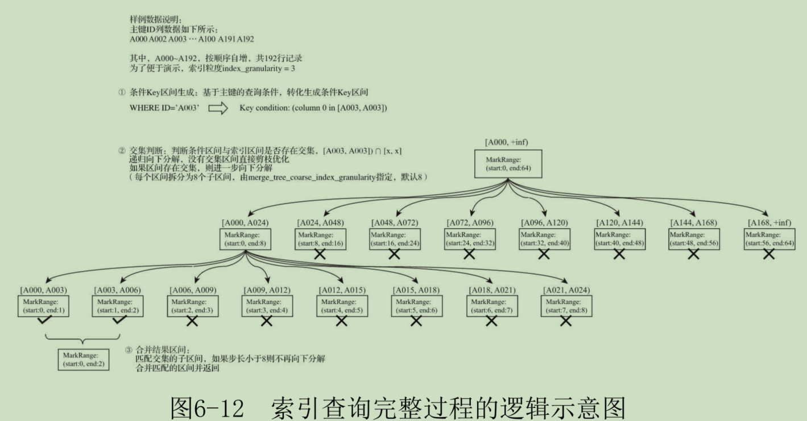

# 第一章 clickhouse的历史
- 传统BI系统
  - 传统的联机事务处理OLTP
  - BI商业只能系统，数仓，联机分许OLAP
- 现在BI系统
  - SaaS模式，将软件面向大众
  - 传统数据库思路：数据分层，数据集市，数据立方体
- OLAP常见架构分类
  - 联机分析，多维分析
  - ROLAP：Relational 关系性OLAP，星型模型或者雪花模型。对数据的实时处理能力要求高
  - MOLAP：multidimensional 多维性OLAP:多维数组的形式保存数据，预先聚合结果，空间换实践
  - HOLAP:Hybrid 混合架构OLAP
- OLAP实现技术的演进
  - 传统关系型数据库：数据体谅多，维度数目多的情况下存在严重的性能问题
  - 大数据技术阶段：维度爆炸，数据同步实时性不高的问题。主流MOLAP架构可以在亿万级数据下，毫秒级的查询响应时间
- clickhouse诞生
  - BI的SaaS产品：一站式，自服务，实时应答，专业化
  - 使用搜索引擎ElasticSearch
  - 查询响应时间比spark快很多:1亿的数据体量，hive的126倍
  - 社区活跃
- 发展历程
  - mysql时期：顺序存储的数据有更高的查询性能，但它不行
  - metrage:key-value模型，用了LSM树，实时查询改为预处理
    - LSM树：内存中小数，数据局部有序，可以用稀疏索引进一步优化
    - 预处理，立方体建模：维度爆炸
  - OLAPServer：自服务
    - 关系模型，数据文件稀疏索引定位数据段，列存储
  - CLickhouse
    - 选择了实时查询，同时保证查询性能
- 名字含义：click 点击事件 click stream data warehouse
- 场景：使用与商业智能领域
- 不适用：不支持事务，不擅长按照行粒度查询，不擅长按行删除数据

# 第二章 clickhouse 架构概述
- 核心特性
  - 完备的DBMS功能（database management system数据库管理系统）
    - DDL数据定义语言 ,DML数据操作语言 ,权限控制 ,数据备份和恢复 ,分布式管理
  - 列式存储与数据压缩
    - 列式存储。对数据压缩的友好性，数据中重复想越多，压缩率越高，减少数据扫描的数量，只要选定的列
    - 降低IO和存储的压力，支持向量化执行
  - 向量化执行引擎
    - 寄存器硬件层面的特性，为性能带来指数级的提升。
    - 消除程序中循环的优化，多线程执行，在cpu寄存器层面实现数据的并行操作
    - cpu的SIMD指令，单条指令操作多条数据
    - 存储离cpu越近，访问速度越快
    - 对比传统的火山模型（volcano/pipeline model）:一次拉取一条数据，指令解释开销
    - 物化模型：一次处理全部数据，容易oom
    - 向量化/批处理模型 vectorized/batch model
  - 关系模型与SQL查询
    - 星型模型，雪花模型，宽表模型
  - 多样化的表引擎
  - 多线程和分布式
    - 线程级并行，由更高层次的软件层控制
    - 在数据存取方柏霓，支持分区，也支持分片
  - 多主架构：Multi-Master
  - 在线查询：对查询快速响应，无需预处理加工
  - 数据分片和分布式查询：
    - 本地表和分布式表的概念
- 架构设计
  - column与field
    - column：列对象，接口IColumn，实现ColumnString，..
    - Field: 单值对象，聚合的设计模式，Null,Uin64等数据类型和相应的处理逻辑
  - DataType
    - 负责数据的序列化和反序列化，IDataType使用了泛化的设计模式
    - 数据的读取由Column或Field对象获取
  - Block与Block流
    - Block对象：数据对象，数据类型，列名称组成的三元组。Column,DataType,列名称字符串
    - IBlockInputStream,IBlockOutputStream
  - table
    - IStorage接口指代数据表，定义了DDL和read和write方法
    - 根据AST查询语句的只是要求，返回指定列的原始数据
  - Parser与Interpreter
    - parser分析器负责创建AST对象
    - Interpreter解释器负责解释AST，并进一步拆功能键查询的执行管道
  - Functions与Aggregate Functions
    - 采用向量化的方式直接作用与一整列数据
    - 聚合函数有状态，支持序列化与反序列化，能够在分布式节点之间进行传输，实现增量计算
  - Cluster与Replication
    - 集群由分片（shard）与副本（Replica)
- 为什么快：自下向上设计
  - 在硬件上设计：在内存中group by，并且使用hashTable装载数据
  - 算法在前：选用性能最好的算法
  - 特定场景，特殊优化：更对不同场景，选用不同算法

# 第三章 安装和部署


# 第四章 数据定义
## 4.1 数据类型
- 基础类型
  - 数值类型：整数Int8/16/32/64，UInt,浮点数Float32/64,正无穷inf，非数字nan，定点数Decimal32/64/128/(P,S)
  - 字符串类型：String,FixedString：固定长度，UUID：32为位，主键类型
  - 时间类型：DateTime,DateTime64,Date
    - 毫秒，微秒只能借助Uint实现
- 复合类型
  - Array
    - `select array(1,2)` or `[1,2]`
    - 同一个数组内可以包含多种类型，但各个类型之间必须兼容
    - 定义表字段时，数据需要指定元素类型
  - Tuple
    - 元素之间可以不同数据类型，不兼容
    - `tuple(1,'a',now())` or `(1,2.0,null,now())`
    - 定义表字段时，要指定类型
    - 写入的时候进行类型检查 `Tuple_TEST values (('abc',123))`
  - Enum
    - `c1 Enum8('ready'=1,'start'=2)`
    - 唯一性
  - Nested：嵌套类型
    - 表字段嵌套层级只支持一级
    - 嵌套类型本质是一种多维数组
    - 同一行内每个数组的字段的长度必须相等
- 特殊类型
  - nullable: 和基础类型搭配使用
  - Domain:域名类型，IPv4,IPv6
    - 便捷性：格式检查；性能更好
    -不支持隐式类型转换：IPv4NumToString

## 4.2 定义数据表
- 数据库
  - `CREATE DATABASE IF NOT EXISTS db_name [ENGINE = engine]`
  - Ordinary默认引擎
  - `DROP DATABASE [IF EXISTS] db_name`
- 数据表
  - 常规定义法
```sql
--常规定义法
CREATE TABLE [IF NOT EXISTS] [db_name.]table_name ( 
    name1 [type] [DEFAULT|MATERIALIZED|ALIAS expr], 
    name2 [type] [DEFAULT|MATERIALIZED|ALIAS expr], 
    省略… 
    ) ENGINE = engine
--复制
CREATE TABLE [IF NOT EXISTS] [db_name1.]table_name AS [db_name2.] table_name2 [ENGINE = engine]
--支持在不同数据库之间复制

--select子句
CREATE TABLE [IF NOT EXISTS] [db_name.]table_name ENGINE = engine AS SELECT …

--DESC查询可以返回表的定义结构

--删除
DROP TABLE [IF EXISTS] [db_name.]table_name
```
- 默认值表达式: default,meterialized,alias
  ```sql
  CREATE TABLE dfv_v1 ( 
      id String, 
      c1 DEFAULT 1000, 
      c2 String DEFAULT c1 
  ) ENGINE = TinyLog
  ```
  - 数据写入：只有default类型的字段可以出现在insert语句中，而MATERIALIZED和ALIAS都不能被显式赋值，它们只能依靠计算取值
  - 数据查询：MATERIALIZED和ALIAS类型的字段不会出现在SELECT *查询的返回结果集中
  - 数据存储：只有DEFAULT和MATERIALIZED类型的字段才支持持久化
  - 修改动作不会印象数据表内先前已经存在的数据

- 临时表 
  - 在普通表的基础上添加temporary 关键词
  - 特性
    - 生命周期是会话session绑定的，所以它只支持Memory表引擎，会话结束，数据表就会被销毁
    - 临时表不属于任何数据库，所以在它的建表语句中，既没有数据库参数也没有表引擎参数
    - 临时表的优先级是大于普通表的
    ```sql
    CREATE TEMPORARY TABLE [IF NOT EXISTS] table_name ( 
    name1 [type] [DEFAULT|MATERIALIZED|ALIAS expr], 
    name2 [type] [DEFAULT|MATERIALIZED|ALIAS expr], )
    ```
- 分区表
  - 提高查询性能，数据的纵向切分
  - 只有合并书MergeTree家族的表引擎才支持数据分区
  ```sql
  CREATE TABLE partition_v1 ( 
  ID String, 
  URL String, 
  EventTime Date 
  ) ENGINE = MergeTree() 
  PARTITION BY toYYYYMM(EventTime) 
  ORDER BY ID
  ```
- 视图
  - 普通：只是一层简单的查询代理:`CREATE VIEW [IF NOT EXISTS] [db_name.]view_name AS SELECT ...`
  - 物化视图: 有独立的村塾，数据保存形式有表引擎决定
  ```sql
  CREATE [MATERIALIZED] VIEW [IF NOT EXISTS] [db.]table_name [TO[db.]name] [ENGINE = engine] [POPULATE] AS SELECT
  ```
    - 源表写入新数据，物化视图也会同步更新
    - populate决定了初始化测录入，已存在的数据一并导入
    - 不支持同步删除
    - 删表 `drop table view_name`'

## 4.3 数据表的基本操作
目前只有MergeTree、Merge和Distributed这三类表引擎支持ALTER查询
- 追加新字段
```sql
ALTER TABLE tb_name ADD COLUMN [IF NOT EXISTS] name [type] [default_expr] [AFTER name_after]

ALTER TABLE testcol_v1 ADD COLUMN OS String DEFAULT 'mac'

ALTER TABLE testcol_v1 ADD COLUMN IP String AFTER ID
```
- 修改数据类型
```sql
ALTER TABLE tb_name MODIFY COLUMN [IF EXISTS] name [type] [default_expr]
--类型需要兼容
ALTER TABLE testcol_v1 MODIFY COLUMN IP IPv4
```
- 修改备注 comment
- 删除已有字段 drop
- 移动数据表 `RENAME TABLE [db_name11.]tb_name11 TO [db_name12.]tb_name12` 只能单节点
- 清空数据表 `TRUNCATE TABLE [IF EXISTS] [db_name.]tb_name`

## 4.4 数据分区的基本操作
- 查询分区信息 `SELECT partition_id,name,table,database FROM system.parts WHERE table = 'partition_v2'`
- 删除指定分区 `ALTER TABLE tb_name DROP PARTITION partition_expr`
- 复制分区数据 `ALTER TABLE B REPLACE PARTITION partition_expr FROM A`
  - 有相同的分区键，表结构完全相同
- 重置分区数据: 初始值 `ALTER TABLE tb_name CLEAR COLUMN column_name IN PARTITION partition_expr`
- 卸载和装载分区:分区数据迁移和备份 `ALTER TABLE tb_name DETACH PARTITION partition_expr`, `ALTER TABLE tb_name ATTACH PARTITION partition_expr`
- 备份和还原分区，freeze和fetch

## 4.5 分布式DDL执行
- DDL语句支持分布式执行，`on cluster cluster`

## 4.6 数据的写入
```sql
INSERT INTO [db.]table [(c1, c2, c3…)] VALUES (v11, v12, v13…), (v21, v22, v23…), ...
-- ，c1、c2、c3是列字段声明，可省略
-- 在使用VALUES格式的语法写入数据时，支持加入表达式或函数

INSERT INTO [db.]table [(c1, c2, c3…)] FORMAT format_name data_set
INSERT INTO partition_v2 FORMAT CSV \ 
    'A0017','www.nauu.com', '2019-10-01' \ 
    'A0018','www.nauu.com', '2019-10-01'

INSERT INTO [db.]table [(c1, c2, c3…)] SELECT ...
```
- 表达式和函数会带来额外的性能开销
- 数据操作式面向Block数据块的，每个数据块最多可以写入1048576行数据（由max_insert_block_size参数控制）具有原子性

## 4.7 数据的删除与修改
- delete和update能力，是mutation查询
- 更适合批量数据的修改和删除
- 不支持事务，一旦提交，就会对现有数据产生影响，不能回滚
- 异步的后台过程，具体执行进度，查询过system.mutations系统表
- is_done =1 表示执行完毕
- 等到mergertree引擎下一次合并动作出发时候，非激活目录才会物理上被删除
- update不能修改分区键和主键

# 第五章 数据字典

用键值和属性映射的形式定义数据，字段中的数据会主动或被动加载到内存，并支持动态更新。适合常量，避免给不必要的join(如根据ID转名称)

- 内置字典
  - 只有Yandex.Metrica字典，但不开放。只是提供了字典的定义机制和取数函数
  - 配置说明
    - 默认禁止，开启将config.xml文件中path_to_regions_hierarchy_file和path_to_regions_names_files
    - path_to_regions_hierarchy_file等同于区域数据的主表：由1个regions_hierarchy.txt和多个regions_hierarchy_[name].txt区域层次的数据文件共同组成
    - path_to_regions_names_files等同于区域数据的维度表，记录了与区域ID对应的区域名称
  - 使用内置字典
    - `mkdir /opt/geo`
    - 复制数据到目录下
    - 打开配置
    - `SELECT regionToName(toUInt32(20009))`
- 外部扩展字典
  - 以插件形式注册
  - 准备字典数据：csv格式，用于flat,hashed,cache,complex_key_hashed,complex_key_cache,range_hashed,ip_trie
  - 扩展字典配置文件的元素组成
    - 由config.xml文件中的dictionaries_config 指定，默认识别/etc/clickhouse-server目录下所有以_dictionary.xml结尾的配置
    ```xml
    <?xml version="1.0"?> 
    <dictionaries> 
      <dictionary>
        <name>dict_name</name>
        <structure><!—字典的数据结构 --></structure> 
        <layout> <!—在内存中的数据格式类型 --> </layout> 
        <source> <!—数据源配置 --> </source>
        <lifetime> <!—字典的自动更新频率 --> </lifetime>
       </dictionary> 
    </dictionaries>
    ```
  - 数据结构：structure
    - 由key 和属性attribute 组成 `<structure> <!— <id> 或 <key> --> <id><!—Key属性--> </id> <attribute> <!—字段属性--> </attribute> ... </structure>`
    - key：至少一个
      - 数值型：支持flat,hashed、range_hashed和cache类型的字典 `<id><!—名称自定义--> <name>Id</name> </id>`
      - 复合型：使用tuple 定义 仅支持complex_key_hashed、complex_key_cache和ip_trie类型的字典`<key><attribute> <name>field1</name> <type>String</type> </attribute> <attribute> <name>field2</name> <type>UInt64</type> </attribute> 省略… </key>`
    - attribute
      ```
      <attribute> 
      <name>Name</name> 
      <type>DataType</type> 
      <!—空字符串--> 
      <null_value></null_value> 
      <expression>generateUUIDv4()</expression> 
      <hierarchical>true</hierarchical> 
      <injective>true</injective> 
      <is_object_id>true</is_object_id> 
      </attribute>
      ```
  - 扩展字典的类型
    - flat: 性能最好，只是用Uint数值型key，内存中用数组保存，最多500000行数据
      - 检查 ` SELECT name, type, key, attribute.names, attribute.types FROM system.dictionaries`
    - hashed ；Uint64数值型key,内存中使用散列结构保存，没有存储上限制
    - range_hashed: 增加了指定时间区间的特性，以散列结构存储并按照时间排序，用range_min和range_max元素指定
    - cache: Uintkey,内存中用固定长度的向量数组保存/cells,由 size_in_cells指定，必须是2的整数被
      - 不会一次将所有数据载入内存，性能不稳定，取决与缓存的命中率
      - 使用本地数据做数据源，必须用executable形式
    - complex_key_hashed: 复合型key
    - complex_key_cache:
    - ip_trie: 复合型key,指定单个String类型字段，用于指代IP前缀，内存中用trie树结构保存
  - 数据源
    - 文件类型
      - 本地文件：path用绝对路径，用file定义
      - 可执行文件：command 用cat 访问绝对路径，使用exectable定义
      - 远程文件：用http元素，url,相当于post请求
    - 数据库类型
      - mysql
      - clickhouse:TinyLog
      - MongoDB
    - 其他类型
  - 数据更新策略：lifetime,min,max
    - 在数据更新的过程中，旧版本的字典将持续提供服务,不支持增量更新
    - 当min和max都是0的时候，将禁用字典更新
  - 基本操作
    - 元数据查询：`SELECT name, type, key, attribute.names, attribute.types, source FROM system.dictionaries`
    - 数据查询 `SELECT dictGet('test_flat_dict','name',toUInt64(1))`, `SELECT dictGet('test_ip_trie_dict', 'asn', tuple(IPv4StringToNum('82.118.230.0')))`
    - 字典表
    ```sql
    CREATE TABLE tb_test_flat_dict ( 
    id UInt64, 
    code String, 
    name String 
    ) ENGINE = Dictionary(test_flat_dict);
    ```
    - 使用DDL查询创建
    ```sql
    CREATE DICTIONARY test_dict( 
    id UInt64, 
    value String 
    )PRIMARY KEY id 
    LAYOUT(FLAT()) 
    SOURCE(FILE(PATH '/usr/bin/cat' FORMAT TabSeparated)) 
    LIFETIME(1)
    ```

## 第六章 MergeTree 原理解析
只有合并树表引擎才支持主键索引，数据分区，数据副本和数据采样的特性，支持alter相关操作

- mergertree的创建方式与存储结构
  - 简介： 以数据片段的方式写入磁盘，通过后台线程，定期合并数据片段，数据片段往复合并
  - 创建方式
    ```sql
    CREATE TABLE [IF NOT EXISTS] [db_name.]table_name (
     name1 [type] [DEFAULT|MATERIALIZED|ALIAS expr],
     name2 [type] [DEFAULT|MATERIALIZED|ALIAS expr],
     省略... 
    ) ENGINE = MergeTree() 
    [PARTITION BY expr] 
    [ORDER BY expr] 
    [PRIMARY KEY expr] 
    [SAMPLE BY expr] 
    [SETTINGS name=value, 省略...]
    ```
    - partition by：分区键，支持单个列字段，元组，列表达式
    - order by: 排序键，默认主键与排序相同，支持单个列字段，元组
    - primary key:主键，生成一级索引。主键允许重复数据
    - sample by：抽样表达式，用什么标准进行采样
    - settings: index_granularity表示索引的粒度，默认位8192
    - index_granularity_bytes：数据的体量大小，默认为10M(10×1024×1024)，设置为0表示不启动自适应功能，新版本有了自适应
      间隔大小的特性
    - enable_mixed_granularity_parts：是否开启自适应索引间隔的功能，默认开启
    - merge_with_ttl_timeout
    - storage_policy：多路径的存储策略
  - 存储结构
    
    - 3个层级：数据表目录，分区目录，个分区下的具体数据文件
      - partition：分区目录，余下各类数据文件
      - checksums.txt：校验文件，保存了为文件是size大小和哈希值，用于校验文件的完整性和正确性
      - columns.txt：列信息文件，明文
      - count.txt：计数文件，明文，记录当前分区目录下数据的总行数
      - primary.idx:一级索引，存放稀疏索引
      - [Column].bin:数据文件，压缩格式存储，默认位LZ4压缩格式
      - [Column].mrk：列字段标记文件，保存了.bin文件中数据的偏移量信息，和稀疏索引对其，和.bin文件一一对应
      - [Column].mrk2:自适应大小的索引间隔，用他命名
      - partition.dat与minmax_[Column].idx：分区键，前者保存当前分区下分区表达式最终生成的值，后者记录当前分区下分区字段对应原始数据的最小和最大值
      - skp_idx_[Column].idx与skp_idx_[Column].mrk：二级索引，跳数索引，
- 数据分区
  - 分区规则
    - 不指定，默认取名all,所有数据写入
    - 整型：用字符形式输出
    - 日期类型：用YYYYMMDD格式化后的字符形式
    - 其他类型：128Hash算法取值
    - 多个分区字段，用其上规则生成，多个ID之间用 '-'拼接
  - 命名规则
    - `PartitionID_MinBlockNum_MaxBlockNum_Level`
    - partition id
    - MinBlockNum和MaxBlockNum:最小数据块编号与最大数据块编号
    - level:合并的层级，合并过的次数，初始值为0
  - 分区目录的合并过程
    - 每一批数据的写入，会生成一批新的分区目录，在写入后的10-15分钟后，会通过后台任务合并分区目录，旧分区目录默认8分钟后删除
    
    - BlockNum是全局自增的
    - 旧的分区目录不再是激活状态，active=0
- 一级索引
  - 主键定义后，会依据index_granularity间隔，生成一级索引，保存到primary.idx文件
  - 稀疏索引
    
    - 稠密索引，每一行对应一行具体数据记录，稀疏索引中，每一行对应一段
    - 理解稀疏索引类似分页
  - 索引粒度
    - 一级索引和数据标记的间隔粒度相同，数据文件.bin也会依照间隔粒度生成压缩数据块
  - 索引生成规则
    
    - 索引值前后相连，按照主键字段顺序紧密排列一起
    - 组合索引
  - 索引的查询过程
    - markRange数据区间，索引间隔里的具体数据区间
    - 索引查询：数值区间的交集判断，一个是基于主键的查询条件转换而来的条件区间，一个是markRange的数值区间
    - 步骤
      - 生成查询条件去区间
      - 递归交集判断，从最大的区间开始
      - 合并markRange区间
      
- 二级索引
  - 跳数索引，由数据的聚合信息构建而成。根据索引类型不同，聚合信息的内容也不同，默认是关闭的 
  - 需要在create语句内定义，支持元组和表达式
  - `INDEX index_name expr TYPE index_type(...) GRANULARITY granularity`
  - granularity与index_granularity的关系
    - index_granularity定义了数据的粒度
    - granularity定义了聚合信息汇总的粒度granularity定义了一行跳数索引能够跳过多少个index_granularity区间的数据
    
  - 跳数索引的类型
    - minmax,set,ngrambf_v1,tokenbg_v1
    - 一张数据表支持同时申明多个跳数索引
    - minmax:索引记录了一段数据内的最小和最大极值
    - set: 直接记录了声明字段或表达式的取值（唯一)
    - ngrambf_v1: 索引记录的是数据短语的布隆表过滤器，只支持String和FixedString数据类型
    - tokenbf_v1：tokenbf_v1索引是ngrambf_v1的变种.。tokenbf_v1会自动按照非字符的、数字的字符串分割token
- 数据存储
  - 各列独立存储
    - 数据事先依照order by的声明排序，最后用压缩数据块的形式被组织并写入.bin文件中
    - 压缩数据块
      - 头信息：压缩算法类型，压缩后的数据大小，压缩前的数据大小
      - 压缩数据：
      
      - 一个.bin文件是由1个至多个压缩数据块组成的，多个压缩数据块之间，按照写入顺序首位相接
      - 将读取粒度降低到压缩数据块级别，缩小数据读取范围
- 数据标记
  - 生成规则
    
    - 一个元组：编号（压缩数据块的起始偏移量，为压缩数据的起始偏移量）
    - 表示一个片段的数据，不能常驻内训，使用LRU缓存策略
  - 工作方式
    - 读取压缩数据块：使用标记文件的偏移量，定位加载压缩数据块
    - 读取数据：用索引间隔加载特定的一小段，保存解压数据块中的偏移量
    
- 总结
  - 写入过程
    - 每一批数据的写入，都会生成一个新的分区目录。在后续的某一时刻，属于相同分区的目录会依照规则合并到一起；接着，按照index_granularity索引粒度，会分别生成primary.idx一级索引
  - 查询过程
    - 依次借助分区索引、一级索引和二级索引，将数据扫描范围缩至最小。然后再借助数据标记，将需要解压与计算的数据范围缩至最小
  - 数据标记和压缩数据块的对应关系
    - 多对一
    - 一对一
    - 一对多


#  第七章 mergeTree系列表引擎

## 7.1 MergeTree
提供了数据分区，一级索引，二级索引等功能
- 数据TTL: 数据存活时间
  - 表级别和列级别，以先到期的为主
  - 依托某个datatime或date字段，对时间的INTERVAL操作来表示过期时间
    - 列级别，表级别
    - 运行机理：
      - 以分区为单位生成ttl.txt
      - 用json保存，columns,table,min,max
      - 合并分区时，出发TTL过期数据的逻辑，贪婪，合并次数多的，maxBlockNum大的
    - 设置
      - TTL默认的合并频率由MergeTree的merge_with_ttl_timeout参数控制，默认86400秒
      - 也可以使用optimize命令强制触发合并 `optimize TABLE table_name,optimize TABLE table_name FINAL`
      - 控制全局TTL合并任务的启停 `SYSTEM STOP/START TTL MERGES`
- 多路径存储策略
  - 自定义存储策略，以数据分区为最小移动单元，将分区目录写入多块磁盘目录
  - 默认策略：自动保存到config.xml中path指定的路径下
  - JBOD策略：所产生的新分区会轮询写入各个磁盘
  - HOT/COLD策略：适合不同类型的磁盘
  - 配置
    - config.xml,policy
    - 需要重启clickhouse server
    - system.disks看磁盘配置，system.storage_policies看存储策略

## 7.2 ReplacingMergeTree
- 为了数据去重设计的
- order by是去重的关键
- 以分区为单位删除重复数据的
- 版本号的用法：去重时，按照版本号保留最长的
- 默认，保留最后一个


## 7.3 SummingMergeTree
- 场景
  - 终端用户只需要查询数据的汇总结果， 不关心明细数据，并且数据的汇总条件是预先明确的（GROUP BY条件明确，且不会随意改变）
  - 直接方案：MergeTree 存储，使用group by 查询，用sum聚合函数汇总结果
    - 存在额外的存储开销
    - 额外的查询开销
- 定义: 能够在合并分区的时候按照预先定义的条件聚合汇总数据，将同一分组下的多行数据汇总合并成一行，这样既减少了数据行，又降低了后续汇总查询的开销
  - 主键索引，可以和order by 不一样
  - `ENGINE = SummingMergeTree((col1,col2,…))`如若不填写此参数，则会将所有非主键的数值类型字段进行SUM汇总
  - 触发汇总: `optimize TABLE summing_table FINAL`
```sql
CREATE TABLE summing_table( 
    id String, 
    city String, 
    v1 UInt32, 
    v2 Float64, 
    create_time DateTime 
)ENGINE = SummingMergeTree()
PARTITION BY toYYYYMM(create_time) 
ORDER BY (id, city) 
PRIMARY KEY id
```
- 处理逻辑
  - 用ORBER BY排序键作为聚合数据的条件Key
  - 只有在合并分区的时候才会触发汇总的逻辑
  - 数据分区为单位来聚合数据。当分区合并时，同一数据分区内聚合Key相同的数据会被合并汇总，而不同分区之间的数据则不会被汇总
  - 如果在定义引擎时指定了columns汇总列（非主键的数值类型字段），则SUM汇总这些列字段；如果未指定，则聚合所有非主键的数值类型字段
  - 在进行数据汇总时，因为分区内的数据已经基于ORBER BY排序，所以能够找到相邻且拥有相同聚合Key的数据
  - 对于那些非汇总字段，则会使用第一行数据的取值
  - 支持嵌套结构，但列字段名称必须以Map后缀结尾。嵌套类型中，默认以第一个字段作为聚合Key。除第一个字段以外，任何名称以Key、Id或Type为后缀结尾的字段，都将和第一个字段一起组成复合Key

## 7.4 AggregatingMergeTree
- 引子：数据立方体，空间换时间的方式提升查询性能
- 定义：合并分区的时候，按照预先定义的条件聚合数据以二进制的形式存储中间状态结果
- 配置
  - 使用何种聚合函数，以及针对哪些列字段计算，定义AggregateFunction数据类型实现的
  - 写入需要调用*State函数；查询时，则需要调用相应的*Merge函数；*表示定义时使用的聚合函数
  - `uniqState('code1')`,`SELECT id,city,uniqMerge(code),sumMerge(value) FROM agg_table`
- 规则
  - 用ORBER BY排序键作为聚合数据的条件Key
  - 使用AggregateFunction字段类型定义聚合函数的类型以及聚合的字段
  - 只有在合并分区的时候才会触发聚合计算的逻辑
  - 以数据分区为单位来聚合数据
  - 在进行数据计算时，因为分区内的数据已经基于ORBER BY排序，所以能够找到那些相邻且拥有相同聚合Key的数据
  - 非主键、非AggregateFunction类型字段，则会使用第一行数据的取值
  - AggregateFunction类型的字段使用二进制存储，在写入数据时，需要调用*State函数；而在查询数据时，则需要调用相应的*Merge函数。其中，*表示定义时使用的聚合函数
  - AggregatingMergeTree通常作为物化视图的表引擎，与普通MergeTree搭配使用
- 后面分析 SimpleAggregateFunction和AggregateFunction的区别
```sql
CREATE TABLE agg_table( 
    id String, city String,
     code AggregateFunction(uniq,String), 
     value AggregateFunction(sum,UInt32), 
     create_time DateTime 
 )ENGINE = AggregatingMergeTree() 
PARTITION BY toYYYYMM(create_time) 
ORDER BY (id,city) 
PRIMARY KEY id

CREATE MATERIALIZED VIEW agg_view 
ENGINE = AggregatingMergeTree() 
PARTITION BY city ORDER BY (id,city) 
AS SELECT 
          id, 
          city, 
          uniqState(code) AS code, 
          sumState(value) AS value 
FROM agg_table_basic 
GROUP BY id, city
```

## 7.5 CollapsingMergeTree
- 以增代删的思路，支持行级数据修改和删除的表引擎。定义一个sign标记位字段，记录数据行的状态，折叠合并树
```sql
CREATE TABLE collpase_table(
    id String, 
    code Int32, 
    create_time DateTime, 
    sign Int8
)ENGINE = CollapsingMergeTree(sign)
PARTITION BY toYYYYMM(create_time)
ORDER BY id
```
- 注意
  - 折叠数据在分区合并时才体现
    - 强制合并
    - having sum(sign) >0
  - 只有相同分区内的数据被折叠
  - 对写入的顺序要求严格，对多线程时容易出问题


## 7.6 VersionedCollapsingMergeTree
对数据的写入顺序没有要求
```sql
CREATE TABLE collpase_table(
    id String, 
    code Int32, 
    create_time DateTime, 
    sign Int8,
    ver UInt8
)ENGINE = CollapsingMergeTree(sign,ver)
PARTITION BY toYYYYMM(create_time)
ORDER BY id
```
- 自动将ver加入到order by的末端，这得处理时，会回到正确的顺序


## 7.7 关系
- 继承关系
  - mergeTree派生出其他的
  - 组合关系：ReplicatedMergeTree
    - 分布式协同的能力，记住zookeeper的消息日志广播功能，实现副本实例之间的数据同步功能

# 第八章 其他常见表引擎
- 外部存储类型：从其他存储系统读取数据，只负责元数据管理和数据查询
  - HDFS
    - 在HDFS上给clickhouse用户授权
    - 表定义 `ENGINE = HDFS(hdfs_uri,format)`
    - 又写又读；只负责读，写由其他外部系统完成
    - 路径：绝对路径，*，？通配符，{M..N}数字区间
  - Mysql
    - 与数据表定理映射
    - `ENGINE = MySQL('host:port', 'database', 'table', 'user', 'password'[, replace_query, 'on_duplicate_clause'])`
  - JDBC
    - 依赖名为clickhouse-jdbc-bridge的查询代理服务
    - 启动代理服务
    - config。xml全局配置访问地址
    - `ENGINE = JDBC('jdbc:url', 'database', 'table')`
  - Kafka
    ```
    ENGINE = Kafka() 
    SETTINGS 
    kafka_broker_list = 'host:port,... ', 
    kafka_topic_list = 'topic1,topic2,...', 
    kafka_group_name = 'group_name', 
    kafka_format = 'data_format'[,] 
    [kafka_row_delimiter = 'delimiter_symbol'] 
    [kafka_schema = ''] 
    [kafka_num_consumers = N] 
    [kafka_skip_broken_messages = N] 
    [kafka_commit_every_batch = N]
    ```
    - clickhouse不支持恰好一次，支持最多一次，最少一次
  -File
    - config.xml配置中由path指定的路径
    - 直接读取本地文件的数据 `ENGINE = File(format)`
    - 目录：以表的名称命名 `<ch-path>/data/default/test_file_table/data.CSV`
    - 文件固定以data.format命名，在<ch-path>/data/default路径下便会创建一个名为file_table的目录
- 内存类型
  - Memory
    - 数据保存在内存中，数据不会被压缩也不会被格式转换。服务重启时，数据会丢失
    - 性能和MergeTree相当
    - 广泛应用与CLICKHOUSE内部，集群键数据分发数据的载体来用
  - Set
    - 有物理内存， 先写至内存，后同步到磁盘
    - 元素唯一，有去重的能力
    - 不支持select,只能间接作为in查询的右侧条件被查询使用
    - `SELECT arrayJoin([1, 2, 3]) AS a WHERE a IN set_1`
    - 存储结构
      - [num].bin：所有列字段的数据
      - tmp临时目录
  - join
    - 存储结构类似set表引擎
    - 能作为join查询的连接表，也能被直接查询使用
    - `ENGINE = Join(join_strictness, join_type, key1[, key2, ...])`
    - join_strictness：连接精度: all,any,asof
    - join_type: 连接类型：支持INNER、OUTER和CROSS
    - join_key：连接键，它决定了使用哪个列字段进行关联
    - join_strictness为ANY，所以join_key重复的数据会被忽略
    - `SELECT id,name,price FROM join_tb1 LEFT JOIN id_join_tb1 USING(id)`
  - Buffer
    - 不支持文件持久化存储，用内存
    - 作为缓冲区，解决高并发问题
    - `ENGINE = Buffer(database, table, num_layers, min_time, max_time, min_rows, max_rows, min_bytes, max_bytes)`
    - num_layers：可以理解成线程数;min_time和max_time：时间条件的最小和最大值;min_rows和max_rows：数据行条件的最小和最大值;min_bytes和max_bytes：数据体量条件的最小和最大值;
    - Buffer表刷新的判断依据有三个，满足其中任意一个，Buffer表就会刷新数据
    - 上述三组条件在每一个num_layers中都是单独计算的
- 日志类型
  - 简介
    - 数据量小，一次写入多次查询
    - 不支持索引，分区，不支持并发读写
  - TinyLog
    - 性能最低
    - 存储结构：数据文件：按列独立存储+元数据
  - StripeLog
    - 存储结构：
      - data.bin:所有列字段用同一个文件保存
      - index.mrk：数据标记，允许使用多线程，并行读取数据块
      - sizes.json：元数据文件
  - Log
    - 性能最高
    - 存储结构
      - 【column】.bin：数据文件，按列独立存储
      - _marks.mrk:数据标记，统一存储
      - sizes.json
    - 支持并行查询，按列按需读取，使用了更多的文件描述符
- 接口类型
  - Merge
    - 不存储数据，不支持数据写入，合并多个查询的结果集
    - `ENGINE = Merge(database, table_name)` name支持正则
    - 用到了虚拟字段_table
  - Dictionary
    - 数据字典的一层封装
    - `ENGINE = Dictionary(dict_name)`
    - 可以创建dictionary引擎的数据库，会自动创建字典
  - Distributed
    - 分布式表的透明代理
- 其他类型
  - Live View
    - 类似事件监听器，将一条SQL的查询结果作为监控目标，当目标数据增加时，做出响应
    - `CREATE LIVE VIEW lv_origin AS SELECT COUNT(*) FROM origin_table1`
    - `watch lv_origin`
  - null
    - 返回正确，但忽略数据不会保存
    - `ENGINE = Null`
    - 在使用物化视图的时候，如果不希望保留源表的数据，那么将源表设置成Null引擎将会是极好的选择
  - URL
    - 当执行SELECT查询的时候，底层会将其转换为GET请求的远程调用。而执行INSERT查询的时候，会将其转换为POST请求的远程调用
    - `ENGINE = URL('url', format)`

## 第九章 数据查询
```
[WITH expr |(subquery)] 
SELECT [DISTINCT] expr 
[FROM [db.]table | (subquery) | table_function] [FINAL] 
[SAMPLE expr] 
[[LEFT] ARRAY JOIN] 
[GLOBAL] [ALL|ANY|ASOF] [INNER | CROSS | [LEFT|RIGHT|FULL [OUTER]] ] JOIN (subquery)|table ON|USING columns_list 
[PREWHERE expr] 
[WHERE expr] 
[GROUP BY expr] 
[WITH ROLLUP|CUBE|TOTALS] 
[HAVING expr] 
[ORDER BY expr] 
[LIMIT [n[,m]] 
[UNION ALL] 
[INTO OUTFILE filename] 
[FORMAT format] 
[LIMIT [offset] n BY columns]
```
- with
  - 支持CTE公共表达式，通过with子句
  - 用法
    - 定义变量： `WITH 10 AS start SELECT number FROM system.numbers WHERE number > start LIMIT 5`
    - 调用函数： `WITH SUM(data_uncompressed_bytes) AS bytes SELECT database , formatReadableSize(bytes) AS format FROM system.columns GROUP BY database ORDER BY bytes DESC`
    - 定义子查询： `WITH (SELECT SUM(data_uncompressed_bytes) FROM system.columns ) AS total_bytes`
      - 结果集只能返回一行数据
    - 子查询中重复使用：嵌套使用with
- from子句
  - 从数据表中取数
  - 从子查询中取数
  - 从表函数中取数 `SELECT number FROM numbers(5)`
  - 可省略，从虚拟表中取数
  - 可以使用final,强制查询合并，降低查询性能
- sample
  - 数据采样，幂等：数据不变化，同样规则返回同样数据
  - 只用于mergertree，建表时定义 `ORDER BY (CounterID, intHash32(UserID)) SAMPLE BY intHash32(UserID)`
  - SAMPLE BY所声明的表达式必须同时包含在主键的声明内,Sample Key必须是Int类型
  - 用法
    - SAMPLE factor `SELECT CounterID FROM hits_v1 SAMPLE 0.1`,统计查询时，为了近似，需要乘上系数；_sample_factor来获取采样系数
    - SAMPLE rows `SELECT count() FROM hits_v1 SAMPLE 10000` ,_sample_factor来获取当前查询所对应的采样系数
    - SAMPLE factor OFFSET n 示按因子系数和偏移量采样 `SELECT CounterID FROM hits_v1 SAMPLE 0.4 OFFSET 0.5`
- array join
  - 允许在数据表的内部，与数组或嵌套类型的字段进行JOIN操作
  - 在一条SELECT语句中，只能存在一个ARRAY JOIN（使用子查询除外）。目前支持INNER和LEFT两种
  - inner
    - `SELECT title,value FROM query_v1 ARRAY JOIN value`
    - 最终的数据基于value数组被展开成了多行，并且排除掉了空数组
  - LEFT ARRAY JOIN
    - `SELECT title,value,v FROM query_v1 LEFT ARRAY JOIN value AS v`
    - 在INNER JOIN中被排除掉的空数组出现在了返回的结果集
    - 同时对多个数组字段进行ARRAY JOIN操作时，查询的计算逻辑是按行合并而不是产生笛卡儿积
  - 对嵌套类型数据的访问，ARRAY JOIN既可以直接使用字段列名;也可以使用点访问符的形式
- join语句
  - 连接精度
    - 默认是all,只支持等式，交叉连接不需要使用join key，会产生笛卡尔积
    - all：结果集返回右表中所有与左表id相匹配的数据
    - any：结果集返回了右表中左表id相连接第一行的数据
    - ASOF：模糊连接，允许在连接键后追加一个模糊连接的匹配条件asof_column；using的最后一个字段会被自动转换成asof_column模糊连接条件
  - 连接类型
    - inner join:返回交集
    - outer join: 
      - left 左全+交
      - right
      - full: 全 + 交
    - cross: 交叉连接，笛卡尔积
  - 多表连接
    - 两两连接，前面的结果集合和后面的join
    - 支持关联查询的语法：cross join:如果查询语句中共不包含where条件
    - 如果包含，就转为inner join
  - 注意事项
    - 性能
      - 左大右小的原则
      - join查询目前没有缓存支持：如果使用大量的join，考虑用join表引擎
      - 大量纬度属性补全的查询场景中，建议使用字典代替join
    - 空值策略与简写形式
      - 连接查询的空值策略，默认位0，由数据类型的默认值填充，为1，由null填充
      - using简写
- where和prewhere
  - 过滤条件恰好是主键字段，则能够进一步借助索引加速查询
  - prewhere,目前只能由于MergeTree系列的表引擎：指挥读取prewhere指定的列字段数据，用于数据过滤的条件判断，然后再读取select的列字段补全属性
  - 自动优化，会自动使用prewhere
  - 一些情况不会优化，使用常量表达式，使用默认值为alias类型的字段，包含arrayJoin、globalIn、globalNotIn或者indexHint的查询；查询的列字段与WHERE谓词相同；·使用了主键字段
- group by
  - select只能使用key申明字段，或者聚合函数
  - 存在null值是，会将null=null特定值处理
  - with rollup
    - 按照聚合键从右向左上卷数据
    - `SELECT table, name, SUM(bytes_on_disk) FROM system.parts GROUP BY table,name WITH ROLLUP ORDER BY table`
  - with cube
    - 基于聚合键之间所有的组合生成小计信息
    - `SELECT database, table, name, SUM(bytes_on_disk) FROM (SELECT database, table, name, bytes_on_disk FROM system.parts WHERE table ='hits_v1') GROUP BY database,table,name WITH CUBE ORDER BY database,table ,name`
  - with totals
    - 基于聚合函数对所有数据进行总计
    - `SELECT database, SUM(bytes_on_disk),COUNT(table) FROM system.parts GROUP BY database WITH TOTALS`
- having
  - 再聚合之后增加了filter过滤动作
  - 嵌套where：使用了谓词下推，聚合之前就进行了数据过滤，减少了后续需要处理的数据量
- order by 
  - 指定全局排序，建表中的是分区内的局部排序
  - nulls last: 其他值（value）→NaN→NULL
  - nulls first: NULL→NaN→其他值（value）
- limit by 
  - 运行于order by之后，limit之前。按照指定分组，最多放回前n行数据.常用于TOP N的查询场景
  - `SELECT database,table,MAX(bytes_on_disk) AS bytes FROM system.parts GROUP BY database,table ORDER BY database ,bytes DESC LIMIT 3 BY database`
  - LIMIT BY也支持跳过OFFSET偏移量获取数据
  - `LIMIT n OFFSET y BY express`/`LIMIT y,n BY express`
  - `SELECT database,table,MAX(bytes_on_disk) AS bytes FROM system.parts GROUP BY database,table ORDER BY bytes DESC LIMIT 3 OFFSET 1 BY database`
- limit
  - 返回指定前n行数据
  - `LIMIT n LIMIT n OFFSET m LIMIT m，n`
  - 没有使用order by指定全局顺序时候，limit查询返回的数据可能不同
- select
  - 列字段可以使用正则 `SELECT COLUMNS('^n'), COLUMNS('p') FROM system.databases`
- distinct
  - 去重
  - distinct执行计划更简单，可以和group by同时使用
  - 先distinct,由group by
  - 先distinct 后order by
  - 也遵循null  = null
- union all
  - 联合多组查询，不能使用其他子句
  - 列字段的数量相同，数据类型相同或兼容
  - 列字段名称可以不同，以左边的为准
  - union distinct只能由嵌套查询来变相实现
- 查看执行计划
  - 没有explain,好像有了
  - `clickhouse-client -h ch7.nauu.com --send_logs_level=trace <<< 'SELECT * FROM hits_v1' > /dev/null`
  - expression: 线程
  - key condition: 主键索引 `Key condition: (column 0 in [67141, 67141])`
  - minmax index condition: 分区索引 `MinMax index condition: (column 0 in [16146, 16146])`
  - `Selected 12 parts by date, 12 parts by key, 1098 marks to read from 12 ranges`该查询语句共扫描了12个分区目录，共计1098个MarkRange
  - `Read 8873910 rows, 8.50 GiB in 28.267 sec., 313928 rows/sec., 308.01 MiB/sec.`该查询语句总共读取了8 873 910行数据（全表），共8.50 GB
  - `MemoryTracker: Peak memory usage (for query): 340.03 MiB.`该查询语句消耗内存最大时为340 MB
  - 通过将ClickHouse服务日志设置到DEBUG或者TRACE级别，可以变相实现EXPLAIN查询

# 第十章 副本与分片

