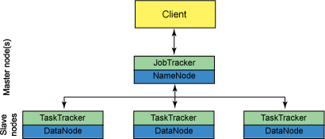

- 中高级大数据数仓简历编写
  - 自我介绍
  - 职业技能
    - linux,java,shell,python
    - 大数据基础框架，hadoop,hive,spark,flink,kafka,clickhouse
    - 数仓搭建理论：离线，实时，数据治理
    - 修饰语：精通，了解，掌握，熟悉
    - 高级：设计方面能力，从0-1处理过多少亿级别数据，具备设计，调优能力，数据治理。源码读写能力，二次开发能力
  - 工作经验
  - 项目介绍——不在于多，在于精
    - 项目名称：注意项目名称高大上
    - 项目描述：完整表现出项目干啥的，解决什么问题
    - 技术：精通和掌握级别的技术
    - 项目职责：
      - 数据源
      - 数仓搭建：离线，实时：每个层次的处理——（不要太笼统，具体些）
      - BI报表
      - 数据治理：【高级】
      - 对数据源-改造能力，二次开发（数据开发）
  - 自我评价
    - 抗压能力，团结合作，工作认真

- 面试
  - 背景：数仓，ETL，实时，开发工程师
  - 理解，必须掌握，能口述一遍
  - 数仓工程师：1.1-1.9，2-6章
  - 实时，开发工程师

- Linux
  - 常用命令：find,ps ,top ,netstat,tail , less ,ping ,telnet
  - 命令
    - 查看内存 top
    - 查看磁盘存储情况： df -h
    - 查看你磁盘io读写情况，iotop（需要安装一下），iotop -o
    - 查看端口占用情况 netstat -tunlp | grep 端口号
    - 查看进程 ps aux
  - 使用Linux命令查询file1中空行所在的行号： `awk '/^$/{print NR}' file1.txt `
  - 使用Linux命令计算第二列的和并输出 `cat chengji.txt | awk -F " " '{sum+=$2} END{print sum}'`
  - Shell脚本里如何检查一个文件是否存在？如果不存在该如何处理？
    - ```
      #!/bin/bash
      if [ -f file.txt ]; then echo "文件存在!"
      else
      echo "文件不存在!"
      fi
      ```
  - 用shell写一个脚本，对文本中无序的一列数字排序并打印求和 `sort -n test.txt|awk '{a+=$0;print $0}END{print "SUM="a}'`
  - 请用shell脚本写出查找当前文件夹（/home）下所有的文本文件内容中包含有字符”shen”的文件名称 `grep -r "shen" /home | cut -d ":" -f 1`

- hadoop基础
  - 大数据基础环境
    - 简要描述如何安装配置apache的一个开源Hadoop，只描述即可，无需列出具体步骤，列出具体步骤更好
        1. 准备三台客户机（配置IP，配置主机名...）
        2. 安装jdk，安装hadoop
        3. 配置JAVA_HOME和HADOOP_HOME
        4. 使每个节点上的环境变量生效（source /etc/profile）
        5. 准备分发脚本 xsync
           a. **在/user/atguigu/bin下创建脚本：xsync
        6. 明确集群的配置
        7. 修改配置文件
           a. **core-site.xml
           b. **hadoop-env.sh
           c. **hdfs-site.xml
           d. **yarn-env.sh
           e. **yarn-site.xml
           f. **mapred-env.sh
           g. **mapred-site.xml
           h. **配置slaves
        8. 分发配置文件
           a. **xsync /etc/hadoop
        9. 删掉data和logs文件夹
        10. 配置ssh（hadoop102，hadoop103）
        11. 分发配置文件
        12. 格式化hdfs（hdfs namenode -format）
        13. 群启hdfs
    - Hadoop中需要哪些配置文件，其作用是什么？
      - core-site.xml: 
      - ZooKeeper集群的地址和端口。注意，数量一定是奇数，且不少于三个节点
    - 请列出正常工作的Hadoop集群中Hadoop都分别需要启动哪些进程，它们的作用分别是什么
      1. NameNode它是hadoop中的主服务器，管理文件系统名称空间和对集群中存储的文件的访问，保存有metadate。
      2. SecondaryNameNode它不是namenode的冗余守护进程，而是提供周期检查点和清理任务。帮助NN合并editslog，减少NN启动时间。
      3. DataNode它负责管理连接到节点的存储（一个集群中可以有多个节点）。每个存储数据的节点运行一个datanode守护进程。
      4. ResourceManager（JobTracker）JobTracker负责调度DataNode上的工作。每个DataNode有一个TaskTracker，它们执行实际工作
      5. NodeManager（TaskTracker）执行任务。
      6. DFSZKFailoverController高可用时它负责监控NN的状态，并及时的把状态信息写入ZK。   它通过一个独立线程周期性的调用NN上的一个特定接口来获取NN的健康状态。FC也有选择谁作为Active NN的权利，因为最多只有两个节点，目前选择策略还比较简单（先到先得，轮换）。
      7. JournalNode 高可用情况下存放namenode的editlog文件。
    - 简述Hadoop的几个默认端口及其含义。
      - 1）dfs.namenode.http-address:50070
        2）SecondaryNameNode辅助名称节点端口号：50090
        3）dfs.datanode.address:50010
        1.fs.defaultFS:8020 或者9000
        2.yarn.resourcemanager.webapp.address:8088
    - HDFS的存储机制（读写流程）
      - 写入
      - 
      - 1）客户端向namenode请求上传文件，namenode检查目标文件是否已存在，父目录是否存在。
        2）namenode返回是否可以上传。
        3）客户端请求第一个 block上传到哪几个datanode服务器上。
        4）namenode返回3个datanode节点，分别为dn1、dn2、dn3。
        5）客户端请求dn1上传数据，dn1收到请求会继续调用dn2，然后dn2调用dn3，将这个通信管  道建立完成。
        6）dn1、dn2、dn3逐级应答客户端
        7）客户端开始往dn1上传第一个block（先从磁盘读取数据放到一个本地内存缓存），以packet为单位，dn1收到一个packet就会传给dn2，dn2传给dn3；dn1每传一个packet会放入一个应答队列等待应答
        8）当一个block传输完成之后，客户端再次请求namenode上传第二个block的服务器。（重复  执行3-7步）
      - 读取
      - 
      - 1.客户端向namenode请求下载文件，namenode通过查询元数据，找到文件块所在的datanode
        地址。
        2.挑选一台datanode（就近原则，然后随机）服务器，请求读取数据。
        3.datanode开始传输数据给客户端（从磁盘里面读取数据放入流，以packet为单位来做校验。
        4.客户端以packet为单位接收，先在本地缓存，然后写入目标文件。
    - SecondaryNameNode 工作机制
      1. 第一阶段：namenode启动
         1. 第一次启动namenode格式化后，创建fsimage和edits文件。如果不是第一次启动，  直接加载编辑日志和镜像文件到内存。
         2. 客户端对元数据进行增删改的请求
            1. namenode记录操作日志，更新滚动日志。
            2. namenode在内存中对数据进行增删改查。
      2. 第二阶段：Secondary NameNode工作
         1. 拷贝fsimage.chkpoint到namenode
         2. Secondary NameNode询问namenode是否需要checkpoint。直接带回namenode是否检查结果。
         3. Secondary NameNode请求执行checkpoint。
         4. namenode滚动正在写的edits日志
         5. 将滚动前的编辑日志和镜像文件拷贝到Secondary NameNode
         6. Secondary NameNode加载编辑日志和镜像文件到内存，并合并。
         7. 生成新的镜像文件fsimage.chkpoint
         8. namenode将fsimage.chkpoint重新命名成fsimage
    - NameNode与SecondaryNameNode 的区别与联系
        1. 机制流程同上；
        2. 区别
           a. NameNode负责管理整个文件系统的元数据，以及每一个路径（文件）所对应的数  据块信息。
           b. SecondaryNameNode主要用于定期合并命名空间镜像和命名空间镜像的编辑日志。
        3. 联系：
           1. SecondaryNameNode中保存了一份和namenode一致的镜像文件（fsimage）和编  辑日志（edits）。
           2. 在主namenode发生故障时（假设没有及时备份数据），可以从SecondaryNameNode
              恢复数据。
    - 服役新数据节点和退役旧节点步骤
      - 节点上线
      - 节点下线
    - Namenode挂了怎么办
      - 将SecondaryNameNode中数据拷贝到namenode存储数据的目录
      - 使用-importCheckpoint选项启动namenode守护进程，从而将SecondaryNameNode    中数据拷贝到namenode目录中。
    - Namenode HA高可用
      - 高可用，是保证业务连续性的有效解决方案,一般有两个或两个以上的节点，分为活动节点（Active）及备用节点（Standby））。用于实现业务的不中断或短暂中断
      - QJM/Qurom Journal Manager,基本原理就是用 2N+1 台 JournalNode 存储 EditLog，每次写数据操作有>=N+1 返回成功时即认为该次写成功，数据不会丢失了
      - FailoverController 主要包括三个组件:
        - HealthMonitor: 监控 NameNode 是否处于 unavailable 或 unhealthy 状态
        - ActiveStandbyElector: 监控 NN 在 ZK 中的状态
        - ZKFailoverController: 订阅 HealthMonitor 和 ActiveStandbyElector 的事件，并管理 NN 的状态
          - 健康监测：周期性的向它监控的 NN 发送健康探测命令
          - 会话管理：如果 NN 是健康的，zkfc 就会在 zookeeper 中保持一个打开的会话，如果 NameNode 同时还是 Active 状态的，那么 zkfc 还会在 Zookeeper 中占有一个类型为短暂类型的 znode，当这个 NN 挂掉时，这个 znode 将会被删除，然后备用的NN 将会得到这把锁，升级为主 NN，同时标记状态为 Active
        - master 选举：通过在 zookeeper 中维持一个短暂类型的 znode，来实现抢占式的锁机制，从而判断那个 NameNode 为 Active 状态
    - yarn HA
      - Hadoop 2.4.0版本开始，Yarn 实现了 ResourceManager HA
      - 由于资源使用情况和 NodeManager 信息都可以通过 NodeManager 的心跳机制重新构建出来，因此只需要对 ApplicationMaster 相关的信息进行持久化存储即可
      - 在一个典型的 HA 集群中，两台独立的机器被配置成 ResourceManger。在任意时间，有且只允许一个活动的 ResourceManger,另外一个备用。切换分为两种方式
    - HA Hadoop搭建
    - 单点故障与”脑裂”
      - 
      - client的事务性操作对HA提供了支持
      - QJM
    - Hadoop 节点分布
      - 
    - 联邦的实现
      - 为什么：Hadoop的NN所使用的资源受所在服务的物理限制，不能满足实际生产需求
      - 实现：采用多台NN组成联邦。NN是独立的，NN之间不需要相互调用。NN是联合的，同属于一个联邦，所管理的DN作为block的公共存储
      - 主要优点：
        - ● 命名空间可伸缩性——联合添加命名空间水平扩展。DN也随着NN的加入而得到拓展。
          ● 性能——文件系统吞吐量不是受单个Namenode限制。添加更多的Namenode集群扩展文件    系统读/写吞吐量。
          ● 隔离——隔离不同类型的程序，一定程度上控制资源的分配
      - 配置
      - 操作
  - mapreduce
    - 谈谈Hadoop序列化和反序列化及自定义bean对象实现序列化
      - 序列化和反序列化
        - 序列化就是把内存中的对象，转换成字节序列（或其他数据传输协议）以便于存储（持久 化）和网络传输。
        - 反序列化就是将收到字节序列（或其他数据传输协议）或者是硬盘的持久化数据，转换成 内存中的对象
        - Java的序列化是一个重量级序列化框架（Serializable），一个对象被序列化后，会附带很多额外的信息（各种校验信息，header，继承体系等），不便于在网络中高效传输。所以， hadoop自己开发了一套序列化机制（Writable），精简、高效
      - 自定义bean对象要想序列化传输步骤及注意事项
          a. 必须实现Writable接口
          b. 反序列化时，需要反射调用空参构造函数，所以必须有空参构造
          c. 重写序列化方法
          d. 重写反序列化方法
          e. 注意反序列化的顺序和序列化的顺序完全一致
        - 要想把结果显示在文件中，需要重写toString()，且用”\t”分开，方便后续用
      - 如果需要将自定义的bean放在key中传输，则还需要实现comparable接口，因为mapreduce框中的shuffle过程一定会对key进行排序
    - FileInputFormat切片机制
      1. 简单地按照文件的内容长度进行切片
      2. 切片大小，默认等于block大小
      3. 切片时不考虑数据集整体，而是逐个针对每一个文件单独切片
    - 自定义InputFormat流程
      1. 自定义一个类继承FileInputFormat
      2. 改写RecordReader，实现一次读取一个完整文件封装为KV
    - 如何决定一个job的map和reduce的数量
      - map
        - splitSize=max{minSize,min{maxSize,blockSize}}
        - map数量由处理的数据分成的block数量决定default_num = total_size / split_size;
      - reduce
        - reduce的数量job.setNumReduceTasks(x);x 为reduce的数量。不设置的话默认为 1
    - Maptask的个数由什么决定
      - 一个job的map阶段MapTask并行度（个数），由客户端提交job时的切片个数决定
    - MapTask工作机制
      1. Read阶段：Map Task通过用户编写的RecordReader，从输入InputSplit中解析出一个个key/value。
      2. Map阶段：该节点主要是将解析出的key/value交给用户编写map()函数处理，并产生一    系列新的key/value。
      3. Collect收集阶段：在用户编写map()函数中，当数据处理完成后，一般会调用OutputCollector.collect()输出结果。在该函数内部，它会将生成的key/value分区（调用Partitioner），并写入一个环形内存缓冲区中。
      4. Spill阶段：即“溢写”，当环形缓冲区满后，MapReduce会将数据写到本地磁盘上，生成一个临时文件。需要注意的是，将数据写入本地磁盘之前，先要对数据进行一次本地排序，并在必     要时对数据进行合并、压缩等操作。
      - 溢写阶段
        - 步骤1：利用快速排序算法对缓存区内的数据进行排序，排序方式是，先按照分区编号partition进行排序，然后按照key进行排序。这样，经过排序后，数据以分区为单位聚集在一起，且同一分区内所有数据按照key有序。
        - 步骤2：按照分区编号由小到大依次将每个分区中的数据写入任务工作目录下的临时文件output/spillN.out（N表示当前溢写次数）中。如果用户设置了Combiner，则写入文件之前，对每    个分区中的数据进行一次聚集操作。
        - 让每个MapTask最终只生成一个数据文件，可避免同时打开大量文件和同时读取大量小文件产生的随机读取带来的开销
    - ReduceTask工作机制
      1. Copy阶段：ReduceTask从各个MapTask上远程拷贝一片数据，并针对某一片数据，如果   其大小超过一定阈值，则写到磁盘上，否则直接放到内存中。
      2. Merge阶段：在远程拷贝数据的同时，ReduceTask启动了两个后台线程对内存和磁盘上   的文件进行合并，以防止内存使用过多或磁盘上文件过多。
      3. Sort阶段：按照MapReduce语义，用户编写reduce()函数输入数据是按key进行聚集的一   组数据。为了将key相同的数据聚在一起，Hadoop采用了基于排序的策略。由于各个MapTask已经实现对自己的处理结果进行了局部排序，因此，ReduceTask只需对所有数据进行一次归并排序即可。
      4. Reduce阶段：reduce()函数将计算结果写到HDFS上。
    - 请描述mapReduce有几种排序及排序发生的阶段
      - 部分排序： MapReduce根据输入记录的键对数据集排序。保证输出的每个文件内部排序
      - 全排序：
        - 最简单的方法是使用一个分区。但该方法在处理大型文件时效率极低，因为一台机器必须处理所有输出文件，从而完全丧失了MapReduce所提供的并行架构
        - 首先创建一系列排好序的文件；其次，串联这些文件；最后，生成一个全局排序的文件。主要思路是使用一个分区来描述输出的全局排序
      - 辅助排序：有时也需要通过特定的方法对键进行排序和分组等以实现对值的排序
      - 二次排序：如果compareTo中的判断条件为两个即为二次排序
      - 自定义排序
    - 请描述mapReduce中shuffle阶段的工作流程，如何优化shuffle阶段
      - 分区，排序，溢写，拷贝到对应reduce机器上，增加combiner，压缩溢写的文件
      - 
    - 请描述mapReduce中combiner的作用是什么，一般使用情景，哪些情况不需要，及和reduce的区别
      1. Combiner的意义就是对每一个maptask的输出进行局部汇总，以减小网络传输量。
      2. Combiner能够应用的前提是不能影响最终的业务逻辑，而且，Combiner的输出kv应该跟reducer的输入kv类型要对应起来。
      3. Combiner和reducer的区别在于运行的位置。Combiner是在每一个maptask所在的节点运行； Reducer是接收全局所有Mapper的输出结果。
    - Mapreduce的工作原理，请举例子说明mapreduce是怎么运行的
      - 如果没有定义partitioner，那数据在被送达reducer前是如何被分区的
      - 如果没有自定义的 partitioning，则默认的 partition 算法，即根据每一条数据的 key 的 hashcode 值摸运算（%）reduce 的数量，得到的数字就是“分区号”
    - MapReduce 怎么实现 TopN
      - 可以自定义groupingcomparator，或者在map端对数据进行排序，然后再reduce输出时，控制只输出前n个数。就达到了topn输出的目的
    - 有可能使 Hadoop 任务输出到多个目录中么？如果可以，怎么做
      - 可以输出到多个目录中，采用自定义OutputFormat
      - a. 自定义outputformat，
          b. 改写recordwriter，具体改写输出数据的方法write()
    - 简述hadoop实现join的几种方法及每种方法的实现
      - reduce side join
        - Map端的主要工作：为来自不同表(文件)的key/value对打标签以区别不同来源的记录。然后用连接字段作为key，其余部分和新加的标志作为value，最后进行输出。
        - 两个数据集分别由两个不同的 MapReduce 作业处理，然后通过 Reduce 阶段进行连接。其中一个数据集被标记为“小”数据集（可能不是完全小于内存），而另一个是“大”数据集。在 Map 阶段，每个数据集都会被映射为键值对，其中键用于将数据发送到正确的 Reduce 任务中，以便进行连接
        - Reduce端的主要工作：在reduce端以连接字段作为key的分组已经完成，我们只需要在每一个分组当中将那些来源于不同文件的记录(在map阶段已经打标志)分开，最后进行合并就ok了
      - map side join
        -  当一个数据集比较小，可以完全装载到内存中时，可以使用 Map-Side Join。在这种情况下，小的数据集被加载到内存中，然后在 Map 阶段与大的数据集进行连接。这种方法避免了 Reduce 阶段，从而提高了性能
        - 具体办法：采用distributedcache
          a. 在mapper的setup阶段，将文件读取到缓存集合中。
          b. 在驱动函数中加载缓存。
        - job.addCacheFile(new URI("file:/e:/mapjoincache/pd.txt"));// 缓存普通文件到task运行
      - Distributed Cache Join
        - 使用分布式缓存（Distributed Cache）来将小数据集分发到所有的 Map 任务中
    - 请简述hadoop怎样实现二级排序
      - 对map端输出的key进行排序，实现的compareTo方法。 在compareTo方法中排序的条件有二个
    - 参考下面的MR系统的场景
      - 有三个文件的大小分别是:64KB 130MB 260MB Hadoop框架会把这些文件拆分为多少块
        - 4块：64K，130M，128M，132M
      - Hadoop中RecordReader的作用是什么
        - 负责将输入数据分割、解析并转换成键值对，以供 Map 任务进行处理
  - yarn
    - 述Hadoop1与Hadoop2 的架构异同
      - 加入了yarn解决了资源调度的问题。
      - 加入了对zookeeper的支持实现比较可靠的高可用
    - 为什么会产生yarn,它解决了什么问题，有什么优势
      - Yarn最主要的功能就是解决运行的用户程序与yarn框架完全解耦。
      - Yarn上可以运行各种类型的分布式运算程序（mapreduce只是其中的一种），比如mapreduce、storm程序，spark程序……
    - MR作业提交全过程
      - 
    - HDFS的数据压缩算法？及每种算法的应用场景
      - gzip压缩:
        - 压缩率比较高，而且压缩/解压速度也比较快；hadoop本身支持，在应用中处理gzip格    式的文件就和直接处理文本一样；大部分linux系统都自带gzip命令，使用方便
        - 不支持split
      - Bzip2压缩
        - 支持split；具有很高的压缩率，比gzip压缩率都高；hadoop本身支持，但不支持native； 在linux系统下自带bzip2命令，使用方便
        - 压缩/解压速度慢；不支持native
      - Lzo压缩
        - 压缩/解压速度也比较快，合理的压缩率；支持split，是hadoop中最流行的压缩格式；    可以在linux系统下安装lzop命令，使用方便
        - 压缩率比gzip要低一些；hadoop本身不支持，需要安装；在应用中对lzo格式的文件需    要做一些特殊处理（为了支持split需要建索引，还需要指定inputformat为lzo格式）
      - Snappy压缩
        - 高速压缩速度和合理的压缩率
        - 不支持split；压缩率比gzip要低；hadoop本身不支持，需要安装
    - Hadoop的调度器总结
      - 先进先出调度器（FIFO）
      - 容量调度器（Capacity Scheduler）:
        - 支持多个队列，每个队列用FIFO，
      - 公平调度器（Fair Scheduler）
        - 按照优先级分配
        - 缺额越大，优先获得资源
    - mapreduce推测执行算法及原理
      - 作业完成时间取决于最慢的任务完成时间
      - 推测执行机制
        - 发现拖后腿的任务，比如某个任务运行速度远慢于任务平均速度。为拖后腿任务启动一个备份任务，同时运行。谁先运行完，则采用谁的结果
        1. 执行推测任务的前提条件
        2. 每个task只能有一个备份任务；
        3. 当前job已完成的task必须不小于0.05（5%）
        4. 开启推测执行参数设置。Hadoop2.7.2 mapred-site.xml文件中默认是打开的。
        - 不能启用推测执行机制情况
          - a. 任务间存在严重的负载倾斜；
              b. 特殊任务，比如任务向数据库中写数据
  - Hadoop优化
    - mapreduce 跑的慢的原因？
      - 计算机性能：CPU、内存、磁盘健康、网络
      - I/O 操作优化
        1. 数据倾斜
        2. map和reduce数设置不合理
        3. reduce等待过久
        4. 小文件过多
        5. 大量的不可分块的超大文件
        6. spill次数过多
        7. merge次数过多等。
    - mapreduce 优化方法
      1. 数据输入：
           a. 合并小文件：在执行mr任务前将小文件进行合并，大量的小文件会产生大量的map任务，增大map任务装载次数，而任务的装载比较耗时，从而导致 mr 运行较慢。
           b. 采用ConbinFileInputFormat来作为输入，解决输入端大量小文件场景。
      2. map阶段
         1. 减少spill次数：通过调整io.sort.mb及sort.spill.percent参数值，增大触发spill的内存上限，    减少spill次数，从而减少磁盘 IO。
         2. 减少merge次数：通过调整io.sort.factor参数，增大merge的文件数目，减少merge的次    数，从而缩短mr处理时间。
         3. 在 map 之后先进行combine处理，减少 I/O。
      3. reduce阶段
      4. 合理设置map和reduce数：两个都不能设置太少，也不能设置太多。太少，会导致task等待，延长处理时间；太多，会导致 map、reduce任务间竞争资源，造成处理超时等错误
      5. 设置map、reduce共存：调整slowstart.completedmaps参数，使map运行到一定程度后， reduce也开始运行，减少reduce的等待时间。
      6. 规避使用reduce，因为Reduce在用于连接数据集的时候将会产生大量的网络消耗。
      7. 合理设置reduc端的buffer，默认情况下，数据达到一个阈值的时候，buffer中的数据就    会写入磁盘，然后reduce会从磁盘中获得所有的数据。也就是说，buffer和reduce是没有直接关联的，中间多个一个写磁盘->读磁盘的过程，既然有这个弊端，那么就可以通过参数来配置，使得buffer 中 的 一 部 分 数 据 可 以 直 接 输 送 到 reduce， 从 而 减 少 IO 开 销 ： mapred.job.reduce.input.buffer.percent，默认为0.0。当值大于0的时候，会保留指定比例的内存读buffer中的数据直接拿给reduce使用。这样一来，设置buffer需要内存，读取数据需要内存， reduce计算也要内存，所以要根据作业的运行情况进行调整。
      8. IO传输
         （1）采用数据压缩的方式，减少网络IO的的时间。安装Snappy和LZOP压缩编码器。
         （2）使用SequenceFile二进制文件
      9. 数据倾斜问题
         1. 数据频率倾斜——某一个区域的数据量要远远大于其他区域。 
         2. 数据大小倾斜——部分记录的大小远远大于平均值。
         3. 如何收集倾斜数据
            1. 在reduce方法中加入记录map输出键的详细情况的功能
         4. 减少数据倾斜的方法
            1. 抽样和范围分区：可以通过对原始数据进行抽样得到的结果集来预设分区边界值
            2. 自定义分区：于输出键的背景知识进行自定义分区
            3. Combine：使用Combine可以大量地减小数据频率倾斜和数据大小倾斜。在可能的情况下，combine的目的就是聚合并精简数据
    - HDFS小文件优化方法
      - 小文件弊端：HDFS上每个文件都要在namenode上建立一个索引，这个索引的大小约为150byte，这样当小文件比较多的时候，就会产生很多的索引文件，一方面会大量占用namenode的内存空间，另一方面就是索引文件过大是的索引速度变慢
      - 方案
        - Hadoop Archive：是一个高效地将小文件放入HDFS块中的文件存档工具，它能够将多个小文件打包成一个HAR    文件，这样在减少namenode内存使用
        - Sequence file：由一系列的二进制key/value组成，如果key为文件名，value为文件内容，则可以将大批小文件合并成一个大文件
        - CombineFileInputFormat：一种新的inputformat，用于将多个文件合并成一个单独的split，    另外，它会考虑数据的存储位置
        - 开启JVM重用：对于大量小文件Job，可以开启JVM重用会减少45%运行时间。  
          - JVM重用理解：一个map运行一个jvm，重用的话，在一个map在jvm上运行完毕后，jvm继续运行其他jvm 
          - 具体设置：mapreduce.job.jvm.numtasks值在10-20之间
    - MapReduce怎么解决数据均衡问题，如何确定分区号
      - 解决方案同解决数据倾斜的方案
    - Hadoop中job和Tasks之间的区别是什么
      - 一个Mapreduce程序就是一个Job，而一个Job    里面可以有一个或多个Task，Task又可以区分为Map Task和Reduce Task.
- zookeeper
  - 请简述ZooKeeper的选举机制
    ⅰ. 服务器1启动，此时只有它一台服务器启动了，它发出去的报没有任何响应，所以它的选    举状态一直是LOOKING状态。
    ⅱ. 服务器2启动，它与最开始启动的服务器1进行通信，互相交换自己的选举结果，由于两者都没有历史数据，所以id值较大的服务器2胜出，但是由于没有达到超过半数以上的服务器都同意选举它(这个例子中的半数以上是3)，所以服务器1、2还是继续保持LOOKING状态。
    ⅲ. 服务器3启动，根据前面的理论分析，服务器3成为服务器1、2、3中的Leader，而与上面    不同的是，此时有三台服务器选举了它，所以它成为了这次选举的Leader。
    ⅳ. 服务器4启动，根据前面的分析，理论上服务器4应该是服务器1、2、3、4中最大的，但    是由于前面已经有半数以上的服务器选举了服务器3，所以它成为Follower。
    ⅴ. 服务器5启动，同4一样成为Follower。
  - 客户端对ZooKeeper的ServerList的轮询机制
    - 随机，客户端在初始化( new ZooKeeper(String connectString, int sessionTimeout, Watcher watcher) )的过程中，将所有Server保存在一个List中，然后随机打散，形成一个环。之后从0号位开始一个一个使用
  - 客户端如何正确处理CONNECTIONLOSS(连接断开) 和SESSIONEXPIRED(Session 过期)两类连接异常
    - 发生CONNECTIONLOSS后，此时用户不需要关心我的会话是否可用，应用所要做的就是等待    客户端帮我们自动连接上新的zk机器，一旦成功连接上新的zk机器后，确认之前的操作是否执行成功了
  - 一个客户端修改了某个节点的数据，其他客户端能够马上获取到这个最新数据吗
    - ZooKeeper不能确保任何客户端能够获取（即Read Request）到一样的数据，除非客户端自己要求，方法是客户端在获取数据之前调用org.apache.zookeeper.AsyncCallbac k.VoidCallback, java.lang.Object) sync
    - ZK客户端A对 /my_test 的内容从 v1->v2, 但是ZK客户端B对 /my_test 的内容获取，依然得到的是 v1. 请注意，这个是实际存在的现象，当然延时很短。解决的方法是客户端B先调用 sync(), 再调用 getData()
  - ZooKeeper对节点的watch监听是永久的吗？为什么
    - 不是
    - 官方声明：一个Watch事件是一个一次性的触发器，当被设置了Watch的数据发生了改变的时    候，则服务器将这个改变发送给设置了Watch的客户端，以便通知它们
    - 一般是客户端执行getData(“/节点A”,true)，如果节点A发生了变更或删除，客户端会得到它的watch事件，但是在之后节点A又发生了变更，而客户端又没有设置watch事件，就不再给客户端发送
  - ZooKeeper中使用watch的注意事项有哪些
    ① Watches通知是一次性的，必须重复注册.
    ② 发生CONNECTIONLOSS之后，只要在session_timeout之内再次连接上（即不发生SESSIONEXPIRED），那么这个连接注册的watches依然在。
    ③ 节点数据的版本变化会触发NodeDataChanged，注意，这里特意说明了是版本变化。存在这样的情况，只要成功执行了setData()方法，无论内容是否和之前一致，都会触发NodeDataChanged。
    ④ 对某个节点注册了watch，但是节点被删除了，那么注册在这个节点上的watches都会被移除。
    ⑤ 同一个zk客户端对某一个节点注册相同的watch，只会收到一次通知。
    ⑥ Watcher对象只会保存在客户端，不会传递到服务端
  - 能否收到每次节点变化的通知
    - 如果节点数据的更新频率很高的话，不能
    - 当一次数据修改，通知客户端，客户端再次注册watch，在这个过程中，可能数据已经发生了许多次数据修改
  - 能否为临时节点创建子节点
    - ZooKeeper中不能为临时节点创建子节点，如果需要创建子节点，应该将要创建子节点的节点    创建为永久性节点
  - 是否可以拒绝单个IP对ZooKeeper的访问？如何实现
    - ZK本身不提供这样的功能，它仅仅提供了对单个IP的连接数的限制。你可以通过修改iptables    来实现对单个ip的限制
  - 在getChildren(String path, boolean watch)是注册了对节点子节点的变化，那么子节点的子节点变化能通知吗
    - 不能
  - 创建的临时节点什么时候会被删除，是连接一断就删除吗？ 延时是多少
    - 连接断了之后，ZK不会马上移除临时数据，只有当SESSIONEXPIRED之后，才会把这个会话建立的临时数据移除。因此，用户需要谨慎设置Session_TimeOut
  - ZooKeeper是否支持动态进行机器扩容？如果目前不支持，那么要如何扩容呢
    - ZooKeeper中的动态扩容其实就是水平扩容，Zookeeper对这方面的支持不太好，目前有两种方式
    - 全部重启：关闭所有Zookeeper服务，修改配置之后启动，不影响之前客户端的会话
    - 逐个重启：这是比较常用的方式。
  - ZooKeeper集群中服务器之间是怎样通信的
    - Leader服务器会和每一个Follower/Observer服务器都建立TCP连接，同时为每个F/O都创建一个叫做LearnerHandler的实体。
    - LearnerHandler主要负责Leader和F/O之间的网络通讯，包括数据同步，请求转发和Proposal提议的投票等。Leader服务器保存了所有F/O的LearnerHandler
  - ZooKeeper是否会自动进行日志清理？如何进行日志清理
    - zk自己不会进行日志清理，需要运维人员进行日志清理
  - 谈谈你对ZooKeeper的理解
    - Zookeeper 作为一个分布式的服务框架，主要用来解决分布式集群中应用系统的一致性问题。ZooKeeper提供的服务包括：分布式消息同步和协调机制、服务器节点动态上下线、统一配置管理、负载均衡、集群管理等
    - ZooKeeper提供基于类似于Linux文件系统的目录节点树方式的数据存储，即分层命名空间。Zookeeper 并不是用来专门存储数据的，它的作用主要是用来维护和监控你存储的数据的状态变化，通过监控这些数据状态的变化，从而可以达到基于数据的集群管理，ZooKeeper节点的数据上限是1MB
    - Zookeeper=文件系统+通知机制
    - 对于ZooKeeper的数据结构，每个子目录项如  NameService  都被称作为  znode，这个  znode是被它所在的路径唯一标识
    - znode 可以有子节点目录，并且每个 znode 可以存储数据，注意 EPHEMERAL 类型的目录节点不能有子节点目录(因为它是临时节点)
    - znode 是有版本的，每个 znode 中存储的数据可以有多个版本，也就是一个访问路径中可以存储多份数据
    - znode 可以是临时节点，一旦创建这个 znode 的客户端与服务器失去联系，这个 znode 也将自动删除
    - Zookeeper 的客户端和服务器通信采用长连接方式，每个客户端和服务器通过心跳来保持连接，这个连接状态称为 session，如果 znode 是临时节点，这个 session 失效，znode 也就删除了
    - znode 的目录名可以自动编号
  - ZooKeeper节点类型
    - 短暂（ephemeral）：客户端和服务器端断开连接后，创建的节点自己删除
    - 持久（persistent）：客户端和服务器端断开连接后，创建的节点不删除
    - 持久化目录节点（PERSISTENT）
    - 持久化顺序编号目录节点（PERSISTENT_SEQUENTIAL）：客户端与zookeeper断开连接后，该节点依旧存在，只是Zookeeper给该节点名称进行顺序编号
    - 临时目录节点（EPHEMERAL）
    - 临时顺序编号目录节点（EPHEMERAL_SEQUENTIAL）：客户端与zookeeper断开连接后，该节点被删除，只是Zookeeper给该节点名称进行顺序编号
  - 请说明ZooKeeper的通知机制
    - ZooKeeper选择了基于通知（notification）的机制，即：客户端向ZooKeeper注册需要接受通知的znode，通过znode设置监控点（watch）来接受通知
    - 监视点是一个单次触发的操作，意即监视点会触发一个通知。为了接收多个通知，客户端必须在每次通知后设置一个新的监视点
    - 
  - ZooKeeper的监听原理是什么
    - 应用程序中，mian()方法首先会创建zkClient，创建zkClient的同时就会产生两个进程，即Listener进程（监听进程）和connect进程（网络连接/传输进程）
    - 当zkClient调用getChildren()等     方法注册监视器时，connect进程向ZooKeeper注册监听器，注册后的监听器位于ZooKeeper的监听器列表中，监听器列表中记录了zkClient的IP，端口号以及要监控的路径
    - 一旦目标文件发生变化，ZooKeeper就会把这条消息发送给对应的zkClient的Listener()进程
    - Listener进程接收到后，就会执行process()方法
  - 请说明ZooKeeper使用到的各个端口的作用
    - 2888：Follower与Leader交换信息的端口
    - 3888：万一集群中的Leader服务器挂了，需要一个端口来重新进行选举，选出一个新的Leader，而这个端口就是用来执行选举时服务器相互通信的端口
  - ZooKeeper的部署方式有哪几种？集群中的角色有哪些？ 集群最少需要几台机器
    - ZooKeeper的部署方式有单机模式和集群模式，集群中的角色有Leader和Follower，集群最少3（2N+1）台，根据选举算法，应保证奇数
  - ZooKeeper集群如果有3台机器，挂掉一台是否还能工作？ 挂掉两台呢
    - 对于ZooKeeper集群，过半存活即可使用
  - ZooKeeper使用的ZAB协议与Paxo算法的异同
    - Paxos算法是分布式选举算法，Zookeeper使用的 ZAB协议（Zookeeper原子广播）
    - 相同：比如都有一个Leader，用来协调N个Follower的运行；Leader要等待超半数的Follower做出正    确反馈之后才进行提案；二者都有一个值来代表Leader的周期
    - 不同：ZAB用来构建高可用的分布式数据主备系统（Zookeeper），Paxos是用来构建分布式一致性状态机系统
  - 请谈谈对ZooKeeper对事务性的支持
    - ZooKeeper对于事务性的支持主要依赖于四个函数，zoo_create_op_init， zoo_delete_op_init， zoo_set_op_init以及zoo_check_op_init
    - 每一个函数都会在客户端初始化一个operation，客户端程序有义务保留这些operations
    - 当准备好一个事务中的所有操作后，可以使用zoo_multi来提交所有的操作，由zookeeper服务来保证这一系列操作的原子性。也就是说只要其中有一个操作失败了，相当于此次提交的任何一个操作都没有对服务端的数据造成影响
    - Zoo_multi的返回值是第一个失败操作的状态信号

- HIVE
  - 基础
    - Hive表关联查询，如何解决数据倾斜的问题
      - 倾斜原因：map输出数据按key Hash的分配到reduce中，由于key分布不均匀、业务数据本身的特、建表时考虑不周、某些SQL语句本身就有数据倾斜等原因造成的reduce 上的数据量差异过大
      - 如何避免
        - 对于key为空产生的数据倾斜，可以对其赋予一个随机值
        - 参数调节 ： hive.map.aggr=true hive.groupby.skewindata=true
          - 有数据倾斜的时候进行负载均衡，当选项设定位true,生成的查询计划会有两个MR Job,第二个MR Job再根据预处理的数据结果按照Group By Key 分布到 Reduce中
        - SQL 语句调节
          - 选用join key分布最均匀的表作为驱动表。做好列裁剪和filter操作，以达到两表做join 的时候，数据量相对变小的效果
          - 大小表Join：使用map join让小的维度表（1000 条以下的记录条数）先进内存。在map端完成reduce.
          - 大表Join大表:把空值的key变成一个字符串加上随机数，把倾斜的数据分到不同的reduce上，由于null 值关联不上，处理后并不影响最终结果
          - count distinct大量相同特殊值:将值为空的情况单独处理，如果是计算count distinct，可以不用处理，直接过滤，在最后结果中加1。如果还有其他计算，需要进行group by，可以先将值为空的记录单独处理，再和其他计算结果进行union
  - 请谈一下Hive的特点，Hive和RDBMS有什么异同
    - hive是基于Hadoop的一个数据仓库工具，可以将结构化的数据文件映射为一张数据库表，并提供完整的sql查询功能，可以将sql语句转换为MapReduce任务进行运行。其优点是学习成本低，可以通过类SQL语句快速实现简单的MapReduce统计，不必开发专门的MapReduce应用，十分适合数据仓库的统计分析，但是Hive不支持实时查询。
    - 
  - 请说明hive中 Sort By，Order By，Cluster By，Distrbute By各代表什么意思
    - order by：会对输入做全局排序，因此只有一个reducer（多个reducer无法保证全局有序）。只有一个reducer，会导致当输入规模较大时，需要较长的计算时间。
    - sort by：不是全局排序，其在数据进入reducer前完成排序
    - distribute by：按照指定的字段对数据进行划分输出到不同的reduce中。
    - cluster by：除了具有 distribute by 的功能外还兼具 sort by 的功能
  - 简要描述数据库中的 null，说出null在hive底层如何存储，并解释select a.* from t1 a left outer join t2 b on a.id=b.id where b.id is null; 语句的含义
    - null与任何值运算的结果都是null, 可以使用is null、is not null函数指定在其值为null情况下的取值
    - null在hive底层默认是用'\N'来存储的，可以通过alter table test SET SERDEPROPERTIES('serialization.null.format' = 'a');来修改
    - 查询出t1表中与t2表中id不相等的所有信息
  - 写出hive中split、coalesce及collect_list函数的用法（可举例）
    - split将字符串转化为数组，即：split('a,b,c,d' , ',') ==> ["a","b","c","d"]。
    - coalesce(T v1, T v2, …) 返回参数中的第一个非空值；如果所有值都为 NULL，那么返回NULL
    - collect_list列出该字段所有的值，不去重	select collect_list(id) from table
  - Hive有哪些方式保存元数据，各有哪些特点
    - Single User Mode：默认安装hive，hive是使用derby内存数据库保存hive的元数据，这样是不可以并发调用hive的
    - User Mode：通过网络连接到一个数据库中，是最经常使用到的模式。假设使用本机mysql服务器存储元数据。这种存储方式需要在本地运行一个mysql服务器，可并发调用
    - Remote Server Mode：在服务器端启动一个 MetaStoreServer，客户端利用 Thrift 协议通过 MetaStoreServer 访问元数据库
  - Hive内部表和外部表的区别
    - 默认创建的表都是管理表，有时也被称为内部表。因为这种表，Hive会（或多或少地）控制着数据的生命周期。Hive默认情况下会将这些表的数据存储在由配置项hive.metastore.warehouse.dir(例如，/user/hive/warehouse)所定义的目录的子目录下
    - 外部表：Hive并非认为其完全拥有这份数据。删除该表并不会删除掉这份数据，不过描述表的元数据信息会被删除掉
  - Hive的HSQL转换为MapReduce的过程
    - HiveSQL ->AST(抽象语法树) -> QB(查询块) ->OperatorTree（操作树）->优化后的操作树 ->mapreduce任务树->优化后的mapreduce任务树
    - SQL Parser：Antlr定义SQL的语法规则，完成SQL词法，语法解析，将SQL转化为抽象 语法树AST Tree
    - Semantic Analyzer：遍历AST Tree，抽象出查询的基本组成单元QueryBlock
    - Logical plan：遍历QueryBlock，翻译为执行操作树OperatorTree
    - Logical plan optimizer: 逻辑层优化器进行OperatorTree变换，合并不必要的ReduceSinkOperator，减少shuffle数据量
    - Physical plan：遍历OperatorTree，翻译为MapReduce任务
    - Logical plan optimizer：物理层优化器进行MapReduce任务的变换，生成最终的执行计划
  - Hive底层与数据库交互原理
    - hive的元数据可能要面临不断地更新、修改和读取操作，所以它显然不适合使用Hadoop    文件系统进行存储。目前Hive将元数据存储在RDBMS中，比如存储在MySQL、Derby中。元数据信息包括：存在的表、表的列、权限和更多的其他信息
  - 请把下面语句用Hive实现
  - 写出将 text.txt 文件放入 hive 中 test 表
    - LOAD DATA LOCAL INPATH '/your/path/test.txt' OVERWRITE INTO TABLE test PARTITION (l_date='2016-10-10')
  - Hive如何进行权限控制
    - 目前hive支持简单的权限管理，默认情况下是不开启，这样所有的用户都具有相同的权限，同时也是超级管理员，也就对hive中的所有表都有查看和改动的权利
    - Hive可以是基于元数据的权限管理，也可以基于文件存储级别的权限管理
    - Hive中的角色和平常我们认知的角色是有区别的，Hive中的角色可以理解为一部分有一些相同“属性”的用户或组或角色的集合。这里有个递归的概念，就是一个角色可以是一些角色的集合
  - 对于hive，你写过哪些udf函数，作用是什么
  - Hive 中的压缩格式TextFile、SequenceFile、RCfile 、ORCfile各有什么区别
    - TextFile:默认格式，存储方式为行存储，数据不做压缩，磁盘开销大，数据解析开销大。 可结合Gzip、Bzip2使用(系统自动检查，执行查询时自动解压)
      - 压缩后的文件不支持split，Hive      不会对数据进行切分，从而无法对数据进行并行操作。并且在反序列化过程中，必须逐个字符判断     是不是分隔符和行结束符，因此反序列化开销会比SequenceFile高几十倍。
    - SequenceFile: 存储方式为行存储，其具有使用方便、可分割、可压缩的特点
      - SequenceFile支持三种压缩选择：NONE，RECORD，BLOCK。Record压缩率低，一般建议使    用BLOCK压缩
    - RCFile:数据按行分块，每块按列存储.RCFile 保证同一行的数据位于同一节点，因此元组重构的开销很低.RCFile 能够利用列维度的数据压缩，并且能跳过不必要的列读取
      - 数据追加：RCFile 不支持任意方式的数据写操作，仅提供一种追加接口，这是因为底层的HDFS当前仅仅支持数据追加写文件尾部
    - ORCFile:数据按行分块 每块按照列存储。压缩快 快速列存取
      - 效率比rcfile高,是rcfile的改良版本
    - 数据仓库的特点是一次写入、多次读取，因此，整体来看，RCFILE相比其余两种格式具有较明显的优势
    - 相比TEXTFILE和SEQUENCEFILE，RCFILE由于列式存储方式，数据加载时性能消耗较大，但是具有较好的压缩比和查询响应
  - Hive join过程中大表小表的放置顺序
    - 将最大的表放置在JOIN语句的最右边，或者直接使用/*+ streamtable(table_name) */指出。在编写带有 join 操作的代码语句时，应该将条目少的表/子查询放在 Join 操作符的左边
    - 在 Reduce 阶段，位于 Join 操作符左边的表的内容会被加载进内存，载入条目较少的表可以有效减少 OOM（out of memory）即内存溢出。所以对于同一个 key 来说，对应的 value 值小的放前，大的放后，这便是“小表放前”原则
  - Hive的两张表关联，使用MapReduce怎么实现
    - 如果其中有一张表为小表，直接使用map端join的方式（map端加载小表）进行聚合
    - 如果两张都是大表，那么采用联合key，联合key的第一个组成部分是join on中的公共字段，第二部分是一个flag，0代表表A，1代表表B，由此让Reduce区分客户信息和订单信息；在Mapper中    同时处理两张表的信息，将join on公共字段相同的数据划分到同一个分区中，进而传递到一个Reduce中，然后在Reduce中实现聚合
  - Hive中使用什么代替in查询
    - 在Hive 0.13版本之前，通过left outer join实现SQL中的in查询，0.13版本之后，Hive已经支持in 查询
  - 所有的Hive任务都会有MapReduce的执行吗
    - 不是，从Hive0.10.0版本开始，对于简单的不需要聚合的类似SELECT <col> from <table> LIMIT n语句，不需要起MapReduce job，直接通过Fetch task获取数据
  - Hive的函数：UDF、UDAF、UDTF的区别
    - UDF（User-Defined-Function） 一进一出
    - UDAF（User-Defined Aggregation Function） 聚集函数，多进一出
    - UDTF（User-Defined Table-Generating Functions） 一进多出 如lateral view explore()
  - 说说对Hive桶表的理解
    - 桶表是对数据进行哈希取值，然后放到不同文件中存储
    - 桶表专门用于抽样查询，是很专业性的
  - Hive自定义UDF函数的流程
    - 写一个类继承（org.apache.hadoop.hive.ql.）UDF类
    - 覆盖方法evaluate()
    - 打JAR包；
    - 通过hive命令将JAR添加到Hive的类路径： hive> add	jar	/home/ubuntu/ToDate.jar
    - 注册函数 hive> create	temporary	function	xxx	as	'XXX';
    - 使用函数；
    - [可选] drop临时函数；
  - Hive可以像关系型数据库那样建立多个库吗
    - 可以
  - Hive实现统计的查询语句是什么
    - count 等
  - Hive优化措施
    - Fetch抓取：Fetch抓取是指，Hive中对某些情况的查询可以不必使用MapReduce计算。例如：SELECT * FROM employees;在这种情况下，Hive可以简单地读取employee对应的存储目录下的文件，然后输出查询结果到控制台
    - 本地模式：对于大多数这种情况，Hive可以通过本地模式在单台机器上处理所有的任务。对     于小数据集，执行时间可以明显被缩短
      - set hive.exec.mode.local.auto=true; //开启本地mr
      - set hive.exec.mode.local.auto.inputbytes.max=50000000;
      - et hive.exec.mode.local.auto.input.files.max=10;
    - 表的优化
      - 小表、大表Join
        - 将key相对分散，并且数据量小的表放在join的左边，这样可以有效减少内存溢出错误发生的几率
        - 可以使用Group让小的维度表（1000条以下的记录条数）先进内存。在map端完成reduce
      - 大表Join大表
        - 空KEY过滤
          - 有时join超时是因为某些key对应的数据太多，而相同key对应的数据都会发送到相同的reducer，需要在SQL语句中进行过滤
          - select n.* from (select * from nullidtable where id is not null ) n	left join ori o on n.id = o.id;
        - 空key转换
          - 可以表a中key为空的字段赋一个随机的值，使得数据随机均匀地分不到不同的reducer上
          - select n.* from nullidtable n full join ori o on
            case when n.id is null then concat('hive', rand()) else n.id end = o.id;
      - MapJoin
        - 可以用MapJoin把小表全部加载到内存在map端进行join，避免reducer处理
        - set hive.auto.convert.join = true; 默认为true
        - 大表小表的阀值设置（默认25M一下认为是小表）： set hive.mapjoin.smalltable.filesize=25000000;
      - Group By
        - 当一个key数据过大时就倾斜了。 并不是所有的聚合操作都需要在Reduce端完成，很多聚合操作都可以先在Map端进行部分聚合，最后在Reduce端得出最终结果
        - 当选项设定为 true，生成的查询计划会有两个MR Job
      - Count(Distinct) 去重统计
        - 一般COUNT DISTINCT使用先GROUP BY再COUNT的方式替换
        - 虽然会多用一个Job来完成，但在数据量大的情况下，这个绝对是值得的。
      - 笛卡尔积
        - 尽量避免笛卡尔积，join的时候不加on条件，或者无效的on条件，Hive只能使用1个reducer来完成笛卡尔积
      - 行列过滤
        - 列处理：在SELECT中，只拿需要的列，如果有，尽量使用分区过滤，少用SELECT *
        - 行处理：在分区剪裁中，当使用外关联时，如果将副表的过滤条件写在Where后面，那么就会    先全表关联，之后再过滤
      - 动态分区调整
        - 分区表Insert数据时候，数据库自动会根据分区字段的值，将数据插入到相应的分区中
        - 开启动态分区参数设置: hive.exec.dynamic.partition=true
        - 设置为非严格模式：hive.exec.dynamic.partition.mode=nonstrict
      - map数目
        - 通常情况下，作业会通过input的目录产生一个或者多个map任务：input的文件总个数，input的文件大小，集群设置的文件块大小
        - 是不是map数越多越好：如果一个任务有很多小文件（远远小于块大小128m），则每个小文件也会被当做一个块，用一个map任务来完成，而一个map任务启动和初始化的时间远远大于逻辑处理的时间，就会造成很大的资源浪费
        - 是不是保证每个map处理接近128m的文件块，就高枕无忧了：答案也是不一定。比如有一个127m的文件，正常会用一个map去完成，但这个文件只有一个或者两个小字段，却有几千万的记录，如果map处理的逻辑比较复杂，用一个map任务去做，肯定也比较耗时
      - 小文件进行合并
        - 在map执行前合并小文件，减少map数：CombineHiveInputFormat具有对小文件进行合并的功能（系统默认的格式）。HiveInputFormat没有对小文件合并功能
        - set hive.input.format= org.apache.hadoop.hive.ql.io.CombineHiveInputFormat;
      - 复杂文件增加Map数
        - 当input的文件都很大，任务逻辑复杂，map执行非常慢的时候，可以考虑增加Map数，来使得每个map处理的数据量减少，从而提高任务的执行效率
        - computeSliteSize(Math.max(minSize,Math.min(maxSize,blocksize)))=blocksize=128M公式，调整maxSize最大值。让maxSize最大值低于blocksize就可以增加map的个数
        - set mapreduce.input.fileinputformat.split.maxsize=100;
      - Reduce数
        - 调整个数的方
          - 每 个 Reduce 处 理 的 数 据 量 默 认 是 256MB hive.exec.reducers.bytes.per.reducer=256000000
          - 每个任务最大的reduce数，默认为1009 hive.exec.reducers.max=1009
          - 计算reducer数的公式 N=min(参数2，总输入数据量/参数1) 
        - 调整reduce个数方法二
          - 在hadoop的mapred-default.xml文件中修改设置每个job的Reduce个数set mapreduce.job.reduces = 15
        - reduce个数并不是越多越好
          - 过多的启动和初始化reduce也会消耗时间和资源；
          - 另外，有多少个reduce，就会有多少个输出文件，如果生成了很多个小文件，那么如果这些小文件作为下一个任务的输入，则也会出现小文件过多的问题
  - 并行执行
    - Hive会将一个查询转化成一个或者多个阶段。这样的阶段可以是MapReduce阶段、抽样阶段、合并阶段、limit阶段
    - 某个特定的job可能包含众多的阶段，而这些阶段可能并非完全互相依赖的，也就是说有些阶段是可以并行执行的，这样可能使得整个job的执行时间缩短
    - 通过设置参数hive.exec.parallel值为true，就可以开启并发执行
    - set hive.exec.parallel.thread.number=16;	//同一个sql允许最大并行度，默认为8
  - 严格模式
    - 可以防止用户执行那些可能意向不到的不好的影响的查询
    - hive.mapred.mode值为默认是非严格模式nonstrict 。开启严格模式需要修改hive.mapred.mode值为strict
    - 对于分区表，除非where语句中含有分区字段过滤条件来限制范围，否则不允许执行
    - 对于使用了order by语句的查询，要求必须使用limit语句
    - 限制笛卡尔积的查询
  - JVM重用
    - JVM重用是Hadoop调优参数的内容，其对Hive的性能具有非常大的影响，特别是对于很难避    免小文件的场景或task特别多的场景，这类场景大多数执行时间都很短
    - JVM重用可以使得JVM     实例在同一个job中重新使用N次
    - 开启JVM重用将一直占用使用到的task插槽，以便进行重用，直到任务完成后才能释放。如果某个“不平衡的”job中有某几个reduce task执行的时间要比其他Reduce task消耗的时间多的多的话，那么保留的插槽就会一直空闲着却无法被其他的job使用，直到所有的task 都结束了才会释放
  - 推测执行
    - 根据一定的法则推测出“拖后腿”的任务，并为这样的任务启动一个备份任务，该任务与原始任务同时处理同一份数据，并最终选用最先成功运行完成任务的计算结果作为最终结果
    - Hadoop的mapred-site.xml文件中进行配置
  - EXPLAIN（执行计划）
    - EXPLAIN [EXTENDED | DEPENDENCY | AUTHORIZATION] query
- HiveSQL
  - 建表
    - create table student(s_id string,s_name string,s_birth string,s_sex string) row format delimited fields terminated by '\t';
    - create table course(c_id string,c_name string,t_id string) row format delimited fields terminated by '\t';
    - create table teacher(t_id string,t_name string) row format delimited fields terminated by '\t';
    - create table score(s_id string,c_id string,s_score int) row format delimited fields terminated by '\t';
  - 导数据
    - load data local inpath '/export/data/hivedatas/student.csv' into table student;
    - load data local inpath '/export/data/hivedatas/course.csv' into table course;
    - load data local inpath '/export/data/hivedatas/teacher.csv' into table teacher;
    - load data local inpath '/export/data/hivedatas/score.csv' into table score;
  - hive查询语法
    - SELECT [ALL | DISTINCT] select_expr, select_expr, ...
      FROM table_reference
      [WHERE where_condition]
      [GROUP BY col_list [HAVING condition]]
      [CLUSTER BY col_list]| [DISTRIBUTE BY col_list] [SORT BY| ORDER BY col_list]
      [LIMIT number]
  - SQL问题
    - 查询"01"课程比"02"课程成绩高的学生的信息及课程分数
      - join  score a,b on 01 /02 ,取分数字段，做比较
      - select student.*,a.s_score as 01_score,b.s_score as 02_score
        from student
        join score a on student.s_id=a.s_id and a.c_id='01'
        left join score b on student.s_id=b.s_id and b.c_id='02'
        where a.s_score>b.s_score;
    - 查询平均成绩大于等于60分的同学的学生编号和学生姓名和平均成绩
      - student.s_id,student.s_name,tmp.平均成绩 from student
        join (
        select score.s_id,round(avg(score.s_score),1)as 平均成绩from score group by s_id)
        as tmp
        on tmp. 平 均 成 绩 >=60 and student.s_id = tmp.s_id 
    - 查询所有同学的学生编号、学生姓名、选课总数、所有课程的总成绩
      - select student.s_id,student.s_name,(count(score.c_id) )as total_count,sum(score.s_score)as total_score
        from student
        left join score on student.s_id=score.s_id
        group by student.s_id,student.s_name ;
    - 查询学过编号为"01"但是没有学过编号为"02"的课程的同学的信息
      - select student.* from student
        join (select s_id from score where c_id =1 )tmp1 on student.s_id=tmp1.s_id
        left join (select s_id from score where c_id =2 )tmp2 on student.s_id =tmp2.s_id
        where tmp2.s_id is null;
    - 查询没有学全所有课程的同学的信息
      - 先查询出课程的总数量
      - select s_id from score
        group by s_id
        having count(c_id)=3
    - 查询和"01"号的同学学习的课程完全相同的其他同学的信息
      - :hive不支持group_concat方法,可用 concat_ws(’|’, collect_set(str)) 实现
      - select student.*,tmp1.course_id from student
        join (select s_id ,concat_ws('|', collect_set(c_id)) course_id from score group by s_id having s_id not in (1))tmp1
        on student.s_id = tmp1.s_id
        join (select concat_ws('|', collect_set(c_id)) course_id2 from score where s_id=1)tmp2
        on tmp1.course_id = tmp2.course_id2;
    - 按各科成绩进行排序，并显示排名
      - row_number() over()分组排序功能(mysql没有该方法)
      - where score.s_id=student.s_id
        group by score.s_id,s_name order by sumscore desc;
      - 简写形式，笛卡尔积
    - 查询所有课程的成绩第2名到第3名的学生信息及该课程成绩
      - rank between 2 and 3
      - (select * from score where c_id='01' order by s_score desc limit 3)tmp1 order by s_score asc limit 2
- HIVE业务强化练习
  - HIVESQL
    - 分组topN
      - row_number函数：按指定的列进行分组生成行序列, 从 1 开始, 如果两行记录的分组列相同, 则行序列+1。
      - over 函数:是一个窗口函数：
        - over（order by score range between 2 preceding and 2 following）：窗口范围为当前行的数据幅度减2加2后的范围内的数据求和。
        - over（partition by class order by score）按照班级分区,并按着分数排序.
      - row_number() over (partition by school,class,subjects order by score desc) rank_code
      - 优化： row_number() over (distribute by school,class,subjects sort by score desc) rank_code
    - where与having
      - having是分组（group by）后的筛选条件，分组后的数据组内再筛选，也就是说HAVING子句可以让我们筛选成组后的各组数据。
      - where则是在分组,聚合前先筛选记录。也就是说作用在GROUP BY子句和HAVING子句前。
    - 数据倾斜
      - group by的时候容易数据倾斜
      - map端部分聚合：
        - hive.map.aggr=true（用于设定是否在 map 端进行聚合，默认值为真，相当于combine）
        - hive.groupby.mapaggr.checkinterval=100000（用于设定 map 端进行聚合操作的条数）
      - 有数据倾斜时进行负载均衡：hive.groupby.skewindata，当选项设定为true是，生成的查询计划有两个MapReduce任务
        - 在第一个MapReduce中，map的输出结果集合会随机分布到reduce中， 每个reduce做部分聚合操作，并输出结果
        - 第二个MapReduce任务再根据预处理的数据结果按照Group By Key分布到reduce中
    - 分区表
      - 我们可以通过根据每个月对表进行分区来解决查询慢的问题，但是我们不能直接对现有的非分区表进行分区
      - 创建一个分区表，partitioned_transaction
        - create table partitioned_transaction (cust_id int, amount float, country string) partitioned by (month string) row format delimited fields terminated by ‘,’ ;
        - 在Hive中启用动态分区：
          - SET hive.exec.dynamic.partition = true;
          - SET hive.exec.dynamic.partition.mode = nonstrict;
        - 将数据从非分区表导入到新创建的分区表中：
          - insert overwrite table partitioned_transaction partition (month) select cust_id, amount, country, month from transaction_details;
  - hive知识点
    - Hive合并字符串函数
      - concat()函数：将多个字符串连接成一个字符串。concat(str1, str2,…)返回结果为连接参数产生的字符串，如果有任何一个参数为null，则返回值为null。
      - concat_ws()函数：功能：和concat()一样，将多个字符串连接成一个字符串，但是可以一次性指定分隔符（concat_ws就是concat with separator）
      - 语法：concat_ws(separator, str1, str2, …)说明：第一个参数指定分隔符。需要注意的是分隔符不能为null，如果为null，则返回结果为null。
    - 动态分区和动态函数
      - 动态分区与静态分区还有一个细微的差别是，静态分区一 定会创建分区，不管SELECT语句的结果有没有数据。而动态分区，只有在SELECT结果的记录数>0的时候，才会创建分区
      - 静态分区是插入时对分区字段指定值，动态分区是插入时对分区字段不指定值
      - 动态分区可以通过下面的设置来打开
        - set hive.exec.dynamic.partition=true;
        - set hive.exec.dynamic.partition.mode=nonstrict;
        - insert overwrite table tbl_name partition(pt, if_online) select field1, field2, ..., pt, if_online from tbl where xxx;
        - 注意输入字段的最后面必须是动态分区字段。需要在select中查出分区的字段
      - 静态分区写法的区别
      - insert overwrite table tbl_name partition(pt=20121023, if_online=1) select field1, field2, ..., fieldn from tbl where xxx;
      - 不需要在select中查出分区的字段，已指定值
    - 行列转换
      - SELECT explode(array(1,2,3)) AS element;
      - 不能与group by、cluster by、distribute by、sort by联用。不能进行UDTF嵌套。
    - lateral view 子句
      - 其实explode是一个UDTF函数（一行输入多行输出），这个时候如果要select除了explode得到的字段以外的多个字段，需要创建虚拟表
      - `select uid, game from user_game LATERAL VIEW explode(split(game_list,",")) tmpTable as game`
      - 对于string,使用split进行切割，获得数组
      - game 是给 explode(split(game_list,",")) 列起的别名
    - 创建分区表
      - create table tb_load2(id int ,name string) partitioned by (sex string)
        row format delimited fields terminated by ','; 
      - 加载数据，数据本身要是分区的数据
      - load data inpath '/hive/test/load_part_male.txt' into table tb_load2 partition (sex='male'); 
      - load data inpath '/hive/test/load_part_female.txt' into table tb_load2 partition (sex='female'); 
      - load data local inpath '/home/hadoop/load3.txt' overwrite into table tb_load1;
    - beeline服务：
  - HiveSQL十题
    - 按月累计总和
      - 日期正则处理：date_format(regexp_replace(visitdate,'/','-'),'yyyy-MM') AS visitmonth
      - 累计聚合：sum(subtotal_visit_cnt) over (partition BY userid ORDER BY visitmonth) AS total_visit_cnt
      - 分区内按顺序聚合
    - 店铺
      - 每个店铺的UV访客数目
        - SELECT shop,count(DISTINCT user_id) FROM test_sql.test2 GROUP BY shop
        - SELECT t.shop,count(*) FROM (SELECT user_id,shop FROM test_sql.test2 GROUP BY user_id,shop) t GROUP BY t.shop
      - 每个店铺访问次数top3的访客信息。输出店铺名称、访客id、访问次数
        - row_number() over(partition BY t1.shop ORDER BY t1.cnt DESC) rank 
        - 先 group by 
    - 订单
      - 给出 2017年每个月的订单数、用户数、总成交金额
        - SELECT t1.mon,
          count(t1.order_id) AS order_cnt, count(DISTINCT t1.user_id) AS user_cnt, sum(amount) AS total_amount
          FROM
          (SELECT order_id, user_id, amount, date_format(dt,'yyyy-MM') mon FROM test_sql.test3
          WHERE date_format(dt,'yyyy') = '2017') t1 
          GROUP BY t1.mon
      - 给出2017年11月的新客数(指在11月才有第一笔订单)
        - SELECT count(user_id)
          FROM test_sql.test3 GROUP BY user_id
          HAVING date_format(min(dt),'yyyy-MM')='2017-11';
        - having 对group之后进行筛选，count，对筛选后的数据聚合
    - 用户看电影
      - 有一个5000万的用户文件(user_id，name，age)，一个2亿记录的用户看电影的记录文件(user_id， url)，根据年龄段观看电影的次数进行排序
      - SELECT user_id,
        CASE WHEN age <= 10 AND age > 0 THEN '0-10' WHEN age <= 20 AND age > 10 THEN '10-20' ELSE '70以上' END as age_phase
      - 给出年龄端的合并标识
    - 活跃用户
      - 求得所有用户和活跃用户的总数及平均年龄。（活跃用户指连续两天都有访问记录的用户）
      - SELECT user_id  FROM
        (SELECT user_id,date_sub(dt,rank) flag FROM
        (SELECT dt,user_id, row_number() over(PARTITION BY user_id ORDER BY dt) rank
        FROM test_sql.test5
        GROUP BY dt,user_id) t1) t2 GROUP BY user_id,flag
        HAVING count(*) >=2
      - 连续n天，排序，然后日期减去排序值，连续天数的值一样，获得合并标识符
    - 请用sql写出所有用户中在今年10月份第一次购买商品的金额，
      - SELECT
        userid, paymenttime, money, orderid
        from(SELECT userid,
        money, paymenttime, orderid,
        row_number() over (PARTITION BY userid ORDER BY paymenttime) rank
        FROM test_sql.test6
        WHERE date_format(paymenttime,'yyyy-MM') = '2017-10') t WHERE rank = 1
    - 图书管理数据库：图书表book，读者表reader，借阅记录表borrow_log
      - 找出姓李的读者姓名（NAME）和所在单位（COMPANY）：
        - LIKE '李%';
      - 查找价格介于10元和20元之间的图书种类(SORT）出版单位（OUTPUT）和单价（PRICE），结果按出版单位（OUTPUT）和单价（PRICE）升序排序
      - 求”科学出版社”图书的最高单价、最低单价、平均单价
        - SELECT MAX(price), MIN(price), AVG(price)
          FROM test_sql.book
          WHERE OUTPUT = '科学出版社';
      - 数据进行备份
        - CREATE TABLE test_sql.borrow_log_bak AS SELECT *
          FROM test_sql.borrow_log;
      - 图书”在Hive中的建表语句（Hive实    现，提示：列分隔符|；数据表数据需要外部导入：分区分别以month＿part、day＿part 命名）
        - CREATE TABLE book_hive ( book_id string,
          SORT string, book_name string, writer string, OUTPUT string,
          price DECIMAL ( 10, 2 ) )
          partitioned BY ( month_part string, day_part string )
          ROW format delimited FIELDS TERMINATED BY '\\|' stored AS textfile;
    - hive 中更新，低版本Hive中无update语法
      - 配置hive支持事务操作，分桶表，orc存储格式
      - 第一步找到要更新的数据，将要更改的字段替换为新的值，第二步找到不需要更新的数据，第三步将上两步的数据插入一张新表中。
    - 线上服务器访问日志
      - 求11月9号下午14点（14-15点），访问/api/user/login接口的top10的ip地址
      - SELECT ip,count(*) AS cnt FROM test_sql.test8
        WHERE date_format(date,'yyyy-MM-dd HH') >= '2016-11-09 14'
        AND date_format(date,'yyyy-MM-dd HH') < '2016-11-09 15' AND interface='/api/user/login'
        GROUP BY ip
        ORDER BY cnt desc LIMIT 10;
    - 充值日志表
      - 查询充值日志表2019年01月02号每个区组下充值额最大的账号
        - rank() over(partition BY temp.dist_id ORDER BY temp.sum_money DESC) ranks 
      - 查询各自区组的money排名前十的账号
        - row_number () over (PARTITION BY dist_id ORDER BY gold DESC
- scala基础
  - 元组
    - 创建：val tuple1 = (1, 2, 3, "heiheihei") println(tuple1)
    - 元组数据的访问，注意元组元素的访问有下划线，并且访问下标从 1 开始，而不是 0：val value1 = tuple1._4 println(value1)
    - 遍历：
      - for (elem <- tuple1.productIterator )
      - tuple1.productIterator.foreach(i => println(i))
  - 隐式转换
    - 隐式转换函数是以 implicit 关键字声明的带有单个参数的函数
    - 这种函数将会自动应用，将值从一种类型转换为另一种类型
    - implicit def a(d: Double) = d.toInt
  - 函数式编程理解
    - Scala 中函数的地位：一等公民
    - Scala 中的匿名函数(函数字面量)
    - Scala 中的高阶函数
    - Scala 中的闭包
    - Scala 中的部分应用函数
    - Scala 中的柯里化函数
  - 样例类
    - case class Person(name:String,age:Int)
    - ds=df.as[Person]
  - 柯里化
    - 函数编程中，接受多个参数的函数都可以转化为一系列接受一个参数的函数，这个转化过程就叫柯里化
    - def curriedAdd(x: Int)(y: Int): Int = x + y
    - val add3 = curriedAdd(3) _ // 使用 _ 来表示我们只传递了第一个参数
    - val result2 = add3(5)
  - 闭包
    - 是一个函数，它捕获了其自身定义范围之外的变量或值。这意味着闭包可以访问并操作在其外部定义的变量，即使这些变量已经超出了其原始作用域
    - 允许你创建具有状态和行为的函数，这些函数可以保持对其创建时的上下文的访问权，而不受外部作用域的限制
  - Some、None、Option的正确使用
    - Option[Int]的函数，表示可能返回一个整数或没有返回值
    - Some[T]：Some是Option的一个子类，用于表示存在一个值的情况。它包装了实际的值
    - None：None是Option的另一个子类，用于表示没有值的情况。它不包含任何值。
    - 可以使用match表达式或getOrElse方法来从Option中提取值，或者在没有值的情况下提供默认值
    - val result = divide(10, 2)
      val value = result match {
      case Some(v) => v // 提取Some中的值
      case None => 0   // 在没有值的情况下提供默认值
      }
    - val value2 = result2.getOrElse(0) // 使用getOrElse提供默认值
- Spark
  - 基础
    - spark并行度的理解
      - 各个stage的task的数量，代表Spark作业在各个阶段stage的并行度
        - 资源并行度：由节点数和cpu数决定
        - 数据并行度：task的数据，partition大小
      - 建议task数目为core数目的2-3倍
    - 设置并行度
      - spark.default.parallelism 默认没有值，设置了，在shuffle的过程中起作用
      - core = executor-core*num-executors
      - 根据数据量 task的数目配置资源
    - 部署方式
      - local:运行在一台机器上
      - standalone:构建一个基于Mster+Slaves的资源调度集群，Spark任务提交给Master运行。是Spark自身的一个调度系统。
      - Yarn: Spark客户端直接连接Yarn，不需要额外构建Spark集群。有yarn-client和yarn-cluster两种模式，主要区别在于：Driver程序的运行节点。
      - Mesos：国内大环境比较少用。
    - submit.sh提交
      - executor-cores —— 每个executor使用的内核数，默认为1，官方建议2-5个
      - executor-memory —— executor内存大小，默认1G
      - driver-cores —— driver使用内核数，默认为1
      - driver-memory —— driver内存大小，默认512M
      - name app 名称
    - 简述Spark的架构与作业提交流程
      - 
      - 调优之前与调优之后性能的详细对比（例如调整map个数，map个数之前多少、之后多少，有什么提升）
      - 比如我们有几百个文件，会有几百个map出现，读取之后进行join操作，会非常的慢。这个时候我们可以进行coalesce操作，比如240个map，我们合成60个map，也就是窄依赖。这样再shuffle，过程产生的文件数会大大减少。提高join的时间性能。
      - Execution内存解析：
        - Spark在一个Executor中的内存分为三块，一块是execution内存，一块是storage内存，一块是other内存。
        - 在spark-1.6.0以前的版本，execution和storage的内存分配是固定的 (静态内存模型)
        - 在spark2.x及以后的版本，execution内存和storage内存可以相互借用，（称作动态内存模型）
        - spark.memory.storageFraction (default 0.5)这个参数设置内存表示  Executor内存中  storage/(storage+execution)
        - --conf spark.memory.fraction=0.7 \用于执行内存计算任务（如Shuffle操作和数据缓存）的堆内存的分数（比例）,默认0.6
        - spark.default.parallelism只有在处理RDD时才会起作用，对Spark SQL的无效
        - spark.sql.shuffle.partitions则是对sparks SQL专用的设置
        - spark.yarn.executor.memoryOverhead：executor执行的时候，用的内存可能会超过executor-memoy，所以会为executor额外预留一部分内存
    - 为什么要用Yarn来部署Spark
      - Yarn 支持动态资源配置
      - Yarn 作为通用的种子资源调度平台，除了 Spark 提供调度服务之外，还可以为其他系统提供调度， 如 Hadoop MapReduce, Hive 等 
    - Spark作业提交流程
      - spark-submit 提交代码，执行 new SparkContext()，在 SparkContext 里构造 DAGScheduler 和 TaskSchedule
      - TaskScheduler 会通过后台的一个进程，连接 Master，向 Master 注册 Application
      - Master 接收到 Application 请求后，会使用相应的资源调度算法，在 Worker 上为这个Application 启动多个 Executer。
      - Executor 启动后，会自己反向注册到 TaskScheduler 中。 所有 Executor 都注册到 Driver 上之后，SparkContext 结束初始化
      - 每执行到一个 Action，就会创建一个 Job。Job 会提交给 DAGScheduler
      - DAGScheduler 会将 Job划分为多个 stage，然后每个 stage 创建一个 TaskSet
      - Executor 上有线程池，每接收到一个 Task，就用 TaskRunner 封装，然后从线程池里取出一个线程执行这个 task。
    - Spark on yarn 作业执行流程
      - Spark 支持资源动态共享，运行于 Yarn 的框架都共享一个集中配置好的资源池
      - 可以很方便的利用 Yarn 的资源调度特性来做分类·，隔离以及优先级控制负载，拥有更灵活的调度策略
      - Yarn 可以自由地选择 executor 数量
      - Yarn 支持 Spark 安全的集群管理器，使用 Yarn，Spark 可以运行于 Kerberized Hadoop 之上
    - yarn-client 和 yarn cluster 有什么区别
      - 用途不同，yarn-cluster 适用于生产环境。而 yarn-client 适用于交互和调试，也就是希望快速地看到 application 的输出
      - 位置不同： 主要区别在于驱动程序的位置。在yarn-client中，驱动程序在客户端上运行，而在yarn-cluster中，驱动程序在YARN集群中的一个容器中运行
      - 通信方式不同： 在yarn-client中，客户端直接与ResourceManager通信。在yarn-cluster中，客户端提交应用程序到ResourceManager，应用程序的通信是通过ApplicationMaster代理完成的
    - Spark 中的数据倾斜
      - 定位：OOM，内存溢出，任务执行缓慢。看日志，看webUi确定
      - 原因：某一部分（如 Spark 或 Kafka 的一个 Partition）的数据显著多于其它部分，从而使得该部分的处理速度成为整个数据集处理的瓶颈（木桶效应）
      - 方案
        - 调整并行度分散同一个 Task 的不同 Key，增加shuffle的partition
        - 自定义Partitioner:默认为 HashPartitioner，分散key的分布，让她更均匀
        - 广播小表，将Reduce side（侧）Join转变为Map side（侧）Join：通过Spark的Broadcast机制，将Reduce侧Join转化为Map侧Join，避免Shuffle 从而完全消除Shuffle带来的数据倾斜
        - 为 skew 的 key 增加随机前/后缀：使倾斜的数据集分散到不同的 Task 中
        - 大表随机添加 N 种随机前缀，小表扩大 N 倍：直接对存在数据倾斜的数据集全部加上随机前缀，然后对另外一个不存在严重数据倾斜的数据集整体与随机前缀集作笛卡尔乘积（即将数据量扩大 N 倍）
        - 先局部聚合，再全局聚合
  - spark core
    - Spark中的血统概念（RDD）
      - RDD在Lineage依赖方面分为两种Narrow Dependencies与Wide Dependencies
      - 用来解决数据容错时的高效性以及划分任务时候起到重要作用
    - 简述Spark的宽窄依赖，以及Spark如何划分stage，每个stage又根据什么决定task个数
      - 窄依赖发生在父RDD的每个分区只被子RDD的一个分区所依赖的情况下。换句话说，每个父RDD分区的数据只被一个子RDD分区所使用.有的计算可以在同一节点上进行，不需要跨网络传输数据
      - 宽依赖发生在父RDD的分区被多个子RDD的分区所依赖的情况下。换句话说，一个或多个父RDD分区的数据会被多个子RDD分区所使用,因为它需要进行数据的洗牌（shuffle），这可能涉及跨网络传输大量数据
      - Stage：根据RDD之间的依赖关系的不同将Job划分成不同的Stage，遇到一个宽依赖则划分一个Stage
      - Task：Stage是一个TaskSet，将Stage根据分区数划分成一个个的Task
    - 列举Spark的action算子
      - reduce
      - collect
      - first
      - take
      - aggregate
      - countByKey
      - foreach
      - saveAsTextFile
    - 列举会引起Shuffle过程的Spark算子
      - reduceBykey： groupByKey
    - 列举Spark的transformation算子
      - map（func）：返回一个新的RDD，该RDD由每一个输入元素经过func函数转换后组成
      - mapPartitions(func)：类似于map，但独立地在RDD的每一个分片上运行
      - reduceByKey（func，[numTask]）：在一个(K,V)的RDD上调用，返回一个(K,V)的RDD，使用定的reduce函数，将相同key的值聚合到一起，reduce任务的个数可以通过第二个可选的参数来     设置
      - aggregateByKeyy[U](zeroValue: U)(seqOp: (U, V) => U, combOp: (U, U) => U): RDD[(K, U)]:允许你指定一个初始值（零值）和两个不同的聚合函数，用于对每个键的值进行局部聚合和全局聚合
      - combineByKey:允许你为不同的键使用不同的初始值和聚合函数
      - mergeValue
      - mergeCombiners
    - 简述Spark的两种核心Shuffle（HashShuffle与SortShuffle）的工作流程
      - HashShuffle：在HashShuffle中，数据被划分为多个分区，并根据分区键（通常是用户指定的键）进行哈希分区。哈希值相同的数据会被分配到同一个Reduce任务中。这意味着数据的分布取决于哈希函数的输出，而不是数据的实际内容。
        - hashParitioner：对于给定的key，计算其hashCode，并除于分区的个数取余,返回的值就是这个key所属的分区ID
        - 可能数据倾斜，极端情况下某几个分区会拥有rdd的所有数据,
        - RangePartitioner：保证每个分区中数据量的均匀，而且分区与分区之间是有序的，但是分区内的元素是不能保证顺序的，原理是水塘抽样
        - 不足
          - shuffle产生海量的小文件在磁盘上，此时会产生大量耗时的、低效的IO操作
          - 容易导致内存不够用，由于内存需要保存海量的文件操作句柄和临时缓存信息，如果数据    处理规模比较大的化，容易出现OOM
          - 容易出现数据倾斜，导致OOM
        - conslidate是如何优化Hash shuffle时在map端产生的小文件
          - 为了解决Hash Shuffle同时打开过多文件导致Writer handler内存使用过大以及产生过多文件导致大量的随机读写带来的低效磁盘IO
          - conslidate根据CPU的个数来决定每个task shuffle map端产生多少个文件
          - 假设原来有10 个task，100个reduce，10个CPU，那么使用hash shuffle会产生10*100=1000个文件， conslidate产生10*10=100个文件
          - conslidate部分减少了文件和文件句柄，并行读很高的情况下（task很多时）还是会很多文件
      - SortShuffle：在SortShuffle中，数据被写入磁盘，并在磁盘上进行排序。每个Reduce任务会读取已排序的数据。数据的分布与排序后的顺序有关，而不是哈希值。
        - Sort-basesd shuffle产生多少个临时文件
          - 2*Map阶段所有的task数量，Mapper阶段中并行的Partition的总数量，其实就是Mapper端 task
        - Sort-based shuffle的缺陷
          - 如果数据分布不均匀，可能会导致某些节点上的数据量过大，从而引发数据倾斜问题
          - Sort-based Shuffle 在排序阶段需要将大量数据写入磁盘，然后再从磁盘读取数据。这会引入显著的磁盘 I/O 开销，对性能有负面影响
          - 数据在进行 Shuffle 时需要被复制到不同节点上的临时文件中，然后在进行 Reduce 阶段时再次读取。这会导致数据的冗余复制，增加了存储和传输的开销
      - 优化的HashShuffle:每个Map任务的输出数据被分为多个桶（buckets），每个桶对应一个Reduce任务。然后，每个桶的数据会在内存中进行排序，并按照桶的分配信息直接发送给对应的Reduce任务
      - Bypass的SortShuffle:会将数据直接传递给Reduce任务，而不是写入磁盘并排序。这种方式适用于数据量小的情况，避免了磁盘IO和排序操作。
        - 当shuffle read task的数量小于等于spark.shuffle.sort.bypassMergeThreshold参数的值时(默认为200)，就会启用bypass机制
        - 写入磁盘文件时也是先写入内存缓冲，缓冲写满之后再溢写到磁盘文件的。最后，同样会将所有临时磁盘文件都合并成一个磁盘文件，并创建一个单独的索引文件
        - 不排序，写入磁盘
      - sort 用到了磁盘进行排序
      - 对比
        - 当数据规模小，Hash shuffle快于Sorted Shuffle
        - 当数据量大，sorted Shuffle会比Hash shuffle快很多，因为数量大的有很多小文件，不均匀，甚至出现数据倾斜，消耗内存大
      - 
    - reduceByKey与groupByKey的区别
      - reduceByKey：按照key进行聚合，在shuffle之前有combine（预聚合）操作，返回结果是RDD[k,v]。
      - groupByKey：按照key进行分组，直接进行shuffle
      - reduceByKey更常用，因为它更高效。如果需要访问每个键的所有值，还可以考虑使用groupByKey后再进行map等操作来处理数据
    - Repartition和Coalesce关系与区别
      - 两者都是用来改变RDD的partition数量的，repartition底层调用的就是coalesce方法： coalesce(numPartitions, shuffle = true)
      - repartition一定会发生shuffle，coalesce根据传入的参数来判断是否发生shuffle
      - 一般情况下增大rdd的partition数量使用repartition，减少partition数量时使用coalesce
    - Spark中的缓存机制（cache和persist）与checkpoint 机制
      - 都是做RDD持久化的
      - persist方法允许您显式指定缓存级别，例如MEMORY_ONLY、DISK_ONLY等，以及可选的序列化方式
      - cache:内存，不会截断血缘关系，使用计算过程中的数据缓存
      - checkpoint：磁盘，截断血缘关系，在ck之前必须没有任何任务提交才会生效，ck过程会额外提交一次任务
    - 共享变量（广播变量和累加器）的基本原理与用途
      - 广播变量是将一个只读变量缓存到每个工作节点上，以便在任务中使用
      - 累加器是一种仅限于“加法”和“关联”操作的变量，它允许多个任务并发地向其添加值，但不允许读取累加器的值
        - 只增不减
      - Spark中用于共享数据和聚合结果的关键工具
    - 如何减少Spark运行中的数据库连接数
      - 使用foreachPartition代替foreach，在foreachPartition内获取数据库的连接
    - Transformation和action是什么？区别
      - 转换（transformation）:即从现有的数据集创建一个新的数据集
      - 动作（action）:向驱动器程序返回结果或把结果写入外部系统的操作，会触发实际的计算
      - Transformation 都是惰性的
    - 宽依赖、窄依赖怎么理解
      - 窄依赖指的是每一个 parent RDD 的 partition 最多被子 RDD 的一个 partition 使用
        - 依赖可以支持在同一个 cluster node上，以 pipeline 形式执行多条命令（也叫同一个 stage 的操作）
      - 宽依赖指的是多个子 RDD 的 partition 会依赖同一个 parent RDD的 partition（多子一亲）
        - 宽依赖需要所有的父分区都是可用的
    - Job 和 Task 怎么理解
      - Job 来源于用户执行 action 操作
      - Task 一个 Stage 内，最终的 RDD 有多少个 partition，就会产生多少个 task
    - Checkpoint机制
      - 场景
        - DAG中的Lineage过长，如果重算，则开销太大（如在PageRank中）。
        - 在宽依赖上做Checkpoint获得的收益更大。
      - 检查点（本质是通过将RDD写入Disk做检查点）是为了通过lineage做容错的辅助，lineage过长会造成容错成本过高，这样就不如在中间阶段做检查点容错，如果之后有节点出现问题而丢失分区，     从做检查点的RDD开始重做Lineage，就会减少开销
      - 通过调用 streamingContext.checkpoint(checkpointDirectory) 来完成
      - checkpoint 的时机：
        - 有一个定时器，定时器的周期即初始化 StreamingContext 时设置的 batchDuration。这个周期一到，JobGenerator 将调用generateJobs方法来生成并提交 jobs
        - 之后调用 doCheckpoint 方法来进行checkpoint。doCheckpoint 方法中，会判断当前时间与 streaming application start 的时间之差是否是 checkpoint duration 的倍数，只有在是的情况下才进行 checkpoint
      - 最终 checkpoint 的形式是将类 Checkpoint的实例序列化后写入外部存储
    - Spark的内存模型
      - 
      - Spark的Executor的内存管理是基于JVM的内存管理之上
      - Spark对JVM堆内(On-Heap)空间进行了更为详细的分配，以便充分利用内存
        - Spark的堆内(On-Heap)空间是由--executor-memory或spark.executor.memory参数配置， Executor内运行的并发任务共享JVM堆内内存。而且该堆内内存是一种逻辑上的管理，因为对象的     释放都是由JVM完成
      - 堆外内存(OffHeap)内存主要是为了提高Shuffle排序的效率，存储优化过的二进制数据
        - 改参数默认不开启，通过spark.memory.offHeap.ennable参数启用，并由spark.memory.offHeap.size参数设定堆外空间大小
      - 1.6之前是静态内存管理，之后是同一内存管理UnifiedMemoryManager
      - Executor 端的堆内内存区域大致可以分为以下四大块
        - ● Execution 内存：主要用于存放 Shuffle、Join、Sort、Aggregation 等计算过程中的临时数据
          ● Storage 内存：主要用于存储 spark 的 cache 数据，例如RDD的缓存、unroll数据；
          ● 用户内存（User Memory）：主要用于存储 RDD 转换操作所需要的数据，例如 RDD 依赖等信息。
          ● 预留内存（Reserved Memory）：系统预留内存，会用来存储Spark内部对象。
        - 
      - 参数
        - spark.storage.memoryFraction：用于设置RDD持久化数据在Executor内存中能占的比例，默认是0.6,StorageMemory
        - spark.shuffle.memoryFraction：聚合操作时使用Executor内存的比例由该参数决定，默认是20%,如果聚合时数据超过了该大小，那么就会spill到磁盘,ExecutionMemory
      - Execution 内存和 Storage 内存可以互相共享的，动态调整
        - spark.memory.storageFraction 参数设置基本的 Execution 内存和 Storage 内存区域
        - 如果双方的空间都不足时，则存储到硬盘，按照 LRU规则进行，若己方空间不足而对方空余时，可借用对方的空间
        - Execution 内存的空间被对方占用后，可让对方将占用的部分转存到硬盘，然后"归还"借用的空间
        - Storage 内存的空间被对方占用后，目前的实现是无法让对方"归还"
      - 借用对方的内存需要借用方和被借用方的内存类型都一样，都是堆内内存或者都是堆外内存
      - Task 之间内存分布
        - Executor 内运行的 Task 之间共享着 Execution 内存
        - Spark 内部维护了一个 HashMap 用于记录每个 Task 占用的内存
        - 每个 Task 可以使用 Execution 内存大小范围为 1/2N ~ 1/N，其中 N 为当前 Executor 内正在运行的 Task 个数
        - 一个 Task 能够运行必须申请到最小内存为 (1/2N * Execution 内存)
    - Spark的小文件读取
      - 用wholeTextFiles类，专门读取小文件数据
    - 如何理解Spark的RDD数据结构分区
      - 数据在RDD内部被切分为多个自己和，每个分区有一个单独的task运行，分区数越多，并行度越高
      - 设置
        - spark.default.parallelism=xx
        - 调用parallelize方法
        - textFile：使用指定的分区数 sc.defaultMinPartitions
      - rdd
        - HDFS:MAX(HDFS文件的block数目，sc.defaultMinPartitions)
        - 本地文件：max(本地分片数，sc.defaultMinPartitions)
      - 获取分区索引
        - mapPartitionWithIndex
    - job调度模式
      - FIFO（先进先出）：第一个Job优先获取所有可用的资源，接下来第二个Job再获取剩余资源
      - 公平调度器FAIR共享模式调度下，Spark在多Job之间以轮询（round robin）方式为任务分配资源，所有的任务拥有大致相当的优先级来共享集群的资源
    - 广播变量使用需要注意什么
      - 广播变量在Driver端定义，修改
      - 广播变量在Execoutor只能读取不能修改
      - 不能将RDD广播出去，RDD不存数据，可以将RDD的结果广播出去，rdd.collect()
      - 广播变量使用BlockManager管理，广播变量一般存储在内存中(Executoion区域)
      - 广播变量的数据通常从Driver节点传播到Executor节点，并在Task中使用
  - spark sql
    - SparkSQL中RDD、DataFrame、DataSet三者的区别与联系
      - RDD:编译时类型安全,能检查出类型错误面向对象的编程风格
        - 序列化和反序列化的性能开销,GC的性能开销
      - DataFrame:引入了schema和off-heap
        - schema : RDD每一行的数据, 结构都是一样的，这个结构就存储在schema中。 Spark通过schema 就能够读懂数据, 因此在通信和IO时就只需要序列化和反序列化数据, 而结构的部分就可以省略了
      - DataSet结合了RDD和DataFrame的优点，并带来的一个新的概念Encoder
        - 当序列化数据时，Encoder产生字节码与off-heap进行交互，能够达到按需访问数据的效果，而不用反序列化整个对象
        - 结合了RDD的强类型和DataFrame的查询优化特性。它提供了更丰富的类型安全性和编译时检查
      - SparkSQL中join操作与left join操作的区别
        - join和sql中的inner join操作很相似，返回结果是前面一个集合和后面一个集合中匹配成功的， 过滤掉关联不上的。
        - leftJoin类似于SQL中的左外关联left outer join，返回结果以第一个RDD为主，关联不上的记录为空
        - 因为 left semi join 是 in(keySet) 的关系，遇到右表重复记录，左表会跳过,性能更高
  - spark core
    - Spark master使用zookeeper进行HA的，有哪些元数据保存在Zookeeper
      - 参数spark.deploy.zookeeper.dir指定master元数据在zookeeper中保存的位置
      - standby节点要从zk中，获得元数据信息， 恢复集群运行状态，才能对外继续提供服务，作业提交资源申请等，在恢复前是不能接受请求的
      - 在Master切换的过程中，所有的已经在运行的程序皆正常运行:
        - Spark Application在运行前就已经通过Cluster Manager获得了计算资源，所以在运行时Job本身的调度和处理和Master 是没有任何关系的
        - driver和Executors通讯，不需要和master进行通讯的
      - 在Master的切换过程中唯一的影响是不能提交新的Job
    - Spark on Mesos中，什么是的粗粒度分配，什么是细粒度分配，各自的优点和缺点是什么
      - 粗粒度：启动时就分配好资源， 程序启动，后续具体使用就使用分配好的资源，不需要再分配资源
        - 作业特别多时，资源复用率高，适合粗粒度
        - 容易资源浪费，假如一个job有1000个task，完成了999个，还有一个没完成，那么使用粗粒度，999个资源就会闲置在那里，资     源浪费
      - 细粒度分配：用资源的时候分配，用完了就立即回收资源，启动会麻烦一点，启动一次分    配一次，会比较麻烦
    - 如何配置spark master的HA
      - 配置zookeeper
    - Spark有哪些常见的稳定版本，Spark1.6.0的数字分别代表什么意思
      - 常见的大的稳定版本有Spark 1.3,Spark1.6, Spark 2.0 ，Spark1.6.0
      - 大版本，小版本，bug更新
    - driver的功能是什么
      - 一个Spark作业运行时包括一个Driver进程，也是作业的主进程，具有main函数，并且有SparkContext的实例，是程序的人口点
      - 责向集群申请资源，向master注册信息，负责了作业的调度，负责作业的解析、生成Stage并调度Task到Executor上。包括DAGScheduler，TaskScheduler
    - spark的有几种部署模式，每种模式特点
      - local：只启动一个executor
      - local[k]:启动k个executor
      - local[*]：启动跟cpu数目相同的 executor
      - standalone模式：分布式部署集群，自带完整的服务，资源管理和任务监控是Spark自己监控，这个模式也是其    他模式的基础
      - Spark on yarn模式：分布式部署集群，资源和任务监控交给yarn管理，但是目前仅支持粗粒度资源分配方式，包含cluster和client运行模式，
        - cluster适合生产，driver运行在集群子节点，具有容错功能，
        - client适合调试，dirver运行在客户端
      - Spark On Mesos模式：粗粒度模式（Coarse-grained Mode），细粒度模式（Fine-grained Mode）
    - Spark技术栈有哪些组件，每个组件都有什么功能，适合什么应用场景
      - Spark core：是其它组件的基础，spark的内核，主要包含：有向循环图、RDD、Lingage、Cache、broadcast等，并封装了底层通讯框架，是Spark的基础
      - SparkStreaming是一个对实时数据流进行高通量、容错处理的流式处理系统
      - Spark sql：Shark是SparkSQL的前身，Spark SQL的一个重要特点是其能够统一处理关系表和RDD，
      - MLBase是Spark生态圈的一部分专注于机器学习
      - GraphX是Spark中用于图和图并行计算
    - Spark中Work的主要工作
      - 管理当前节点内存，CPU的使用状况，接收master分配过来的资源指令，通过ExecutorRunner启动程序分配任务，worker就类似于包工头，管理分配新进程，做计算的服务
      - worker心跳给master主要只有workid，它不会发送资源信息以心跳的方式给mater，master分配的时候就知道work，只有出现故障的时候才会发送资源。
      - worker不会运行代码，具体运行的是Executor是可以运行具体appliaction写的业务逻辑代码
    - Spark为什么比mapreduce快
      - 基于内存计算，减少低效的磁盘交互
      - 高效的调度算法，基于DAG
      - 容错机制Linage，精华部分就是DAG和Lingae
    - 简单说一下hadoop和spark的shuffle相同和差异
      - spark在内存管理和性能方面做了更多的优化
      - 都是对数据进行分区partition,然后送到不同的reducer
      - hadoop 是 sort-based进入combine() 和 reduce() 的 records 必须先 sort。这样的好处在于 combine/reduce() 可以处理大规模的数据
      - Spark 默认选择的是 hash-based，通常使用HashMap 来对 shuffle 来的数据进行 aggregate，不会对数据进行提前排序
      - Shuffle Write是指在Shuffle操作期间将数据写入磁盘的过程,Shuffle Read是指在Shuffle操作期间从磁盘中读取数据的过程
      - spark如内存管理、压缩、本地性优化减少Shuffle Write和Shuffle Read的开销
    - Mapreduce和Spark的都是并行计算，那么他们有什么相同和区别
      - 都是用mr模型来进行并行计算
      - hadoop的一个作业称为job，job里面分为map task和reduce task，每个task都是在自己的进程中运行的，当task结束时，进程也会结束。
      - spark用户提交的任务成为application，一个application对应一个sparkcontext，app中存在多个job，每触发一次action操作就会产生一个job。这些job可以并行或串行执行，每个job中有多个stage，stage是shuffle过程中DAGSchaduler通过RDD之间的依赖关系划分job而来的，每个stage 里面有多个task，组成taskset有TaskSchaduler分发到各个executor中执行，executor的生命周期是     和app一样的，即使没有job运行也是存在的，所以task可以快速启动读取内存进行计算。
      - spark的迭代计算都是在内存中进行的，API中提供了大量的RDD操作如join，groupby等，而且通过DAG图可以实现良好的容错
    - RDD机制
      - rdd分布式弹性数据集
      - 不同的场景会有不同的rdd实现类，但是都可以进行互相转换。
      - rdd执行过程中会形成dag图，然后形成lineage保证容错性等
      - 从物理的角度来看rdd存储的是block和node之间的映射
    - spark有哪些组件
      - master：管理集群和节点，不参与计算
      - worker：计算节点，进程本身不参与计算，和master汇报
      - Driver：运行程序的main方法，创建spark context对象
      - spark context：控制整个application的生命周期，包括dagsheduler和task scheduler等组件
      - client：用户提交程序的入口
    - spark工作机制
      - 在client端提交作业后，会由Driver运行main方法并创建spark context上下文
      - 执行add算子，形成dag图输入dagscheduler，按照add之间的依赖关系划分stage输入task scheduler
      - task scheduler会将stage划分为task set分发到各个节点的executor中执行
    - spark的优化
      - 平台层面的调优：防止不必要的jar包分发，提高数据的本地性，选择高效的存储格式如parquet
      - 应用程序层面的调优：过滤操作符的优化降低过多小任务，降低单条记录的资源开销，处理数据倾斜，复用RDD进行缓存，作业并行化执行等等
      - JVM层面的调优：设置合适的资源量，设置合理的JVM，启用高效的序列化方法如kyro，增大off head内存等等
    - 简要描述Spark分布式集群搭建的步骤
      - 准备linux环境，设置集群搭建账号和用户组，设置ssh，关闭防火墙，关闭seLinux，配置host， hostname
      - 配置jdk到环境变量
      - 搭建hadoop集群，如果要做master ha，需要搭建zookeeper集群
      - 启动hadoop集群，启动前要格式化namenode
      - 配置spark集群，修改spark-env.xml，slaves等配置文件，拷贝hadoop相关配置到spark conf 目录下
      - 启动spark集群
    - 描述Yarn执行一个任务的过程
      - 客户端client向ResouceManager提交Application，ResouceManager接受Application并根据集群资源状况选取一个node来启动Application的任务调度器driver（ApplicationMaster）
      - ResouceManager找到那个node，命令其该node上的nodeManager来启动一个新的JVM进程运行程序的driver（ApplicationMaster）部分，driver（ApplicationMaster）启动时会首先向ResourceManager注册，说明由自己来负责当前程序的运行
      - driver（ApplicationMaster）开始下载相关jar包等各种资源，基于下载的jar等信息决定向ResourceManager申请具体的资源内容
      - ResouceManager接受到driver（ApplicationMaster）提出的申请后，会最大化的满足    资源分配请求，并发送资源的元数据信息给driver（ApplicationMaster）
      - driver（ApplicationMaster）收到发过来的资源元数据信息后会根据元数据信息发指令给具体机器上的NodeManager，让其启动具体的container。
      - NodeManager收到driver发来的指令，启动container，container启动后必须向driver（ApplicationMaster）注册
      - driver（ApplicationMaster）收到container的注册，开始进行任务的调度和计算，直到任务完成
    - Yarn中的container是由谁负责销毁的，在Hadoop Mapreduce中container可以复用么
      - ApplicationMaster负责销毁
      - 在Hadoop Mapreduce不可以复用，在spark on yarn程序container可以复用
      - 模式
        - cluster模式：./spark-submit --class xx.xx.xx --master yarn --deploy-mode cluster xx.jar
        - client模式：./spark-submit --class xx.xx.xx --master yarn --deploy-mode client xx.jar
      - 不启动Spark集群Master和work服务，可不可以运行Spark程序
        - 可以，只要资源管理器第三方管理就可以，如由yarn管理，spark集群不启动也可以使用spark
        - spark集群启动的是work和master，这个其实就是资源管理框架，yarn中的resourceManager相当于master
        - NodeManager相当于worker
        - 做计算是Executor
        - 归根接底还是JVM的运行，只要所在的JVM上安装了spark就可以。
    - Spark中的4040端口由什么功能
      - 收集Spark作业运行的信息
    - spark on yarn Cluster 模式下，ApplicationMaster和driver是在同一个进程么？
      - 是,driver 位于ApplicationMaster进程中。该进程负责申请资源，还负责监控程序、资源的动态情况
    - 如何使用命令查看application运行的日志信息
      - yarn logs -applicationId <app ID>
    - Spark on Yarn 模式有哪些优点
      - 与其他计算框架共享集群资源
      - 相较于Spark自带的Standalone模式，Yarn的资源分配更加细致
      - Application部署简化，例如Spark，Storm等多种框架的应用由客户端提交后，由Yarn负责资源    的管理和调度，利用Container作为资源隔离的单位，以它为单位去使用内存,cpu等
      - Yarn通过队列的方式，管理同时运行在Yarn集群中的多个服务，可根据不同类型的应用程序负载情况，调整对应的资源使用量，实现资源弹性管理
    - 谈谈你对container的理解
      - Container作为资源分配和调度的基本单位，其中封装了的资源如内存，CPU，磁盘，网络带宽等。 目前yarn仅仅封装内存和CPU
      - Container由ApplicationMaster向ResourceManager申请的，由ResouceManager中的资源调度器异步分配给ApplicationMaster
      - Container的运行是由ApplicationMaster向资源所在的NodeManager发起的，Container运行时需提供内部执行的任务命令.
    - 运行在yarn中Application有几种类型的container
      - 运行ApplicationMaster的Container：由ResourceManager（向内部的资源调度器）申请和启动的，用户提交应用程序时，可指定唯一的ApplicationMaster所需的资源
      - 运行各类任务的Container：由ApplicationMaster向ResourceManager申请的，并由ApplicationMaster与NodeManager通信以启动之
    - Spark on Yarn架构
      - Yarn提到的App Master可以理解为Spark中Standalone模式中的driver
      - Container中运行着Executor,在Executor中以多线程并行的方式运行Task
    - Executor启动时，资源通过哪几个参数指定
      - num-executors是executor的数量
      - executor-memory 是每个executor使用的内存
      - executor-cores 是每个executor分配的CPU
    - 为什么会产生yarn，解决了什么问题，有什么优势
      - 针对MRV1的各种缺陷提出来的资源管理框架
      - hadoop架构，MRv1 实现了一个相对简单的集群管理器来执行 MapReduce 处理
      - 
      - YARN (MRv2) ：分层的集群框架方法
      - 
        - ResourceManager 将各个资源部分（计算、内存、带宽等）精心安排给基础 NodeManager（YARN 的每节点代理）
        - ResourceManager 还与 ApplicationMaster 一起分配资源，与 NodeManager 一起启动和监视它们的基础应用程序，ApplicationMaster 承担了以前的 TaskTracker 的一些角色，ResourceManager 承担了 JobTracker 的角色
        - ApplicationMaster 负责协调来自 ResourceManager 的资源，并通过 NodeManager 监视容器的执行和资源使用
        - NodeManager 提供针对集群中每个节点的服务，NodeManager 管理抽象容器，这些容器代表着可供一个特定应用程序使用的针对每个节点的资源
    - Mapreduce的执行过程
      - input/map/partition/sort/spill
      - mapper端merge
      - reducer端merge/reduce/output
      - http://www.cnblogs.com/hipercomer/p/4516581.html
    - 一个map的task数量由谁来决定
      - 在输入源是文件的时候，一个map的task数量由splitSize来决定
      - goalSize = totalSize / mapred.map.tasks
      - inSize = max {mapred.min.split.size, minSplitSize}
      - splitSize = max (minSize, min(goalSize, dfs.block.size))
      - 一个task的reduce数量，由partition决定
    - 你们提交的job任务大概有多少个？这些job执行完大概用多少时间
      - 考察你开发完程序有没有认真观察过程序的运行，有没有评估程序运行的效率
    - 你们业务数据量多大？有多少行数据
      - 没有实战的同学，请把回答的侧重点放在MR的运行机    制上面，MR运行效率方面，以及如何优化MR程序
    - 列出你所知道的调度器，说明其工作原理
      - Fifo schedular 默认的调度器 先进先出
        - 适合CPU繁忙型作业（计算时间长，相当于长作业），不利于IO繁忙型作业（计算时间短，相当于短作业）
      - Capacity schedular 计算能力调度器 选择占用内存小 优先级高的
        - 计算能力调度器支持多个队列，每个队列可配置一定的资源量，每个队列采用 FIFO 调度策略
      - Fair schedular 调肚脐 公平调度器 所有job 占用相同资源，轮询
        - 所有的任务拥有大致相当的优先级来共享集群资源，spark多以轮训的方式为任务分配资源， 不管长任务还是端任务都可以获得资源，并且获得不错的响应时间
        - 对于短任务，不会像FIFO那样 等待较长时间了
    - YarnClient模式下，执行Spark SQL报这个错，Exception in thread "Thread-2" java.lang.OutOfMemoryError: PermGen space，但是在Yarn Cluster模式下正常运行
      - 查询过程中调用的是Hive的获取元数据信息、SQL解析，并且使用Cglib等进行序列化反序列化，中间可能产生较多的class文件，导致JVM中的持久代使用较多
      - Cluster模式的持久代默认大小是64M，Client模式的持久代默认大小是32M，而Driver端进行SQL处理时，其持久代的使用可能会达到90M，导致OOM溢出，任务失败
      - 在Spark的conf目录中的spark-defaults.conf里，增加对Driver的JVM配置，因为Driver才负责SQL的解析和元数据获取。配置如下：
        - spark.driver.extraJavaOptions -XX:PermSize=128M -XX:MaxPermSize=256M
    - spark.driver.extraJavaOptions这个参数是什么意思，你们生产环境配了多少
      - 额外 Java 选项的配置参数，传递任何您认为必要的Java虚拟机选项，以满足特定的需求
      - 内存配置，--conf spark.driver.extraJavaOptions=-Xmx2g
      - 垃圾回收配置，--conf spark.driver.extraJavaOptions=-XX:+UseG1GC
      - 类路径配置：--conf spark.driver.extraJavaOptions=-classpath /path/to/my/custom.jar
      - 调试选项：--conf spark.driver.extraJavaOptions=-agentlib:jdwp=transport=dt_socket,server=y,suspend=n,address=5005
      - 导致Executor产生FULL gc 的原因，可能导致什么问题
    - 导致Executor产生FULL gc 的原因，可能导致什么问题
      - 可能导致Executor僵死问题，海量数据的shuffle和数据倾斜等都可能导致full gc
      - JVM的新生代不断GC,同时超过一定大小的数据会直接写到老生代,老生代空间不足了，就触发FULL GC，还是空间不够，那就OOM错误了
    - java.lang.OutOfMemoryError: GC overhead limit exceeded和java.lang.OutOfMemoryError: java heap space原因和解决方法
      - 加载了太多资源到内存，本地的性能也不好，gc时间消耗的较多
      - 增加参数，-XX:-UseGCOverheadLimit，关闭这个特性，同时增加heap大小，-Xmx1024m
      - 参数调大
        - export SPARK_EXECUTOR_MEMORY=6000M
          export SPARK_DRIVER_MEMORY=7000M    - /etc/hosts配置错误，会对集群有什么影响
      - 直接导致域名没法解析，主节点与子节点，子节点与子节点没法正常通讯
      - 间接导致配置错误的相关节点删的服务不正常，甚至没法启动，job执行失败等等
    - Spark使用parquet文件存储格式能带来哪些好处
      - parquet则是整个大数据时代文件存储格式实时首选标准
      - 速度更快
      - parquet的压缩技术非常稳定出色
      - 极大的减少磁盘I/o,
      - spark 1.6x parquet方式极大的提升了扫描的吞吐量
    - Executor之间如何共享数据
      - 基于hdfs或者基于tachyon
    - Spark应用程序的执行过程是什么
      - 构建Spark   Application的运行环境（启动SparkContext），SparkContext向资源管理器（可以是Standalone、Mesos或YARN）注册并申请运行Executor资源
      - 资源管理器分配Executor资源并启动StandaloneExecutorBackend，Executor运行情况将随着心跳发送到资源管理器上
      - SparkContext构建成DAG图，将DAG图分解成Stage，并把Taskset发送给Task Scheduler,
      - Executor向SparkContext申请Task，Task Scheduler将Task发放给Executor运行同时SparkContext 将应用程序代码发放给Executor
      - task在Executor上运行，运行完毕释放所有资源
    - 如何理解Standalone模式下，Spark资源分配是粗粒度的
      - spark默认情况下资源分配是粗粒度的，也就是说程序在提交时就分配好资源，后面执行的时候使用分配好的资源，除非资源出现了故障才会重新分配
    - Spark中standalone模式特点，有哪些优点和缺点
      - standalone是master/slave架构，集群由Master与Worker节点组成，程序通过与Master    节点交互申请资源,Worker节点启动Executor运行
      - standalone调度模式使用FIFO调度方式
      - 无依赖任何其他资源管理系统，Master负责管理集群资源
      - 部署简单；不依赖其他资源管理系统
      - 默认每个应用程序会独占所有可用节点的资源，当然可以通过spark.cores.max来决定一    个应用可以申请的CPU cores个数
      - 可能有单点故障，需要自己配置master HA
    - CPU密集型的应用场景，你有做哪些优化
      - CPU 密集型指的是系统的 硬盘/内存 效能 相对 CPU 的效能 要好很多,I/O在很短的时间就可以完成，而 CPU 还有许多运算要处理
        - 常见应用场景有：图计算、大量的逻辑判断程序，机器学习等
        - 降低任务的并行度，花在任务切换的时间就越多，CPU执行任务的效率就越低
        - 优化计算逻辑，减少计算逻辑的复杂度
        - 尽量减少使用高强度压缩方式，对原始数据的压缩和解压缩会增加CPU的负担
      - I/O 密集型指的是系统的CPU效能相对硬盘/内存的效能要好很多,大部分的状况是 CPU 在等 I/O (硬盘/内存) 的读/写
    - Hadoop生态的认识
      - 分布式文件系统：HDFS，hbase
      - 分布式计算引擎：Spark，MapReduce
      - 周边工具：zookeeper，pig，hive，oozie，sqoop，ranger，kafka
    - jvm怎么调优的，介绍你的Spark JVM调优经验
      - JVM内存区域分为方法区、虚拟机栈、本地方法栈、堆、程序计数器
      - 方法区：也称"永久代” 、“非堆”， 它用于存储虚拟机加载的类信息、常量、静态变量、是各个线程共享的内存区域
      - 虚拟机栈：描述的是Java 方法执行的内存模型：每个方法被执行的时候 都会创建一个“栈帧” 用于存储局部变量表(包括参数)、操作栈、方法出口等信息
      - 本地方法栈：与虚拟机栈基本类似，区别在于虚拟机栈为虚拟机执行的java方法服务，而本地    方法栈则是为Native方法服务
      - 堆：也叫做java 堆、GC堆是java虚拟机所管理的内存中最大的一块内存区域，也是被各个线程共享的内存区域，在JVM启动时创建
      - 程序计数器：是最小的一块内存区域，它的作用是当前线程所执行的字节码的行号指示器
      - 堆
        - JVM中共享数据空间可以分成三个大区，新生代（Young Generation）、老年代（Old Generation）、永久代（Permanent Generation），其中JVM堆分为新生代和老年代
        - 新生代可以划分为三个区，Eden区（存放新生对象），两个幸存区（From Survivor和To Survivor）（存放每次垃圾回收后存活的对象）
        - 永久代管理class文件、静态对象、属性等
        - JVM垃圾回收机制采用“分代收集”： 新生代采用复制算法，老年代采用标记清理算法
        - 
        - 
    - spark做数据清洗
      - 通过spark的RDD的转化
    - spark怎么整合hive
      - 将hive的配置文件hive-site.xml复制到Spark conf目录下
      - 根据hive的配置参数hive.metastore.uris的情况，采用不同的集成方式
        - jdbc方式：hive.metastore.uris没有给定配置值，为空(默认情况),SparkSQL通过hive配置的javax.jdo.option.XXX相关配置值直接连接metastore数据库直接获取hive表元数据, 需要将连接数据库的驱动添加到Spark应用的classpath中
        - metastore服务方式：hive.metastore.uris给定了具体的参数值,SparkSQL通过连接hive提供的metastore服务来获取hive表的元数据, 直接启动hive的metastore服务即可完成SparkSQL和Hive 的集成:
        - 配置了直接使用
    - Spark读取数据，是几个Partition
      - spark中的partion是弹性分布式数据集RDD的最小单元，RDD是由分布在各个点上的partion组成的
      - 创建分区
        - 在调用 textFile 和 parallelize 方法时候手动指定分区个数即可
        - 转换操作得到新 RDD 时直接调用 repartition 方法
        - 窄依赖子 RDD 由父 RDD 分区个数决定
        - Shuffle  依赖则由分区器（Partitioner）决定
    - hbase region多大会分区，spark读取hbase数据是如何划分partition的
      - region超过了hbase.hregion.max.filesize这个参数配置的大小就会自动裂分，默认值是1G
      - hbase有多少个region，Spark读取时就会有多少个partition
    - 数据本地性是在哪个环节确定
      - 具体的task运行在那他机器上，dag划分stage的时候确定的
    - RDD的弹性表现在哪几点
      - 自动的进行内存和磁盘的存储切换
      - 基于Lingage的高效容错
        - task如果失败会自动进行特定次数的重试
        - stage如果失败会自动进行特定次数的重试，而且只会计算失败的分片
        - 数据调度弹性，DAG TASK调度和资源无关
        - 数据分片的高度弹性，a.分片很多碎片可以合并成大的
    - 常规的容错方式有哪几种类型
      - 数据检查点,会发生拷贝，浪费资源
      - 记录数据的更新，每次更新都会记录下来，比较复杂且比较消耗性能
    - RDD通过Linage（记录数据更新）的方式为何很高效
      - lazy记录了数据的来源，RDD是不可变的，且是lazy级别的，且rDD之间构成了链条，lazy是弹性的基石
      - 由于RDD不可变，所以每次操作就产生新的rdd，不存在全局修改的问题，控制难度下降
    - Spark的shuffle过程
      - map输出的数据的根据键值，重新分区
      - shuffle write: 按照键分区，形成bucket桶
        - map端输出的数据不会经过排序
      - shuffle fetch/read:通过socket连接去取数据；使用netty框架去取数据
        - 对于本节点的map输出，直接用本地读取的方式
    - 如何从Kafka中获取数据
      - 基于Receiver的方式：receiver从Kafka中获取的数据都是存储在Spark Executor的内存中的，然后Spark Streaming启动的job会去处理那些数据
      - 基于Direct的方式：会周期性地查询Kafka，来获得每个topic+partition的最新的offset，从而定义每个batch的offset的范围。
    - RDD创建方式
      - 使用程序中的集合创建rdd
      - 使用本地文件系统创建rdd
      - 使用hdfs创建rdd
      - 基于数据库db创建rdd
      - 基于Nosql创建rdd，如hbase
      - 基于s3创建rdd，
      - 操作类型
        - transformation，rdd由一种转为另一种rdd
        - action
        - cronroller，crontroller是控制算子,cache,persist，对性能和效率的有很好的支持
    - Spark中数据
      - 位置是被谁管理
        - 每个数据分片都对应具体物理位置，数据的位置是被blockManager，无论   数据是在磁盘，内存还是tacyan，都是由blockManager管理
      - 数据本地性有哪几种
        - PROCESS_LOCAL是指读取缓存在本地节点的数据
        - NODE_LOCAL是指读取本地节点硬盘数据
        - ANY是指读取非本地节点数据
    - Spark如何处理不能被序列化的对象
      - 将不能序列化的内容封装成object
    - collect功能是什么，其底层是怎么实现的
      - driver通过collect把集群中各个节点的内容收集过来汇总成结果，collect返回结果是Array类型
      - collect对Array抓过来的结果进行合并，合并后Array中只有一个元素，是tuple类型（KV类型的
    - Spark程序执行，有时候默认为什么会产生很多task，怎么修改默认task执行个数
      - 1. 因为输入数据有很多task，尤其是有很多小文件的时候，有多少个输入block就会有多少个task启动
      - spark中有partition的概念，每个partition都会对应一个task，task越多，在处理大规模数据的时    候，就会越有效率
      - spark.sql.shuffle.partitions 50
      - spark.default.parallelism 10
    - Spark Application在没有获得足够的资源，job就开始执行了，可能会导致什么什么问题发生
      - 会导致执行该job时候集群资源不足，导致执行job结束也没有分配足够的资源
      - 结合实际考虑否则很容易出现长时间分配不到资源，job一直不能运行的情况
      - task的调度线程和Executor资源申请是异步的
    - map与flatMap的区别
      - map：对RDD每个元素转换，文件中的每一行数据返回一个数组对象
      - flatMap：对RDD每个元素转换，然后再扁平化，函数返回一个元素序列，将一个元素映射为多个元素
    - join操作优化经验
      - map-side join 和 reduce-side join
      - 当大表和小表join时，用map-side join能显著提高效率
      - 框架提供的 join 操作一般会将所有数据根据 key 发送到所有的 reduce 分区中去，也就是 shuffle 的过程。造成大量的网络以及磁盘IO消耗，运行效率极其低下，这个过程一般被称为 reduce-side-join
    - cogroup rdd实现原理
      - 把相同的key中两个RDD分别进行合并操作，最后返回的RDD的value是一个Pair的实例,这个实例包含两个Iterable的值，第一个值表示的是RDD1中相同KEY的值，第二个值表示的是RDD2中相同key的值
      - 如果要进行合并的两个RDD的都已经是shuffle后的rdd，同时他们对应的partitioner相同时，就不需要执行shuffle
      - 用在：表关联查询
    - parition和block有什么关联关系
      - block位于存储空间、partion位于计算空间，block的大小是固定的、partion大小是不固定
      - hdfs中的block是分布式存储的最小单元，等分，可设置冗余
      - Spark中的partion是弹性分布式数据集RDD的最小单元，partion大小不一，数量不定，是根据application里的算子和最初读入的数据分块数量决定
    - Spark如何自定义partitioner分区器
      - 默认实现了HashPartitioner和RangePartitioner两种分区策略
      - 自定义分区器的时候继承org.apache.spark.Partitioner
      - def numPartitions: Int：这个方法需要返回你想要创建分区的个数
      - def getPartition(key: Any): Int：这个函数需要对输入的key做计算，然后返回该key的分区ID， 范围一定是0到numPartitions-1；
      - equals()：这个是Java标准的判断相等的函数，之所以要求用户实现这个函数是因为Spark内部    会比较两个RDD的分区是否一样
    - task有几种类型
      - result task类型，最后一个task
      - shuffleMapTask类型，除了最后一个task都是此类型
    - 什么是二次排序，你是如何用spark实现二次排序
      - sortBy
      - 自定义comparator
    - Spark解决TopN问题
      - top(N)
      - 分组group by,sort
    - Mapreduce操作的mapper和reducer阶段相当于spark中的哪几个算子
      - 相当于spark中的map算子和reduceByKey算子，当然还是有点区别的,MR会自动进行排序的， spark要看你用的是什么partitioner
    - Spark shell启动时会启动derby
      - spark shell启动会启动spark sql，spark sql默认使用derby保存元数据，但是尽量不要用derby， 它是单实例不利于开发
    - 列举你了解的序列化方法，并谈谈序列化有什么好处
      - 序列化：将对象转换为字节流，本质也可以理解为将链表的非连续空间转为连续空间存储    的数组，可以将数据进行流式传输或者块存储
      - 反序列化就是将字节流转为对象。kyro,Java的serialize等
      - 好处
        - 进程间通讯：不同节点的数据传输
        - 数据持久化到磁盘
    - 常见的数压缩方式，你们生产集群采用了什么压缩方式，提升了多少效率
      - snappy，LZO，gz
      - Hadoop生产环境常用的是snappy压缩方式，
      - GZIP的压缩率最高，但是其实CPU密集型的
      - LZO的压缩率居中，比GZIP要低一些，但是压缩和解压速度明显要比GZIP快很多
      - zippy/Snappy的压缩率最低，而压缩和解压速度要稍微比LZO要快一些。
    - 简要描述Spark写数据的流程
      - RDD调用compute方法，进行指定分区的写入
      - CacheManager中调用BlockManager判断数据是否已经写入，如果未写，则写入
      - BlockManager中数据与其他节点同步
      - BlockManager根据存储级别写入指定的存储层
      - BlockManager向主节点汇报存储状态中
    - Spark中Lineage的基本原理
      - Lineage（又称为RDD运算图或RDD依赖关系图）是RDD所有父RDD的graph（图）
      - 在RDD上执行transformations函数并创建logical execution plan（逻辑执行计划）的结果，是RDD 的逻辑执行计划，记录了RDD之间的依赖关系
      - 实现spark的容错，本质上类似于数据库中重做日志，是容错机制的一种方式
    - 使用shll和scala代码实现WordCount
      - val conf = new SparkConf()
        val sc = new SparkContext(conf)
        val line = sc.textFile("xxxx.txt") line.flatMap(_.split(" ")).map((_,1)).reduceByKey(_+_). collect().foreach(println) sc.stop()
    - Spark RDD 和 MapReduce2的区别
      - mr2只有2个阶段，数据需要大量访问磁盘，数据来源相对单一 
      - spark RDD ,可以无数个阶段进行迭代计算，数据来源非常丰富，数据落地介质也非常丰富spark计算基于内存
    - Spark读取hdfs上的文件，然后count有多少行的操作，你可以说说过程吗。那这个count是在内存中，还是磁盘中计算的呢
      - driver-》DAGScheduler-》TaskScheduler-》Executor
      - 计算过程发生在内存
    - Spark sql又为什么比hive快
      - 计算引擎不一样，一个是spark计算模型，一个是mapreudce计算模型
      - 另外spark sql中有RBO CBO的优化。
    - RDD的数据结构
      1. 一个分区列表，每个分区里是RDD的部分数据（或称数据块）。
      2. 一个依赖列表，存储依赖的其他RDD。
      3. 一个名为compute的计算函数，用于计算RDD各分区的值。
      4. 分区器（可选），用于键/值类型的RDD，比如某个RDD是按散列来分区。
      5. 计算各分区时优先的位置列表（可选），比如从HDFS上的文件生成RDD时，RDD分区的位    置优先选择数据所在的节点，这样可以避免数据移动带来的开销。
    - RDD算子里操作一个外部map比如往里面put数据，然后算子外再遍历map，会有什么问题吗
      - 频繁创建额外对象，容易oom
    - java自带有哪几种线程池
      - newCachedThreadPool:创建一个可缓存线程池，如果线程池长度超过处理需要，可灵活回收空闲线程，若无可回收，则新建线程
      - newFixedThreadPool:创建一个指定工作线程数量的线程池。每当提交一个任务就创建一个工作线程，如果工作线程    数量达到线程池初始的最大数，则将提交的任务存入到池队列中
      - newSingleThreadExecutor:创建一个单线程化的Executor，即只创建唯一的工作者线程来执行任务，它只会用唯一的工作线程来执行任务，保证所有任务按照指定顺序(FIFO, LIFO, 优先级)执行
      - newScheduleThreadPool:创建一个定长的线程池，而且支持定时的以及周期性的任务执行，支持定时及周期性任务执行。    延迟3秒执行
    - BlockManager怎么管理硬盘和内存
      - BlockManager的设计目的是作为slave端的实际block管理类
      - Driver端的BlockManager实际由两部分功能组成
        - 拥有Slave端BlockManager实际操作Block的功能
        - 用BlockManagerMaster来实现Slave端所有BlockManager元数据的维护
      - 解析
        - Driver和Executor都会创建
        - Block的put、get和remove等操作的实际执行者BlockManagerMaster
        - 执行BlockManager中注册等操作BlockManagerMasterEndpoint
        - 内存读写实际执行者DiskStore
        - 磁盘读写实际执行者
        - 用来描述Block的存储级别（存储位置、是否序列化和副本数） MemoryStore
- mysql
  - 建表语句
    - CREATE TABLE  students (sno VARCHAR(3) NOT NULL, sname VARCHAR(4) NOT NULL, ssex VARCHAR(2) NOT NULL,
      sbirthday DATETIME, class VARCHAR(5)
      )
  - 插入数据
    - INSERT INTO TEACHERS(TNO,TNAME,TSEX,TBIRTHDAY,PROF,DEPART) VALUES (856,'张旭','男','1969-03-12','讲师','电子工程系');
  - 实战
  - 强化
    - MyISAM与InnoDB的区别
      - 支持外键，支持事务，行锁、适合高并发，不仅缓存索引还要缓存真实数据，对内存要求较高，而且内存大小对性能有决定性的影响
      - 数据结构：B+Tree
    - b-tree和b+tree
      - B-树的关键字和记录是放在一起的，叶子节点可以看作外部节点，不包含任何信息
      - B+树的非叶子节点中只有关键字和指向下一个节点的索引，记录只放在叶子节点中
      - 在 B-树中，越靠近根节点的记录查找时间越快，只要找到关键字即可确定记录的存在
      - B+ 树中每个记录的查找时间基本是一样的，都需要从根节点走到叶子节点，而且在叶子节点中还要再比较关键字
      - B+树的叶子节点之间通常使用链表或其他方式连接起来，这使得范围查询更加高效，因为可以轻松地遍历叶子节点
      - 插入和删除操作仅需要修改叶子节点，内部节点只包含键，不需要变动
      - B+树适合在需要高效地支持范围查询和顺序访问的情况下使用
    - redis是单线程的，为什么那么快
      - 完全基于内存，绝大部分请求是纯粹的内存操作，非常快速。
      - 数据结构简单，对数据操作也简单，Redis 中的数据结构是专门进行设计的
      - 采用单线程，避免了不必要的上下文切换和竞争条件，也不存在多进程或者多线程导致的切换而消耗 CPU，不用去考虑各种锁的问题，不存在加锁释放锁操作，没有因为可能出现死锁而导致的性能消耗
      - 使用多路 I/O 复用模型，非阻塞 IO
      - 使用底层模型不同，它们之间底层实现方式以及与客户端之间通信的应用协议不一样，Redis 直接自己构建了 VM 机制
    - MySQL的事务
      - 事务的基本要素（ACID）
        - 原子性（Atomicity）:事务开始后所有操作，要么全部做完，要么全部不做，不可能停滞在中   间环节
        - 一致性（Consistency）:：事务开始前和结束后，数据库的完整性约束没有被破坏
        - 隔离性（Isolation）：同一时间，只允许一个事务请求同一数据，不同的事务之间彼此没有任   何干扰
        - 持久性（Durability）：事务完成后，事务对数据库的所有更新将被保存到数据库，不能回滚
      - 事务的并发问题
        - 脏读：事务 A 读取了事务 B 更新的数据，然后 B 回滚操作，那么 A 读取到的数据是脏数据
        - 不可重复读：事务 A 多次读取同一数据，事务 B 在事务 A 多次读取的过程中，对数据作了更新并提交，导致事务 A 多次读取同一数据时，结果 不一致
        - 幻读：系统管理员 A 将数据库中所有学生的成绩从具体分数改为 ABCDE 等级，但是系统管理员B 就在这个时候插入了一条具体分数的记录，当系统管理员 A 改结束后发现还有一条记录没有改过来，就好像发生了幻觉一样，这就叫幻读
  - 大数据存储和计算方案设计
    - 海量日志数据，提取出某日访问百度次数最多的那个IP。
      - 分而治之+Hash:按照IP地址的Hash(IP)%1024值，把海量IP日志分别存储到1024个小文件中
    - 搜索引擎会通过日志文件把用户每次检索使用的所有检索串都记录下来，每个查询串的长度为1-255字节
      - 统计最热门的10个查询串，要求使用的内存不能超过1G
        - 先对这批海量数据预处理，在O（N）的时间内用Hash表完成统计
        - 借助堆这个数据结构，找出 Top K，时间复杂度为 N‘logK
        - 维护K的堆
    - 一个1G大小的一个文件，里面每一行是一个词，词的大小不超过16 字节，内存限制大小是1M。返回频数最高的100 个词
      - 顺序读文件中，对于每个词 x，取 hash(x)%5000，然后按照该值存到 5000 个小文件
      - 对每个小文件，统计每个文件中出现的词以及相应的频率（可以采用 trie 树/hash_map 等）， 并取出出现频率最大的100个词
      - 并把100个词及相应的频率存入文件，这样又得到了5000个文件。下一步就是把这5000个文件进行归并（类似与归并排序）的过程了
    - 有 10 个文件，每个文件1G，每个文件的每一行存放的都是用户的query，每个文件的query都可能重复。要求你按照query的频度排序
      - hash(query)%10 
      - hash_map(query, query_count)来统计每个query出现的次数。利用快速/堆/归并排序按照出现次数进行排序
    - 给定 a、b 两个文件，各存放 50 亿个 url，每个 url 各占 64 字节，内存限制是 4G，让你找出 a、b 文件共同的 url
      - hash 分而治之
      - Bloom filter
        - 4G内存大概可以表示340亿bit。将其中一个文件中的url使用Bloom filter映射为这340亿 bit
        - 然后挨个读取另外一个文件的url，检查是否与 Bloom filter，如果是，那么该 url 应该是共同的 url（注意会有一定的错误率）
    - 在 2.5 亿个整数中找出不重复的整数，注，内存不足以容纳这 2.5 亿个整数。
      - 采用2-Bitmap（每个数分配 2bit，00 表示不存在，01 表示出现一次，10  表示多次，11 无意义）进行，共需内存 2^32 * 2 bit=1 GB 内存
        - 然后扫描这2.5亿个整数，查看Bitmap中相对应位，如果是00变01，01变10，10保持不变。所描完事后，查看bitmap，把对应位     是01的整数输出即可
      - 进行划分小文件的方法。然后在小文件中找出不重复的整数，并排序。然后再进行归并，注意去除重复的元素
    - 给40亿个不重复的 unsigned int 的整数，没排过序的，然后再给一个数，如何快速判断这个数是否在那40亿个数当中
      - 使用位图
      - 申请 512M 的内存，一个 bit 位代表一个 unsigned int 值。读入 40 亿个数， 设置相应的 bit 位，读入要查询的数，查看相应 bit 位是否为 1，为 1 表示存在，为 0 表示不存
    - 怎么在海量数据中找出重复次数最多的一个
      - 先做hash，然后求模映射为小文件，求出每个小文件中重复次数最多的一个，并记录重复次数。然后找出上一步求出的数据中重复次数最多的一个就是所求
    - 上千万或上亿数据（有重复），统计其中出现次数最多的前 N 个数据。
      - 上千万或上亿的数据，现在的机器的内存应该能存下。所以考虑采用hash_map/搜索二叉树/红黑树等来进行统计次数。然后就是取出前N个出现次数最多的数据了，可以用第 2 题提到的堆机制完成
    - 一个文本文件，大约有一万行，每行一个词，要求统计出其中最频繁出现的前10个词
      - 用一个含100个元素的最小堆完成。复杂度为O(100w*lg100)
      - 采用局部淘汰法：排好序的100个元素中最小的元素比，如果比这个最小的要大，那么把这个最小的元素删除，并把x利用插入排序的思想，插入到序列L中。依次循环，知道扫描了所有的元素。复杂度为O(100w*100)
      - 
    
