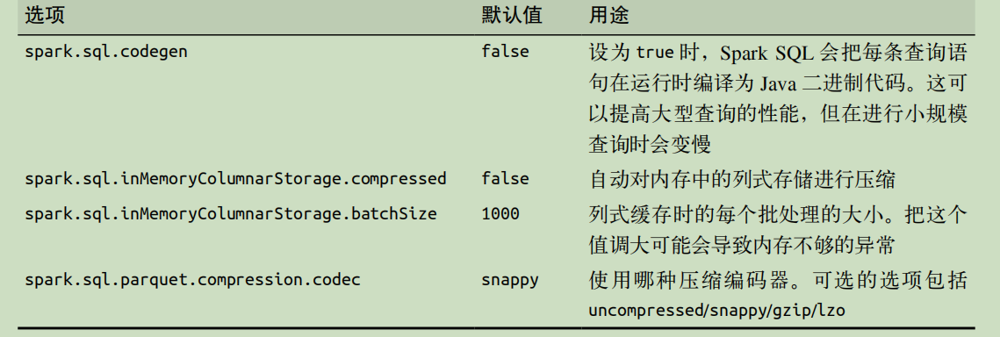

# 第九章 spark sql
- 概述
  - 定义:用来操作结构化和半结构化数据的接口——Spark SQL
  - SchemaRDD是存放 Row 对象的 RDD，每个 Row 对象代表一行记录,SchemaRDD 还包含记录的结构信息（即数据字段）
  - 功能：
    - 从各种结构化数据源（例如 JSON、Hive、Parquet 等）中读取数据
    - 支持在 Spark 程序内使用 SQL 语句进行数据查询，也支持从类似商业智能软件 Tableau 这样的外部工具中通过标准数据库连接器（JDBC/ODBC）连接 Spark SQL 进行查询
    - Spark SQL 支持 SQL 与常规的 Python/Java/Scala 代码高度整合，包括连接 RDD 与 SQL 表、公开的自定义 SQL 函数接口等
- 连接spark sql
  - 引入依赖
  - 程序中初始化入口
- 在应用中使用spark sql
  - 创建入口对象
  - 基本查询
  - SchemaRDD/dataframe
    - 由 Row 对象组成的 RDD，附带包含每列数据类型的结构信息
    - 使用row对象
  - 缓存，cashtable: 在storage界面中呈现
- 读取和存取数据
  - 概述
    - 可以只扫描需要用到的字段
    - 中通过指定结构信息，将常规的 RDD 转化为SchemaRDD
  - hive 
    - Spark SQL 支持任何 Hive 支持的存储格式（SerDe）
  - Parquet:种流行的列式存储格式
  - JSON
  - 基于RDD
  - JDBC/ODBC服务器
    - 与 Hive 中的 HiveServer2 相一致。由于使用了 Thrift 通信协议
    - 使用Beeline
    - 长生命周期的表与查询,要注册该数据表并对其运行 CACHE 命令，就可以利用缓存了
- 用户自定义函数
  - Spark SQL UDF
  - Hive UDF
- Spark SQL性能
  - 以利用其对类型的了解来高效地表示数据,使用内存式的列式存储。这不仅仅节约了缓存的空间，而且尽可能地减少了后续查询中针对某几个字段查询时的数据读取
  - 谓词下推可以让 Spark SQL 将查询中的一些部分工作“下移”到查询引擎上
  - 性能调优选项
    - 
    - spark.sql.inMemoryColumnarStorage.batchSize:
      - Spark SQL 会按照这个选项制定的大小（默认值是 1000）把记录分组，然后分批压缩
      - 太小的批处理大小会导致压缩比过低，而批处理大小过大的话，比如当每个批次处理的数据超过内存所能容纳的大小时，也有可能会引发问题
      - 默认的批处理大小是比较合适的，因为压缩超过 1000 条记录时也基本无法获得更高的压缩比了
    - spark.sql.files.maxPartitionBytes:128M
      - 单个分区的最大字节数
    - spark.sql.files.openCostInBytes：4M
      - 打开文件的预估计成本，以同时扫描的字节数来衡量。将多个文件放入一个分区时使用此功能
    - spark.sql._broadcastTimeout_:300s
      - 广播连接中广播等待时间的超时（以秒为单位）
    - spark.sql.shuffle.partitions:200
      - 配置在混洗数据以进行联接或聚合时要使用的分区数
    - spark.sql.autoBroadcastJoinThreshold:10MB
      - 配置执行join联接时将广播到所有工作节点的表的最大大小（以字节为单位）。通过将此值设置为 -1 可以禁用广播
    - spark.sql.sources.parallelPartitionDiscovery.threshold:32
      - 配置阈值以启用作业输入路径的并行列表。如果输入路径的数量大于此阈值，Spark 将使用 Spark 分布式作业列出文件。否则，它将退回到顺序列表
    - spark.sql.sources.parallelPartitionDiscovery.parallelism:10000
      - 配置作业输入路径的最大列表并行度。如果输入路径的数量大于该值，则会限制使用该值
  - SQL查询的join策略提示
    - BROADCAST > MERGE > SHUFFLE_HASH > SHUFFLE_REPLICATE_NL
    - BROADCAST：广播hash，又称 map_side_only_join
    - shuffle sort merge: 分区完，对分区内的key值排序
    - SHUFFLE_HASH merge join:对两张表用相同的分区算法和分区数进行分区，确保hash值一样的的数据被分发到同一个executor
    - SHUFFLE_REPLICATE_NL:没有指定join 等值条件，笛卡尔积
  - SQL查询的coalesce 合并提示
    - coalesce, repartition and repartitionByRange REBALANCE
    - /*+ hint [ , ... ] */
    - SELECT /*+ COALESCE(3) */ * FROM t;
  - Adaptive Query Execution:AQE自适应查询
    - 自 Apache Spark 3.2.0 起默认启用
    - spark.sql.adaptive.enabledSpark SQL
    - 从 Spark 3.0 开始，AQE 具有三个主要功能：包括合并 post-shuffle 分区、将排序合并连接sort-merge join转换为broadcast广播连接以及倾斜连接优化
  - 合并post-shuffle 分区
    - spark.sql.adaptive.enabled：3.0.0
    - spark.sql.adaptive.coalescePartitions.enabled
      - Spark 将根据目标大小（由 指定spark.sql.adaptive.advisoryPartitionSizeInBytes）合并连续的 shuffle 分区，以避免过多的小任务
    - spark.sql.adaptive.coalescePartitions.parallelismFirst
      - Spark 在合并连续的 shuffle 分区时会忽略指定的目标大小，并且仅遵循指定的最小分区大小
    - spark.sql.adaptive.coalescePartitions.minPartitionSize：10M
      - 合并后 shuffle 分区的最小大小。它的值最多可以是spark.sql.adaptive.advisoryPartitionSizeInBytes的 20%
    - spark.sql.adaptive.coalescePartitions.initialPartitionNum
      - 合并之前洗牌分区的初始数量。如果未设置，则等于spark.sql.shuffle.partitions
    - Spark.sql.adaptive.advisoryPartitionSizeInBytes:64M
      - 自适应优化期间（当为 true 时）随机分区的建议大小
  - 排序合并连接sort-merge join转换为broadcast广播连接
    - spark.sql.adaptive.maxShuffledHashJoinLocalMapThreshold
    - 当所有post shuffle分区都小于阈值时，AQE将sort-merge join转换为shuffled hash join
  - Optimizing Skew Join优化数据倾斜
    - 此功能通过将倾斜任务拆分（并根据需要进行复制）为大小大致均匀的任务，动态处理排序合并连接中的倾斜
    - spark.sql.adaptive.skewJoin.enabled：
    - spark.sql.adaptive.skewJoin.skewedPartitionFactor：5
      - 如果分区的大小大于此因子乘以中值分区大小并且也大于下面参数设置的大小，则分区被视为倾斜
    - spark.sql.adaptive.skewJoin.skewedPartitionThresholdInBytes：256M
      - 数据倾斜判断阈值
