# 第一章 总述
体系架构图 
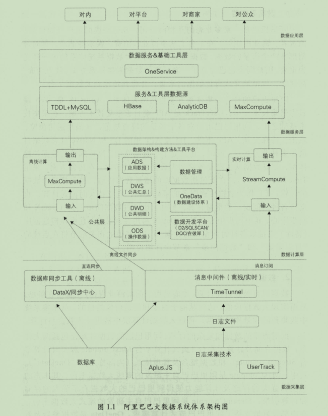
- 数据采集层
  - web端日志采集计数：Aplus.JS;app端日志采集：UserTrack;
  - 面向各个场景埋点，满足通用浏览，点击，特殊交互，APP实践，H5和app里H5和Native日志数据打通的业务场景
  - 使用TimeTunnel：数据库的增量数据传输，包括日志数据的传输
  - 数据同步工具DataX
- 数据计算曾
  - 离线计算平台
  - 实时计算平台
  - 数据整合和管理体现
  - 数据加工链路
    - 操作数据层ODS，明细数据层DWD，汇总数据层DWS，应用数据层ADS
- 数据服务层
  - 以数据仓库整合计算好的数据作为数据源，对外通过接口的方式提供数据服务：数据查询，复杂数据查询（用户识别，用户画像），实时数据推送
- 数据应用层

# 第一篇
## 第二章 日志采集
- 浏览器的页面日志采集
  - 页面浏览/展现日志采集
    - PV页面浏览量，UV访客数
    - 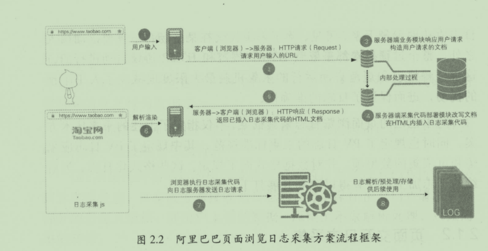
    - 客户端日志采集：由植入页面HTML文档的jsp脚本执行，可以在业务服务器响应业务请求时动态执行；也可以开发页面时，由开发人员手动植入
    - 客户端日志发送：将采集到的数据发送到日志服务器
    - 服务端日志收集：写入日志缓冲区
    - 服务端日志解析存档：日志处理程序顺序读出并按照约定的日志处理逻辑解析
  - 页面交互日志采集
    - 高度自定义的业务特征
    - 用技术服务的形式
      - 注册需要采集交互日志的业务，具体的业务场景以及场景下的具体交互采集点
      - 植入目标也买你
      - 采集代码与因为u互动响应代码一起被触发和执行
      - 发送日志
  - 页面日志的服务器端清洗和预处理
    - 识别流量攻击，网络爬虫和流量作弊
    - 数据去向补正：如身份信息回补
    - 无效数据剔除
    - 日志隔离分发
- 无线客户端的日志采集
  - 目的：分析设备分析，了解用户信息，行为
  - 工具：名为UserTrack的SDK
    - 事件：日志行为的最小单位
  - 页面事件（页面浏览行为）
    - 设备和用户的基本信息
    - 被访问页面的信息
    - 访问基本路径
    - UT的手动模式埋点
      - 提供两个接口，分别在页面展现和页面退出的时候调用
      - 页面扩展信息的接口
      - UT可以实现页面事件的无痕埋点：即无需开发者任何编码即可实现
    - 离开时发送日志：准确知道页面的停留时长
    - 透传参数：当前页面的信息，传递到下一个页面的日志中
      - 使用SPM（超级位置模型）来追踪来源去向，可以稀松还原用户行为路径
  - 控件点击和其他事件
    - 高度自定义的业务特征
    - 记录基本的设备信息，用户信息；+ 控件所在页面名称，控件名称，控件的业务参数。只需要把相关基础信息告诉采集SDK
    - 其他事件：根据业务，自定义事件来采集相关信息
    - 自动捕获应用崩溃，与业务信息不是非常相关的时候，不用开发者触发埋点
  - 特殊场景
    - 每个曝光的元素一般属于一个页面，利用页面的生命周期来实现实弹的聚合及确定发送时机
    - 平衡日志大小，减小流量消耗，采集服务器压力，网络传输压力等
    - 回退行为的识别
  - H5和Native日志统一
    - 既有Native和H5页面，Hybrid app
    - 互跳导致：数据丢失严重，多端的数据隔离，多样的数据口径整理分析和解释
    - 方案：两种日志归一，阿里选择Native部署采集SDK
      - 可以采集更多设备相关数据
      - 待机SDK处理日志，可以先本地缓存然后借机上传。将H5日志归到Native日志
      - 浏览器采集jsp,WebView框架提供接口,客户端采集SDK
  - 设备标识
    - 设备厂商和用户逐渐加强隐私意识，设备唯一标识很难获得，但对多APP的公司来说很重要
  - 日志传输
    - 上传：先存储在客户端本地，然后伺机上传，考虑日志的大小和合理性
    - 存储：切分维度为天，对日志进行分流
- 挑战
  - 实现日志数据的结构化和规范化组织；实现更为高效的下游统计计算
  - 场景
    - 日志分流，定制处理：通过尽可能靠前地布置路由差异，就可以尽可能早地进行分流，降低日志处理过程中 的分支判断消耗
    - 采集与计算一体化设计：两套日志规范和与之对应的元数据中 。
  - 大促保障
    - 全链路保障
    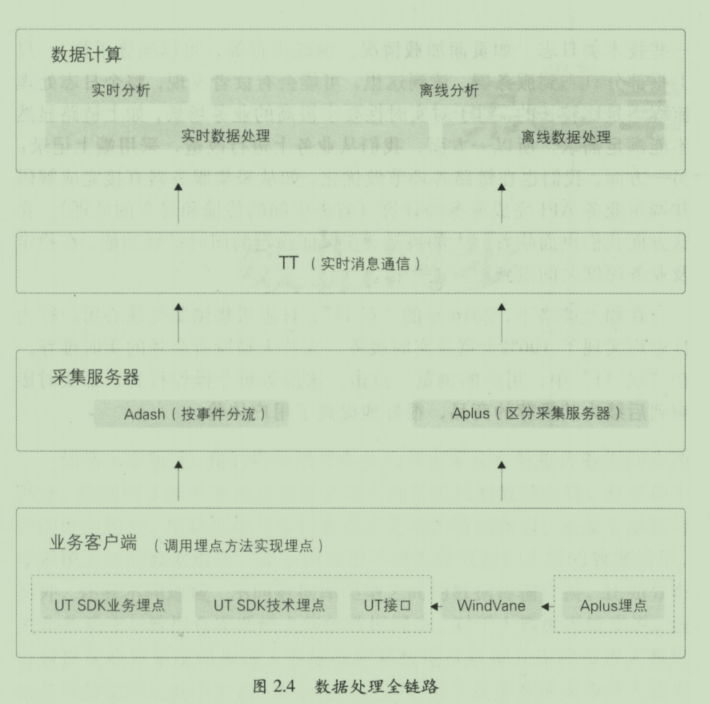

## 第三章 数据同步
- 数据同步基础
  - 直连同步
    - 定义：定义好的接口API和基于动态链接库的方式直接连接业务库，如ODBC/JDBC
    - 特点：配置简单，实现容易，适合操作性业务系统的数据同步
    - 性能影响大，大批量数据同步会严重影响性能。主备策略时，可以从备库抽取数据
  - 数据文件同步
    - 由专门的文件服务器，如FTP服务器传输到目标系统，加载到目标数据库系统中
    - 适合多个异构的数据库系统，日志类数据
    - 校验文件，防止丢包，错误
  - 数据库日志解析同步
    - 解析日志文件获取发生变更的数据
    - 读取日志文件，收集数据信息，数据文件传输到目标系统，加载数据
    - 问题：数据延迟，投入较大，数据漂移和遗漏
- 阿里的数据仓同步方式
  - 特点：
    - 数据来源的多样性
    - 数据量很大，阿里达到EB级别
  - 批量数据同步
    - 将各类数据库系统的数据类型同一转换位字符串类型的方式，实现数据格式的统一
    - DataX:分布式模式，3小时完成2PB
      - Framework 处理缓冲、流程控制、并发、上下文加载等高速数据交换的大部分技术问题，提供简单的接口与插件接人
      - 插件仅需实现对数据处理系统的访问，编写方便
  - 实时数据同步
    - 解析 MySQL binlog日志来实时获得增量的数据更新，并通过消息订阅模式来实现数据的实时同步的
    - TimeTunnel:基于生产者、消费者和 Topic 消息标识的消息中间件，将消息数据持久化到 HBase 的高可用、分布式数据交互系统。
- 遇到的问题和解决方案
  - 分库分表
    - 分布式表：通过建立中间状态的逻辑表来统一分库分表的访问
    - 持久层框架之下、 DB 驱动之上的中间件
  - 高效同步和批量同步
    - OneClick
      - 自动获得元数据信息和配置信息
      - 建表，配置任务，发布，测试操作一键化处理，封装程web接口
  - 增量和全量同步的合并
    - 全量改同步新变更的增量数据
    - 使用merge方式，但大数据平台一般不支持update操作
    - 全外连接+数据全量覆盖重新加载。数据更新错误问题：分区方式
  - 同步性能的处理
    - 负载均衡：通过目标数据库的元数据估算同步任务的总线程数
  - 数据飘逸的处理
    - 更新时间，日志更新时间，业务发生时间，处理数据时间
    - 方法：
      - 多取后一天数据
      - 多个字段限制时间获取准确数据
        - 根据log_time冗余后一天15min的数据，用modified_time 过滤非当天数据，然后用全外连接回补数据

## 第四章 离线数据开发
- 数据开发平台
  - 统一计算平台MaxCompute
    - 体系架构
    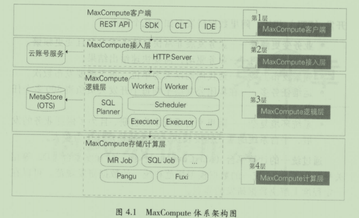
    - 特点
      - 计算性能高，集群规模大，稳定性高，功能组件强大，安全性高
  - 统一开发平台
    - 在云端D2：任务开发、调试及发布，生产任务调度及大数据运维数据权限申请及管理
    - SQLscan:代码检查，SQL检查
    - DQC：数据质量中心：数据监控，数据清洗
    - 在彼岸：功能测试：新增业务需求，数据迁移，重构和修改
      - 组件：数据对比，数据分布，数据脱敏：模糊化
  - 任务调度系统
    - 背景：任务互相依赖，传统的crontab基于时间不能满足
    - 介绍：
      - 开发后，同通过调度系统按顺序执行
      - 核心模块：调度引擎，执行引擎
      - 任务状态机模型
      - 工作流状态机模型
      - 调度引擎工作原理
        - 以事件驱动的方式运行，为数据任务节点生成实例，并在调度树中生成具体执行的工作流
      - 执行引擎工作原理：资源调配，上下文环境
      - 执行引擎用法
    - 特点和应用
      - 调度配置
      - 定时调度
      - 周期调度
      - 手动执行
      - 补数据
      - 基线管理
      - 监控报警

## 第五章 实时计数
- 简介
  - 流式实时处理技术
  - 时效性：离线，准实时，实时
  - 时效性高，常驻任务，性能要求高，应用局限性
- 流式技术架构
  - 数据采集-数据处理-数据存储-数据服务
  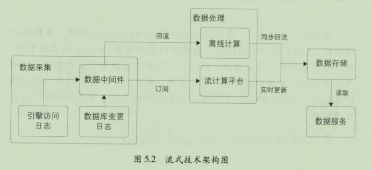
  - 数据采集
    - 数据种类：数据库变更日志，引擎访问日志
    - 采集原则：数据大小限制，时间阈值限制
    - 数据中间件：kafka,TimeTunnel
    - 消息系统，延时毫秒级别，但吞吐量低
  - 数据处理
    - 常用：storm，spark streaming，flink
    - 用Stream SQL
    - 典型问题
      - 去重指标
        - 精确去重，数据倾斜，保存明细数据，将一个节点的内存压力分发到多个节点
        - 模糊去重：
        - 布隆过滤器：位数组算法，不保存真实的明细数据，保存明细数据对应的哈希值标记位，误差率可控，使用精度不高，维度值很多
        - 基数统计：利用哈希：按照数据的分散程度估算现有数集的边界；精度要求不高，统计维度粒度很粗，如天粒度
  - 数据倾斜
    - 去重指标分桶：对去重值进行分桶HASH
    - 非去重指标分桶:数据随机分发，汇总
  - 事务处理
    - 原因：系统的不稳定性，导致数据处理失败，如网络抖动，机器重启，数据丢失
    - 超时时间
    - 事务信息
    - 备份机制
    - 保证数据的幂等性
  - 数据存储
    - 中间计算结果
    - 最终的结果数据
    - 维表数据
    - 数据库：支持多并发读写，满足实时的性能要求，一般使用HBase等列式存储系统
    - 经验：
      - 表名设计：汇总层标识＋数据域＋主维度＋时间维度；如：dws_trd_slr_dtr
      - rowkey设计：MD5 ＋主维度＋维度标识＋子维度 ＋时间维度＋子维度2
  - 数据服务
    - 如OneService
    - 不直连数据库
    - 屏蔽底层取数逻辑
    - 屏蔽存储系统差异
- 流式数据模型
  - 数据分层
    - ODS：操作数据层，聪业务系统采集的原始数据
    - DWD：根据业务过程建模出来的实时事实明细层
    - DWS：计算各个维度的汇总指标
    - ADS：个性化维度汇总层，不通用的
    - DIM:离线维表层中导出的
    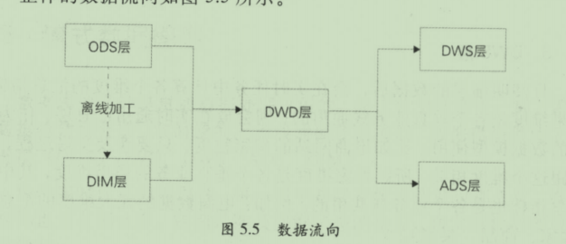
    - 更具重要性优先级，分配计算和存储资源
  - 多流关联
    - 两个实时流关联，问题，数据的到达是增量过程，到达时间是不确定和无序的，涉及中间状态的保存和恢复机制
    - 相互等待，直到关联成功
    - 备份到外部存储系统，任务重启是，可以恢复内存数据
  - 维表使用：使用当前的实时数据（ ）去关联 T-2 的维表数据
    - 数据无法及时准备好
    - 无法准确获取全量最新的数据
    - 数据的无序性
    - 维表的使用方式
      - 全量加载
      - 增量加载：LRU过期
- 大促挑战&保障
  - 特征
    - 毫秒级延时
    - 洪峰明显
    - 高保障性
    - 公关特性
  - 大促保障
    - 实时任务优化
      - 独占资源和共享资源的策略
      - 合理选择缓存机制，尽量降低读写库次数
      - 计算单元合并，降低拓扑层级
      - 内存对象共享，避免字符拷贝
      - 在高吞吐量和低延时间取平衡
    - 如何进行数据链路保障
      - 多链路搭建，多机房容灾，甚至异地容灾
      - 比对多链路计算的结果数据，一键切换到备链路
    - 如何进行压测
      - 数据压测：蓄洪压测
      - 产品压测：产品本身压测，前端页面稳定性测试

## 第六章 数据服务
- 服务架构演进
  - DWSOA: 需求驱动：一个需求开发一个或者几个接口，通过SOA的方式暴露 
  - Open API: 将数据按照统计粒度进行聚合，同样维度的数据，形成一张逻辑表
  - SmartDQ:使用标准SQL语法，使用ORM对象关系映射框架封装标准dataSource.使用逻辑表层，只用变更物理字段的映射，即可完成字段变更
  - 统一的数据服务层：OneService
    - Lego:插件化开发，Docker隔离
    - WebSocker和 long polling:实时数据服务IPUSH
    - uTiming：即时任务和定时任务
- 技术架构
  - SmartDQ
    - 元数据模型：逻辑表到物理表的映射
      - 数据源，物理表，逻辑表，主题
    - 架构图
      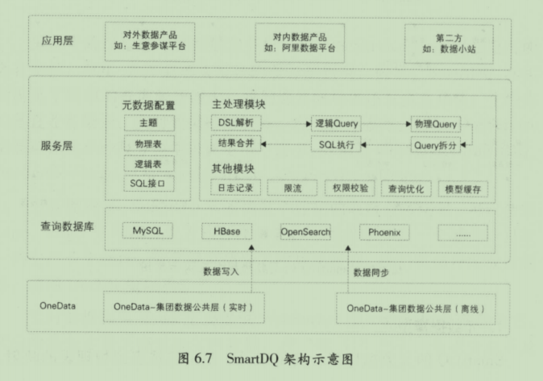
      - 查询数据库实时公共层的九三作业，同步作业公共层的离线数据
      - 服务层:
        - 元数据配置：物理表和逻辑表的映射关系
        - 主处理模块：一次查询聪开始到返回，DSL解析，逻辑Query构建，物理Query构建，Query拆分，SQL执行，结果合并
        - 其他模块
  - iPush
    - 消息源：TT,MetaQ
    - 定制过滤规则，向消息中间件推送
    - 基于高性能异步事件驱动模型的网络通信框架Netty 4
  - Lego
    - 中高度定制化数据查询需求，支持差劲啊
    - 提供日志，服务注册，Diamond配置监听，鉴权，数据源管理
  - uTiming
    - 云端的任务调用，批量数据处理服务，支持用户识别，用户画像，人群圈选服务的离线计算
    - 调度执行 SQL 或特定配置的离线任务
- 最佳实践
  - 性能
    - 资源分配
      - 剥离计算资源，由底层的数据公共层计算
      - 查询资源分配：get线程池，和list线程池
      - 执行计划优化：查询拆分，查询优化list转换为get
    - 缓存优化
      - 元数据缓存：减少元数据调用的性能算好
      - 模型缓存：将解析后的模型缓存（逻辑模型，物理模型）
      - 结果缓存：
    - 查询能力
      - 合并查询：实时+离线，优先用离线，replace语法
      - 推送服务：避免轮询导致资源浪费，有新数据自动通知
  - 稳定性
    - 发布系统
      - 元数据隔离：日常，预发，线上环境
      - 隔离发布：资源划分，资源独占，增量更新
    - 隔离
      - 机房隔离 
      - 分组隔离
    - 安全限制
      - 最大返回记录数，必传字段，超时实践
    - 监控
      - 调用日志采集
      - 调用监控
    - 限流，降级
      - 限流“QPS保护
      - 降级：限流防止故障扩散，修改元数据让访问失败

## 第七章 数据挖掘
- 概述
  - 面向机器学习算法的并行计算框架和算法平台
  - 面向企业级数据挖掘的算法资产管理体系
- 数据挖掘算法平台
  - 数据量上亿，特征维度上百万
  - 支持海量样本的高维特征训练——计算框架mapreduce,mpi,spark
    - 算法平台继承了机器学习算法，包括：分类，聚类算法，协同过滤，PageRank
- 数据挖掘中台体系
  - 过程：商业理解，数据准备，特征工参，模型训练，模型测试，模型部署，线上应用，效果反馈
  - 将一些通用的技术集成形成中台技术体系
  - 场景
    - 个体挖掘应用：对单个实体的行为特征进行预测和分析
    - 关系挖掘应用：研究多个实体间的关系特征
    - 数据中台，算法中台
  - 挖掘数据中台
    - 特征数据：算法需要的特征变量。结果数据：预测结果
    - 分层：特征层FDM，中间层和应用层ADM：个体中间层IDM,关系中间层RDM
    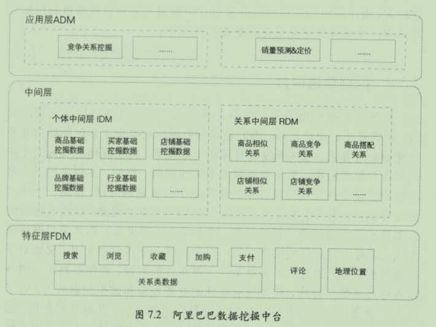
  - 挖掘算法中台
    - 算法原理不难，但结合实际的业务有比较多困难。抽象出对应的方法论和实操模板
    - 场景：消费者画像，业务指标预测。相似关系与竞争关系
- 案例
  - 用户画像
    - 定义: 给用户打标签，如年龄，性别，职业，商品品牌偏好
    - 基础属性，购物偏好，社交关系，财富属性
    - 获取女装描绘词库，根据词语权重去掉无效的停用词
    - 汇聚行为，行为有不同的强度，得到买家风格的偏好程度
  - 互联网反作弊
    - 账户/资金安全与网络欺诈防控
    - 非人行为和账户识别
    - 虚假订单和信用炒作识别
    - 广告推广与APP安装反作弊
    - UGC恶意信息检测
    - 方法
      - 基于业务规则的方法
      - 基于有监督学习的方法：类不平衡
      - 基于无监督学习的方法：异常检测算法
      - 离线反作弊系统
      - 实时反作弊系统

# 第二篇 数据模型

## 大数据领域建模综述
- 为什么要建模
  - 数据模型是数据组织和存储方法，强调从业务，数据存取和使用角度合理存储数据
  - 好处：性能，成本，效率，质量
- 关系数据库系统和数据仓库
  - 数据仓库系统依然依赖关系数据库能力存储和处理数据
- 模型方法论
  - OLTP：主要数据操作：随机读写，满足3NF的实体关系模型存储数据.事务处理种解决数据冗余和一致性问题
  - OLAP：批量读写，不关注事务一致性，关注数据的整合，和一次处理复杂大数据查询和处理中的性能
- 建模方法论
  - ER模型
    - 3NF模型：用实体关系模型描述企业业务
    - 特点
      - 全面了解企业业务和数据
      - 周期长
      - 要求高
    - 阶段
      - 高层模型：高度抽象
      - 中层模型：细化主题的数据项
      - 物理模型：考虑物理存储
  - 维度模型
    - 从分析决策的需求构建模型。目的快速完成需求分析，支持大规模复杂查询的响应性能
    - 代表：星型，雪花模型
    - 步骤
      - 选择分许决策的业务过程
      - 选择粒度
      - 识别维表
      - 选择事实：需要衡量分析的指标
  - DATA vault模型
    - 数据的整合，但不能直接用于数据分析决策，建立一个可审计的基础数据层
    - 组成
      - hub：业务核心实体
      - link: 关系
      - satellite:hub的详细描述内容
  - Anchor模型
    - 对DATA vault进一步规范
- 实践综述
  - 阶段
    - 应用驱动
    - ER+维度模型，
    - 维度建模：公共层模型数据架构体系

## 第九章 阿里数据整合和管理体系
- 概述：从业务架构设计到模型设计，从数据研发到数据服务，做到数据可管理，可追溯，可规避重复建设
  - 定位和价值：统一，规范化的数据接入层和数据中间层，提供标准化的，共享的数据服务能力，降低数据互通成本
  - 体系架构：
    - 业务板块：
    - 规范定义：数据规范命名体系
    - 模型设计：维度建模理论，基于维度建模总线架构
- 规范定义
  - 定义：构建总线矩阵，划分和定义数据，业务过程，维度，度量/原子指标，修饰类型，修饰词，时间周期，派生指标
  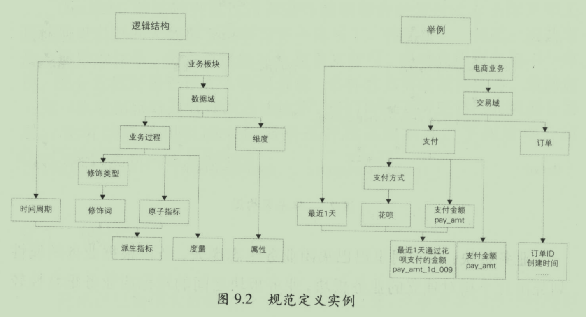
  - 名词术语
  - 指标体系：组成体系
    - 基本原则：
      - 组成体系之间的关系：派生指标
      - 命名约定：命名所用术语，业务过程，原子指标：动作+度量，修改词
      - 算法：概述，距离，SQL算法说明
    - 操作细则
      - 派生指标的种类：事务性指标，存量型指标和复合型指标
      - 复合型指标的规则：比率型，比例型，变化量型，变化率型统计型，排名型，对象集合型
    - 其他规则
      - 上下层级派生指标同时存在
      - 父子关系原子指标存在时
- 模型设计
  - 指导理论：维度建模理论为基础，基于维度数据模型总线架构，构建一致性的维度和事实
  - 模型层次：ODS操作数据层，CDM公共维度模型层：DWD明细数据层和DWS汇聚数据层，ADS应用数据层
    - ODS，数据无处理：同步，结构化，累计历史，清洗
    - CDM：存放明细事实数据，维表数据和公共指标挥动数据，
      - 维度退化到事实表中，减少事实表和维表的关联
      - 更多的宽表化手段构建CDM，提升公共指标的复用性，减少加工
    - ADS：个性化统计指标数据，由CDM与ODS加工生成
      - 不公用性，复杂性（指数型，比值型，排名型指标）
      - 基于引用的数据组装：大宽表集市，横表转纵表，趋势指标串
  - 基本原则
    - 高内聚和低耦合：将业务相近或者相关，粒度相同的数据设计为一个逻辑或者物理模型；及那个高概率同时访问的数据放在一起，将低概率同时访问的数据分开存储
    - 核心模型和扩展模型分离：核心：常用，扩展：个性化
    - 公共处理逻辑下沉和单一：
    - 成本和性能平衡
    - 数据可回滚
    - 一致性：相同含义的字段命名相同，规范命名
    - 命名清晰，可理解
- 模型实施
  - 业界常用模型实施
    - Kimball模型实施
      - 高层设计：高层维度模型图，定义业务过程维度模型范围，提供每种星型模式的技术和功能描述
      - 详细模型：为每个星型模型添加属性和度量信息
      - 模型审查，在设计，验证
      - 提交ETL设计和开发
    - Inmon模型实施过程
      - 通往数据仓库其他部分的智能路线图
      - ERD层：实体关系图，迷哦奥数业务中共的实体和主题域以及它们之间的关系
      - DIS：数据项集层：数据模型中的关键字，属性和细节数据之间的关系
      - 物理层：数据模型的物理特性
    - 其他模型
      - 业务建模
      - 领域建模
      - 逻辑建模
      - 物理建模
  - OneData实施过程
    - 方针：业务调研和需求分析；总体架构设计，数据域划分；维度建模，抽象业务过程和维度；抽象出指标体系
    - 实施工作流
      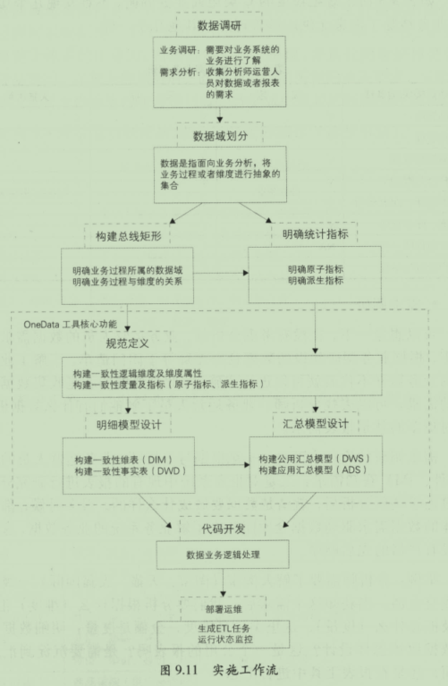
      - 数据调研：业务调研，需求调研
        - 获知需求，分析根据什么维度汇总，汇总什么（类目是维度，金额是度量），明细数据和汇总数据应该怎么设计，是一个公用的报表吗，需要沉淀到汇总表吗，还是在报表工具中汇总
      - 架构设计
        - 数据域划分，将业务过程概括为一个个不可拆分的行为事件，将业务过程或者维度进行抽象的集合
        - 构建总线矩阵：明确每个数据域下有那些业务过程，业务过程与那些维度相关
      - 规范定义：指标体系
      - 模型设计：维度和属性的规范定义
      - 总结：螺旋式实施

## 维度设计
- 设计基础
  - 基本概念
    - 将度量称为事实，将环境描述为维度，维度是用来分析事实所需要的多样环境
    - 维度表所包含的列，称为维度属性：查询约束条件，分组，报表标签生成的基本来源
    - 维度使用主键标识唯一性：代理键，没有业务意义；自然键，有业务意义
  - 设计方法
    - 选择维度或新建维度：必须保证维度的唯一性
    - 确定主维表：一般是ODS表，直接与业务系统同步
    - 确定相关维表
    - 确定维度属性：主维表选择维度属性或生成新的维度属性；从相关维表中选择维度属性或生成新的维度属性
      - 尽可能丰富的维度属性
      - 有意义的文字描述
      - 区分数值型属性和事实
        - 维度属性：查询约束条件或分组统计
        - 事实：度量的计算，如商品价格
      - 沉淀通用的维度属性
  - 维度的层级结构
    - 维度中的一些描述属性以层次方式或一对多的方式相互关联
    - 行业》类目》商品
  - 规范化和反规范化
    - 雪花模式：属性层次被实例化为一系列维度，而不是单一的维度
    - OLTP中使用规范化处理将重复性属性移至其自身所属的表中，删除冗余数据
      - 有效避免数据冗余导致的不一致性
    - 反规范化：将维度的属性层次合并到单个维度中
      - OLAP中主要伟良数据分析和统计，大宽表更方便用户进行统计分析，避免达赖给你关联导致查询性能很差
      - 采用雪花模式，对OLAP只是节约了部分存储，但存储成本低，所以一般是不规范化的
  - 一致性维度和交叉维度
    - 通过构建企业范围内一致性维度和事实来构建总线架构
    - 交叉探查：将不同数据域的商品的事实合并在一起进行数据探查
      - 不一致的问题：维度格式和内容不一致
    - 维度一致的表现
      - 共享维表
      - 一致性上卷：类目的维度属性是商品维度的子集
      - 交叉属性：两个维度有部分相同的维度属性
- 维度设计高级主题
  - 维度整合
    - 数据仓库是一个面向主题的，集成的，非易失的且随时间变化的数据集合
    - 集成：将面向应用的数据转换为面向主题的数据仓库数据
      - 命名规范统一，字段类型统一，公共代码和代码值统一，业务含义相同的表的统一
      - 主从表， 直接合并， 不合并
    - 表级别整合
      - 垂直整合：不同的来源表包含相同的数据集，条数变多
      - 水平整合：不同的来源表包含不同的数据集，列数变多；
        - 存在交叉，需要去重；自然键是否存在冲突，设置超自然键，联合各个子集的自然键
  - 水平拆分
    - 可以按照类别或类型细分
    - 设计维度
      - 主维度保存公共属性，不同分类实例化为不同的维度
      - 维护单一的维度，包含所有可能的属性
    - 原则
      - 扩展性
      - 效能
      - 易用性
    - 水平拆分的依据
      - 维度不同分类的属性差异情况；差异较大时
      - 业务的关联程度；相关性较低的业务
  - 垂直拆分
    - 主从维度：主维表：存放稳定，产出时间早，热度高的属性；从维表：变化较快，产出时间完，热度低
    - 通过存储的冗余和计算成本的鞥加，实现了商品主模型的稳定和产出时间的提前
  - 历史归档
    - 借用前台数据库的归档策略，定期将历史数据归档到历史维表
    - 策略
      - 同前台归档策略；适合逻辑简单，变更不频繁
      - 同前台对党策略，采用数据库变更日志的方式
      - 自定义归档策略
- 维度变化
  - 缓慢变化维
    - 重写维度值：不保留历史数据，取最新数据
    - 插入新的维度行：保留历史数据，不能归一为一个维度
    - 添加维度列：
  - 快照维表
    - 生成全局唯一的代理键难度大；代理键回大大增加ETL的复杂性
    - 快照处理缓慢变化堆；每天保留一份全量快照数据
      - 优点：简单有效，泛白你理解性好
      - 缺点：存储的极大浪费
  - 极限存储
    - 历史拉链存储：缓慢变化维的插入新的维度行，新增两个时间戳字段，将以天为粒度的变更数据记录下来，时间戳是分区键
    - 有理解门槛，分区数量会极度膨胀
    - 方式
      - 透明化：底层数据历史拉链存储，上层做一个视图操作或者在hive里做一个hook
      - 分月做历史拉链表；每个月月初重新开始做历史拉链表
    - 生产中的处理：产出效率低：t-2
      - 前置全量存储表，仅保留最近一段时间的全量分区数据
      - 对变化频繁的字段过滤
  - 微型维度
    - 将一部分不稳定的属性从主维度中移出，放在子集代理键的新表
    - 星形模式：分离变化快的维度属性
    - 不使用的原因
      - 局限性：事先用所有可能值组合加载
      - ETL逻辑复杂
      - 破坏维度的可浏览性
- 特殊维度
  - 递归层次
    - 定义：某维度的实例值的层次关系，如淘宝类目体系
    - 分类：均衡层次结构：固定数量级别。非均衡层次结构：数量级别不固定
    - 递归获得符类目为xx的所有叶子类目
      - 物理实现：递归SQL
    - 参差结构扁平化
      - 解决问题：回填
    - 层次桥接表
      - 父类目id，子类目id,类目层级间隔
  - 行为维度
    - 和事实有关，如交易，物流等
    - 分类
      - 另一个维度的过去行为
      - 快照事实行为维度
      - 分组事实行为维度
      - 复杂逻辑事实行为维度
    - 处理
      - 冗余大现有的维表
      - 加工成单独的维表
      - 原则
        - 避免维度过快增长
        - 避免耦合度过高
  - 多值维度
    - 事实表的一条记录在维表中有多条记录与之对应
    - 处理
      - 降低事实表的粒度
      - 采用多字段
      - 桥接表：灵活，扩展性好，但逻辑复杂，开发和维护成本高，有双重计算的风险
  - 多值属性
    - 某个属性字段同时有多个值
    - 处理
      - 维持维度主键不变，多值属性放在维度的一个属性字段中
      - 维持维度主机那不变，多值属性放在多个属性字段中
      - 主键变化，一个维度值放多条记录
  - 杂项维度
    - 操作型系统中的指示符或者标志字段组合成的
    - 将这些字段建立到一个维表中，事实表值放一个外键
    - ETL会变复杂，会用到代理键

## 第十一章 事实表设计
- 事实表基础
  - 特性
    - 定义：用相关度量来表达有业务过程，包含引用的维度和业务相关的度量
    - 粒度：维度属性组合所表示的细节程度；具体业务含义
    - 数值类型
      - 可加型：可以按照事实表关联的任意维度胡总
      - 半可加型：特定维度汇总
      - 不可加型
    - 事实表类型：事务事实表，周期快照事实表，累积快照事实表
  - 设计原则
    - 尽可能包含所有与业务过程相关的事实
    - 只选择与业务过程相关的事实
    - 分解不可加性事实为可加组件
    - 选择维度和事实之前需前声明粒度
    - 在同一个事实表中不能有多种不同粒度
    - 事实的单位要保持一致
    - 对事实的null值处理
    - 使用退化维度提高事实表的易用性
  - 事实表设计方法
    - 选择业务过程确定事实表类型：业务过程可以一个或多个
    - 声明粒度：尽量用最细的粒度，如父子订单
    - 确定维度：
    - 确定事实
    - 冗余维度：方便下游使用，减少关联
- 事务事实表
  - 设计过程
    - 选择业务过程：下单，支付，发货，成功完结
    - 确定粒度：确定事务事实表每一行所表达的细节层次，如选择子订单的粒度，物流单粒度
    - 确定维度：卖家，买家，商品，商品类目，发货地区，收获地区，父订单维度以及杂项维度
    - 确定事实：交易事务事实表：下单，支付，成功完结

      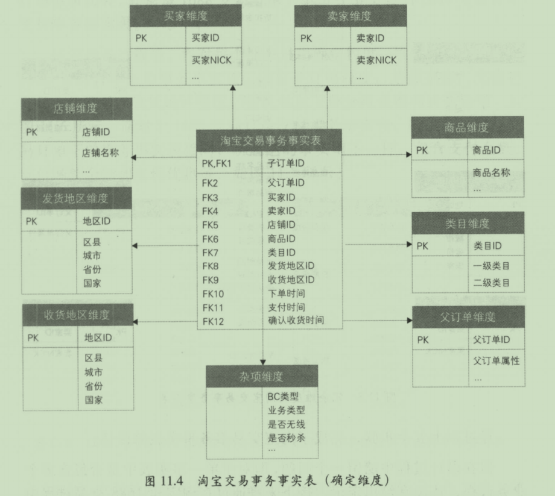
    - 冗余维度
      - 退化维度
  - 单事务事实表
    - 每个业务过程设计一个事实表：可以对每个业务过程独立的分析研究
    - 1688针对下单和支付分别建立但事务事实表
  - 多事务事实表
    - 方法处理
      - 不同业务过程的事实使用不同的事实字段进行存放
      - 不同业务过程的事实使用同一个事实字段进行妨，但增加一个业务过程标签
    - 淘宝交易事务事实表
      - 常用维度比较一致，粒度一样
      - 不是当前业务过程的度量，采用零值处理
      - 标记，是否当天，互不相干
    - 淘宝收藏商品事务事实表
      - 收藏事件类型：区分收藏还是删除
    - 多事务事实表选择
      - 度量比较相似，可以用第二种，用同一个字段
      - 差异较大，用多个字段表示，冗余，零值较多
  - 对比
    - 业务过程：相似性
    - 粒度和维度
    - 事实：单事务比较灵活
    - 下游业务使用：多事务有一定学习成本
    - 计算存储成本：多事务较少，多业务过程融合在一起
  - 父子事实的处理方式
    - 分摊父订单的金额将所有业务过程的度量带进淘宝交易事务事实表
  - 事实的设计准则
    - 事实完整性
    - 事实一致性
    - 事实可加性
- 周期快照事实表
  - 简介：在确定的间隔内对实体的度量进行抽样
  - 特性
    - 粒度以维度形式声明，稠密的，至少一个半可加性质的事实
    - 用快照采样状态
      - 间隔一个或多个维度，采样状态度量，定义快照事实表
    - 快照粒度：采样的周期，被什么采样
    - 密度和稀疏性：无论有无业务，都会记录
    - 半可加性：状态度量是半可加的，不能根据事件维度获得有意义的汇总结果
  - 实例
    - 设计步骤：确定粒度，确定状态度量
    - 混合维度的每天快照事实表：采样周期正对多个维度，周期为每天，维度是买家，卖家
      - 淘宝卖家信用分和DSR快照事实表：采用操作系统数据进行设计加工
    - 全量快照事实表
      - 方法：确定粒度，确定状态度量
  - 注意事项
    - 事务和快照成对设计
    - 附加事实：附加上一个采样周期的部分状态度量
    - 周期到日期度量
- 累计快照事实表
