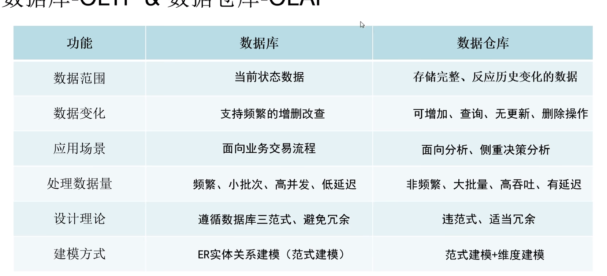
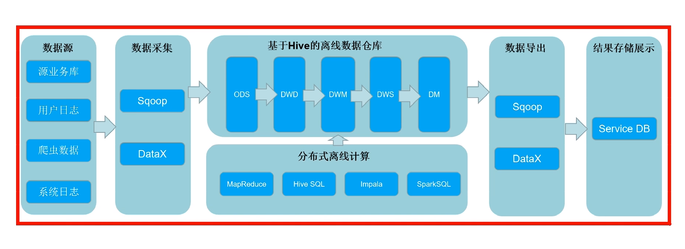
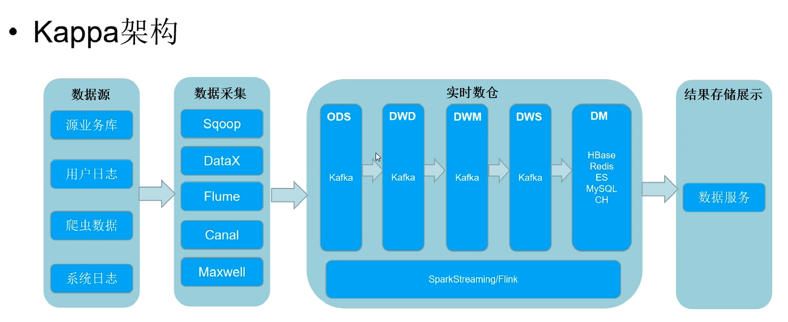
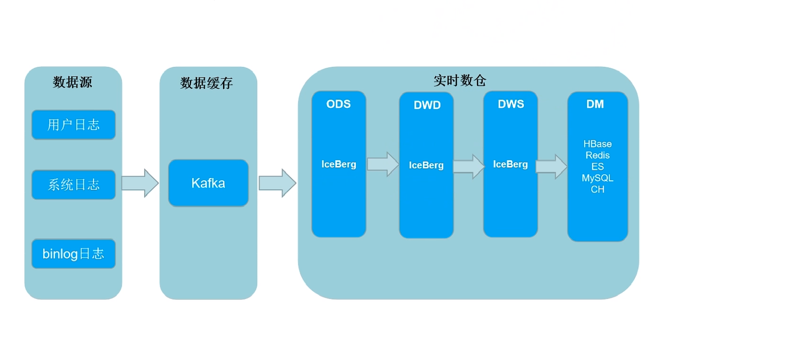

- 大数据数仓平台构建思路
  - 数据分析业务痛点分析
    - 项目数据
      - 业务系统数据-存放关系型数据库
      - 用户日志数据-用户在系统产生——用户点播歌曲日志数据
        - java的限制
          - 数据量大，日志存取
          - 关联更难
          - 实时，java 协调微服务比较困难
          - vue开发比较浪费，一般用开发工具
        - java web为什么要大数据
          - 数据存储有瓶颈
          - 数据计算有瓶颈
          - 实时场景计算有瓶颈
          - 数据挖掘有瓶颈
          - 解决数据孤岛
  - 构建数据仓库平台
    - 范式建模-ER实体关系
      - 第一范式：有主键，原子性，字段不可分
      - 第二范式：有唯一主键，非主键字段依赖主键
      - 第三范式：没有传递依赖
    - ER实体关系模型
      - 理论基础
        - 实体，属性，关系
      - 案例
        - 抽象实体
        - 找到实体之间的关系
        - 找到实体的属性
        - 画出ER关系图
        - 设计数据库表
  - 构建企业级数据仓库
    - 为什么
      - 数据存储在互不兼容的系统中
      - 关系型数据库一般不存储日志数据
      - 决策者从商业角度观察数据，关系型数据库不适合
    - 什么是数据仓库 DW
      - 面向主题的，集成的，相对稳定的，反应历史变化的数据集合
    - 发展历史
      - IBM 信息仓库：ETL，数据展示
      - 比尔-恩门
        - 自上而下：从业务需要分析
        - 问题：小表关联太多，范式建模
      - 拉尔夫-金博尔
        - 维度建模
        - 自下而上：数据集市，抽取数据，形成不同的数据集市
        - 有问题：数据不一致
      - CIF架构：企业信息工厂
        - 数仓分层：不同层采用不同建模方式
    - 维度建模
      - 事实表：维度列+度量列=fact
      - Cube开发，任意列组合
      - dim 维度表：主键唯一：缓慢变化维度
      - 模型
        - 星型模型：有数据冗余，分析效率高
        - 雪花模型：维度表，数据冗余变少，有层级结构，偏范式建模
        - 星座模型：星型模型连起来，多个事实表，共用维度表
    - 企业级数据仓库分层设计
      - ODS operational data store 操作数据层：数据抽取，集成 【范式】
        - 用于数据追溯，防止数据质量问题
      - DW data warehouse 数据仓库
        - DWD data warehouse detail 数据明细层：数据加工，清洗，保证数据质量，提供更干净的数据【范式】
        - DWM data warehouse middle 数据中间层：对通用的维度进行轻度的聚合操作，计算相应的统计指标【维度】
          - 业务简单的时候，可以不用
        - DWS data warehouse service 数据服务层：按照主题业务组织主题宽表，用于OLAP分析，汇聚多个维度【维度】事实表+维度表=宽表
          - 宽表里的字段怎么定义
      - DM data mart 数据集市层：汇总分析某一个主题域的报表数据 【维度】
    - 好处
      - 清晰的数据结构
      - 减少重复开发
      - 统一的数据出口
      - 简化问题
    - 大数据技术栈
      - 架构底层核心技能
        - JVM
        - 多线程&高并发
        - 网络通信IO
      - 数据采集体系技术
        - sqoop
        - datax
        - kettle
        - 实时数据采集
        - flume
        - maxwell
        - canal
        - nifi
      - 中间件技术栈
        - 分布式协调服务zookeeper
        - 分布式缓存redis
        - 分布式消息系统kafka
        - 分布式消息系统pulsar
        - ELK stack 数据分析
      - 分布式存储技术
        - 分布式文件系统HDFS
        - 分布式数据库HBASE
        - 分布式数据仓库HIVE
        - 数据湖技术Hudi
        - 数据胡 delta lack
        - 数据湖 iceberg
      - 数据处理技术
        - 分布式计算框架mapreduce
        - spark
        - flink
      - OLAP生态体系
        - OLAP-Kylin
        - OLAP-Presto
        - OLAP -druid
        - OLAP -Impala
        - OLAP Clickhouse
        - Phoenix
        - Kudu
        - Doris
      - 文件架构设计
        - 离线数仓构建方法论
        - 实时数仓构建方法论
        - 数据治理-数据质量管理
        - 数据治理-元数据管理
        - 数据治理-数据安全管理
        - Kerberos
        - 数据中台构建方法论
        - 可视化：Power BI
      - 集群调度体系
        - 分布式资源调度 YARN
        - 任务流调度oozie
        - 任务流调度 azkaban
        - airflow
        - 集群管理平台 cloudra manager
        - ambari
      - 数据挖掘体系
        - python ...
        - 多元线性回归
        - 贝叶斯算法
        - KNN算法
        - KMeans算法
        - Kmeans++算法
        - TF-IDF
        - 逻辑回归
        - 决策树
        - 随机森林
      - 岗位
        - 大数据ETL开发
        - 大数据离线数仓开发
        - 大数据实时数仓开发
        - 大数据接口开发
        - 大数据业务分析开发
        - 大数据可视化开发
        - 大数据平台开发
        - 大数据数据挖掘
        - 主要
          - 数仓开发
          - 挖掘开发
          - 平台开发
      - 数据库和数据仓库的区别
        - OLTP事务性数据库：
        - OLAP分析型数据库：
        - 
  - 大数据架构演变
    - 传统离线大数据架构
      - 
      - 问题：不能处理实时数据处理
    - Lambda架构（离线+实时链路）-传统实时开发
      - 
      - 问题：
        - 维护两套代码，重复开发，实时链路烟囱式开发
        - 集群资源使用增多
        - 离线结果和实时结果不一致
        - 批量计算T+1可能计算不完
        - 服务器存储大
    - Kappa架构
      - 全是实时链路
      - 
      - 问题
        - kafka 无法支撑海量数据存储
        - Kafka 无法支持高效的OLAP
        - 无法复用数据血缘管理体系
        - kafka 不支持update/upsert
    - 架构选择
      - 混合架构
      - 大多数实时业务用kappa,关键核心业务用离线全量计算，用lambda架构
    - 实时数仓的发展
      - 批流一体
        - 架构角度
        - 计算框架处理角度
        - SQL支持角度
        - 存储层面
      - 湖仓议题实时数仓架构
        - 
        - 用iceBerg/hudi
        - 解决kafka无法海量存储的问题
        - 任意分层的OLAP数据分析
        - 存储统一
        - 复用同一套相同的血缘关系
        - 实时数据更新
    - 公司的实时数仓时间
      - 网易
        - CDC事件采集，Kudu数据湖
      - 顺丰
        - 物流服务
        - 快递车IOT
        - 加了Hudi，进行数据的更新，入库HIVE
        - dim放在hbase
      - 腾讯
        - 业务链
        - lambda
        - 改造后，iceberg
      - 滴滴
        - DDMQ，kappa架构
        - 数据慢慢精准，状态管理
    - 湖仓一体的缺点
      - 数据湖存储海量数据的速度不如kafka
      - hudi类似行存储，列存储
    - 业务架构设计实现
      - 获取歌曲热度，歌手热度，大屏显示
      - 数据：业务库数据，用户点播数据
      - 数据采集
        - 批的：sqoop
        - 的:kettle，canal，datax
        - 日志的：flume,开发日志采集接口
      - dim
        - 存储在hbase，用redis缓存
      - 计算引擎
        - spark+flink+hive
      - OLAP分析引擎：ck，doris
      - 大屏展示
        - tcv
        - power bi
      - Maxwell
        - 采集binlog 日志
      - phoenix 将数据放入hbase
- 数据湖
  - 什么是
    - 集中式的存储库，可以存储各种数据格式数据
  - 为什么需要
    - 做到了离线和实时底层数据存储的统一
    - 实时数仓；kappa架构中kafka的缺陷
      - kafka无法支持海量数据存储
      - 不支持高效的OLAP查询
      - 无法复用数据血缘关系，数据质量管理体系
      - 不支持update/upsert,仅支持append
  - iceberg特点和概念
    - 概念
      - OLAP的开放表tabel format格式，单表可以支持数十PB数据存储
      - 计算引擎兼容，整合的很好
      - 支持元数据管理
      - 轻量级，引入jar可用
    - 特点
      - 支持实时写入和读取
      - 支持事务ACID
      - 不绑定底层存储
      - 支持隐藏分区，和分区变更
      - 支持快照数据重复查询
      - 扫描计划很快
      - 通过元数据对查询高效过滤
      - 基于乐观锁并发支持
    - 数据存储格式
      - 术语
        - 数据文件 data files
        - 数据快照 snapshot: 
        - 清单列表 manifest list
        - 描述文件 manifest file: 清单文件，列表信息
        - 元数据文件
      - 表格式 table format
        - 元数据和数据文件的组织方式
        - 底层数据存储对接HDFS,S3系统，支持多种文件格式，处于计算框架下，文件系统上
    - 特点详细描述
      - 分区和隐藏分区
        - 支持分区加快查询
        - 可以自动分区，可以通过字段计算出来
      - 表演化
        - 更改表的分区，不用数据重新写入迁移
      - 模式schema演化
        - 表的结构修改
      - 分区演化
        - 存在跨分区策略的情况，存在分区策略改变的情况，解析成不同的执行计划
      - 列顺序演化
    - 数据类型
      - 常见数据类型
  - Hive与ICEberg 整合
    - 开启
      - 版本 hive 2.x和 hive 3.1.2
      - 支持hive对iceberg的查询
      - 开启hive对ice支持
        - 下载jar包到hive服务端和客户端对应的lib
        - hive 客户端conf配置hive-site.xml
    - 操作
      - ice支持多种不同类型的catlog元数据类型
      - hive
        - 建表时候，指定stroed by
        - add jar 添加包
        - 默认存储在/usr/hive/warehouse/
        - 设置iceberg.ccatalog属性;
        - tblproperties('iceBear.catalog'='another_hive')
        - location '/xx/xx'
      - hadoop
        - iceberg.catalog.hadoop.type=hadoop
        - iceberg.catalog.hadoop.warehouse=hdfs://xx/xx
        - location 'hdfs://xx/xx' 格式要求严格
      - location_based_table
        - location 随意，从路径下加载表数据
      - hive不支持隐藏分区
      - 路径是分区表，创建表时候，分区字段当普通字段
    - 表数据组织与查询
      - 下载avro_tool.jar包
      - 元数据-snapshot-manifest file -data file
        - 查询但钱最新数据
        - 查询快照数据
        - 根据时间戳查看快照数据
  - 和spark整合
    - spark 3.1.2 对iceberg 0.12.1 整合支持spark 2.4+，加以使用spark3.x以上版本
    - 导入ice-berg，格式依赖 jar包
    - spark sql与catalog整合
      - config
        - 设置Hive catalog
        - 设置Hadoop catlog
      - hive 管理catalog表
        - hive_pord.default.text
        - 创建表
        - 插入数据
        - 查询数据
        - 删除数据/表
          - 数据会被删除，但是表目录还存在
      - hadoop 管理catalog
        - hadooo_prod.xxx.test
        - 删除表：数据会被删除，表也会被删除，库目录存在
    - spark 与iceberg DDL 操作
      - 创建普通表
      - 创建分区表（hadoop）
        - 分区键，value中也要出现
        - 插入数据
          - 向iceberg分区表插入数据之前，需要对数据按照分区列进行排序，相同分区key相邻
        - 创建隐藏分区：基于已有的列进行转换得到分区
          - 插入数据，必须排序，相同日期的放在一起
          - years() months() days() hours() bucket(N,col)根据某个列取模，truncate(L,col)取字符串的前N个字符
      - create table xxx using iceberg [as] select xxx
      - replace tabel xxx as select 
      - alter table 
        - [add|drop|rename|] column
        - 分区操作
          - 在spark 3.x支持
          - alter table xx add partition field xxx
          - alter table xx drop partition field xx
            - 新插入的为 xx = null
    - spark与iceBerg 整合查询
      - 读取数据
        - spark.read().format("iceberg").load()
        - spark.table()
      - 查询表快照
        - spark.sql()
        - select * from catalog.db.table.snapshots
      - 查询表历史
        - select * from catalog.db.table.history
        - select * from catalog.db.table.manifests
        - select * from catalog.db.table.files
      - 查询指定快照
        - call catalog.system.set_current_snapshot('db.table',id)
        - spark.read.option("snapshot-id",xxL).format("iceberg").load("path")
      - 根据时间戳查询数据
        - spark.read.option("as-of-timestamp","").format("iceberg").load("path")
        - call catlog.system.rollback_to_timestamp("db.table",TIMESTAMP'datetime')
      - 回滚快照
        - java api 方式
          - table.manageSnapshos().rollbackTo().commit()
        - sql 方式
          - call catalog.system.rollback_to_snapshot('db.table',id)
      - 合并数据文件/合并小文件
        - 通过java api的方式
        - action.forTable().rewriteDatafiles.targetSizeInBytes(1024).execute()
        - 先textFile读取数据，writeTo写入ICEberg
      - 删除历史快照
        - java api的方式
          - conf，catlog,table
          - table.exprireSnapshots().expire01derThan(timestamp).commit()
          - 对应的不再引用的parquet数据文件会被删除
        - 用sql的方式实现
          - call xxx
          - 最后会有问题
        - 指定元数据的存储策略
          - 处理元数据文件增多问题
          - write.metadata.delete-after-commit.enabled
          - write.metadata.previous-version-max
    - spark 与iceBerg 整合写操作
      - insert into 
      - merge into
        - 对表数据进行行级更新或删除
        - merge into tb1 t using(select ) s on t.id = s.id when [not] matched and xxx then update set xxx|delete|insert (xxx) values (xxx)
        - 更新数据时，不能多个匹配，只能有一条匹配
      - insert overwrite
        - insert overwrite tb1 select xxx from tb2 原来的表的数据被删除，新的数据入表
        - 针对分区表 动态分区覆盖和静态分区覆盖
          - 动态分区：根据iceBerge表分区规则自动费雷
          - 静态分区：手动设置分区，只覆盖目标分区 insert overwrite xxx partition (loc = 'xx')
      - delete from 
        - delete from xx where xxx
        - 匹配到分区，则会修改元数据
        - 匹配到行，则会重写该数据文件
      - update
        - update table set xx where xx
      - dataFrame api 写入iceberg表
        - df.sortWithInPartitions($"column").writeTo(table).create()|replact()|append()|overwrite
        - partitionedBy($"column")
        - spark.read().table()
        - 不用预先创建表
  - structured streaming 写入iceberg
    - 创建kafka
    - 向kafka写入数据
    - 读取
      - spark.readStream.format("kafka").option().option().load()
    - 转化数据
      - df.selectExpr().as[(String,String)].toDF()
      - df2.withColumn("xx",split("xx"),"\t").select()
    - 将结果写入iceberg
      - result.writeStream.format().outputMode.trigger(Tregger.ProcessingTime(10,TimeUnit.Second))
      - option("checkpointLocation","xxxpath")
      - start()
      - query.awaitTermination()
    - 小文件问题：定期执行合并文件；建议一分钟提交一次
  - Flink 与iceBerg 整合
    - 版本：Flink 1.12.x以上 匹配iceBerg 0.12.1
      - 稳定：Flink 1.11.x 与iceBerg 0.11.x
    - Flink 支持dataStream api 和 SQL api 批量/实时操作iceberg
    - dataStream api 
      - 写入iceberg
        - 导入maven依赖
        - 创建flink环境
        - 设置checkpoint
          - checkpoint成功后，才会commit数据
        - flink 读取kafka中数据
        - map 处理成 rowData,String 要用特殊的StringData格式
        - flink 创建iceberg 表(比较麻烦)
        - 将流式结果写出到iceberg表中
        - 启动
        - 通过hive查看保存的数据
          - 可以忽略分区列
      - 读取iceberg表 批量/实时
        - 批量
          - 创建环境
          - 设置tableLoader
          - 读取iceBerg数据
          - 启动
        - 实时
          - .streaming(true)
          - 用hive插入数据，需要插入两个jar包
      - 指定基于快照表来批量/实时读取
        - .startSnapshotId()
      - 合并data files
        - 写成批的任务/流的任务
          - 创建环境
          - 新建catlog,获得table
          - actions.fortable().rewriteDataFiles().targetSizeInBytes().execute()
    - sql api
      - 写入数据
        - maven导入包
        - tableenv checkpoint
        - 执行sql executeSql() 获取cataloag
          - create catalog xx with ('type'='iceberg','catalog-type'='hadoop','warehouse'='hdfs://xx')
        - 使用当前catlog， tblenv.useCatalog
        - 创建数据库
        - 使用当前库 tblenv.useDatabase()
        - 创建表
        - 向表中插入数据
        - 查询数据，创建hive表
      - 批量查询
        - tableenv checkpoint
        - 执行sql executeSql() 获取cataloag
        - 批量读取数据 .executesql()
      - 实时查询
        - config设置
        - /*+ OPTIONS('streaming'='true'，'monitor-interval'='1s' */)
      - 基于快照实时增量读取
        - /*+ OPTIONS('streaming'='true'，'monitor-interval'='1s','start-snapshot-id'='xxx' */)
      - 读取kafka数据，写入iceberg
        - 创建catlog
        - 创建表
        - 读取kafak数据
          - talenv.executeSql('create table xxx with ('connector'='kafak','topic'='xxx','properties.bootstrap.servers'='node2:9092','scan.startup.mode'='latest-offset','format'='csv','properties.group.id'='xx'))
        - 向表写数据
          - tblenv.executeSql("insert into catlog.db.table select xxx from xxx")
    - Flink 兼容iceberg不足
      - 不支持查询元数据
      - 不支持创建有隐藏分区的表
      - 不支持带有水位线的表
      - 不支持删除列，添加列，重命名
      - connector不完善
    - hudi 对比
      - 共同点
        - 基于存储格式上的数据组织方式
        - 提供ACID能力
        - 提供行级别数据修改能力
        - 提供schema拓展能力
        - 支持数据合并，处理小文件
        - 支持查询快照数据
        - 支持批量和实时数据读写
      - 不同
        - iceberg支持parquer.avro,orc格式，hudi支持parquer和avro
        - 数据存储和查询机制不同
          - hudi支持两种，写时黑帮，读时合并
        - hudi可以自动处理小文件
        - 与spark整合
        - 与schema的耦合度