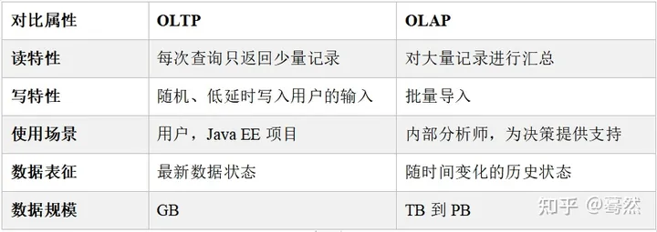

https://zhuanlan.zhihu.com/p/371365562
https://s.geekbang.org/search/c=0/k=%E6%95%B0%E4%BB%93%E5%BB%BA%E6%A8%A1/t=
https://cloud.tencent.com/developer/article/2061307

# 项目
- 数据质量
  - 性能表：容量标签，接通标签，质查标签，切换标签，掉线表现，干扰标签
  - 主题域：性能，告警，B域用户指标（满意度），工参，感知，覆盖运营
  - dim维度表：省维表，地市维表，区县维表，工参维表，楼宇维表，道路维表，区域维表，栅格维表，物业点栅格关系
  - 数据量：一天大概有10G
  - 基础数据加工：物点，小区，栅格/采样点关系
  - 性能数据，4G小区18-250w,5g小区8-25W，一个月有几百GB
  - 流量监控：超忙小区，高负荷，流量最大的情况，后续考虑扩容，新建基站
  - 价值画像：统计，双低小区；高价值小区：根据场景占比，价值得分
  - 投诉黑点：低覆盖率的问题，根据各种业务需要，给出参考解决方案，解决率的变化趋势
  - 网络感知：感知差小区数量，感知差小区占比
  - 资源配置：拆闲补忙
- 数据治理
  - 原有的是sql serve,现在迁移到clickchouse,利用分区表，分布式表的性能
  - 数据资源梳理，数据的血缘管理，梳理有哪些原始数据，中间表，结果表
  - 维度建模的理论，划分主题域，抽象出事实表，维度表，对数据分层，划分ods,dwd,dws，ads层，dim维度表
  - 解决分层中不合理的数据调用，减少跨层调用
  - 排查烟囱式开发，讲相同的逻辑抽象到dws层服用
  - 小文件治理

# 机器学习，深度学习
- 机器学习
  - 有监督学习：有结果
    - 决策树
      - 基于已知各种情况（特征取值）的基础上，通过构建树型决策结构来进行分析的一种方式，是常用的有监督的分类算法
      - 了解决策树的「最优属性」选择，我们需要先了解一个信息论的概念「信息熵（entropy）
      - 有过很多不同类型的模型，典型的模型如ID3、C4.5和CART等
  - 无监督学习：没有正确答案
  - 线性回归，cost函数，梯度下降
  - 过拟合的问题
- 深度学习，神经网格
  - 自动找出隐藏的层
  - 偏差，方差
  - 分类
    - 卷积神经网络
    - 深度强化学习
    - 循环神经网络
    - 生成对抗网络
#sql
- 反关联
  - a left join b on a.id = b.id and b.id is null
- 非空
  - 只能is null
- concat函数在连接字符串的时候，只要其中一个是NULL,那么将返回NULL
# springboot mybatis
- 层次框架
  - controller 接口层：处理来自客户端的http请求
  - service: 业务逻辑层，实现具体业务，通过mybatis的mapper来实现与数据库的交互
  - dao：数据访问层，数据访问对象dao,和mybatis映射器mapper
  - 持久化层：数据库连接，SQL查询等
  - 数据库层：正式数据
- 生命周期
  - 拦截器，安全验证
- IoC,控制反转：用到某些对象的时候，才进行实例化和依赖注入
- AOP，面向切面编程思想,是面向对象编程的补充
  - 解决共性的需求，生命代码在生命周期的什么时候使用，解决组件的共性问题
  - 程序抽象成各个切面，单独的模块。使用动态代理技术
- MVC，model,view,contoller
- 自动装配：注解，满足条件时，实例化bean组件，注入spring容器
- 注解是用来配置和管理应用程序的一种强大方式，它们用于指示Spring Boot框架如何处理类和方法
- hash map
  - 底层基于数据和链表实现
  - 1.7
    - 存在负载因子，初始容量固定，后续扩容
  - 1.8
    - 数组+链表+红黑树
    - 即在链表的长度超过阈值8时转化为红黑树结构
    - 表的时间复杂度是O(n)，红黑树的时间复杂度O(logn)，很显然，红黑树的复杂度是优于链表的
    - 链表长度如果是小于等于6，6/2=3，而log(6)=2.6，虽然速度也很快的，但是转化为树结构和生成树的时间并不会太短
- 面向对象
  - 使用类，对象，封装，继承，多态，将事务抽象为系统中的类
  - 结构化的设计模式
  - 高内聚，低耦合，可扩展
  - 简单工厂模式
  - 观察者模式-listener
- 多线程
  - 实现
    - 继承thread类,重写run()方法
    - 实现runnable接口
    - 实现callable接口
  - 同步/安全
    - synchronized关键字修饰对象/代码块
    - 加锁：ReentrantLock
    - volatile 每次进行重算
    - 原子变量
    - 线程安全的数据结构
  - 锁
    - 公平锁/非公平锁
    - 互斥锁
    - 乐观锁：读不加锁，适用多读；悲观锁：取数都会上锁
- JVM
  - 类加载器，Runtime Data Area（运行时数据区，内存分区），Execution Engine（执行引擎），Native Interface（本地库接口）
  - 内存分布
    - 程序计数器
    - java虚拟机栈
    - 本地方法栈
    - heap堆
    - 运行时常量池
    - 直接内存
  - 垃圾回收制度
    - 引用次数算法
    - 可达性算法
    - 回收方法区
    - 分代回收机制

# 数仓面试、学习总结
- 定义
  - 数据库：按照一定格式和数据结构在计算机保存数据的软件，是物理层
  - 数据集市：一种微型的数据仓库，它通常是有更少的数据，更少的主题区域，以及更少的历史数据，如果数据仓库是企业级的，那数据集市就是部门级的，一般数据集市只能为某个局部范围内的管理人员服务
  - 数据仓库，（Data Warehouse），可简写为DW或DWH
    - 为企业所有级别的决策制定过程，提供所有类型数据支持的战略集合，单个数据存储，出于分析性报告和决策支持目的而创建。为需要业务智能的企业，提供指导业务流程改进、监视时间、成本、质量以及控制
    - 存在的意义在于对企业的所有数据进行汇总，为企业各个部门提供统一的， 规范的数据出口
  - 数据湖：存储所有的源数据
- 特点
  - 面向主题的：按照一定的主题域进行组织，每一个主题对应一个宏观的分析领域
    - 场景：每个部分或业务独立从数仓获取的数据单元，可以称为主题
  - 集成的
    - 数据从各个分散的数据库中收集而来，数据不规范等问题，在集成过程中对数据进行清洗，规划，去敏等操作
  - 数据是稳定的
    - 一般是进行数据的查询，超出存储时限的数据才删除
  - 数据是随时间变化而变化的
    - 数据增量更新
    - 删除过期数据
    - 时间窗口滑动
    - 数仓里会完整的记录某个对象在一段时期内的变化情况
- 架构
  - 传统数仓架构
    - 结构或半结构化数据通过离线ETL定期加载到离线数仓，之后通过计算引擎取得结果，供前端使用
  - 离线大数据架构
    - 采用大数据技术来承载存储与计算任务,Hadoop+Hive/Spark、Oracle RAC、GreenPlum
  - Lambda架构（实时
    - 其将对实时性要求高的部分拆分出来，增加条实时计算链路。从源头开始做流式改造，将数据发送到消息队列中，实时计算引擎消费队列数据，完成实时数据的增量计算
    - 批量处理部分依然存在，实时与批量并行运行
    - 一般是以批量处理结果为准，实时结果主要为快速响应
  - Kappa架构（实时）
    - 其在数据需要重新处理或数据变更时，可通过历史数据重新处理来完成。方式是通过上游重放完成(从数据源拉取数据重新计算)
    - 流式重新处理历史的吞吐能力会低于批处理
  - 混合架构
- 分层
  - ods层：存放原始数据
  - dwd层：数据明细层：对ODS层数据进行清洗、维度退化、脱敏等
  - dws层：轻度汇总层： 对DWD层数据进行一个轻度的汇总
  - DM——数据集市层：为各种统计报表提供数据
  - ads：数据应用层
  - 好处
    - 实现维度建模，支撑决策分析目标，
    - 隔离原始数据，保证数据的质量和降低数据敏感度
    - 数据结构化更清晰：每一层都有各自的作用域和职责
    - 方便数据的血缘追踪，找到数据来源
    - 增强数据复用能力，减少烟囱式开发
    - 简化复杂问题，将大问题分成多个步骤，每一层只处理单一的问题
    - 减少业务的影响
    - 统一数据口径
- 核心理论
  - 范式理论
    - 定义：设计一张数据表的表结构，符合的标准级别，也就是规范和要求
    - 优点：关系型数据库设计时，遵照一定的规范要求，目的在于降低数据的冗余性
    - 缺点：范式的缺点是获取数据时，需要通过Join拼接出最后的数据
    - 第一范式(1NF)、第二范式(2NF)、第三范式(3NF)、巴斯-科德范式(BCNF)、第四范式(4NF)、第五范式(5NF)
    - ACID
      - atomicity原子性
      - consistency一致性
      - isolation 隔离性
      - durablity 持久性
  - 数据仓库建模
    - 数据处理分类
      - 操作型处理/联机事务处理 OLTP（On-Line Transaction Processing），也可以称面向交易的处理系统，它是针对具体业务在数据库联机的日常操作，通常对少数记录进行查询、修改。用户较为关心操作的响应时间、数据的安全性、完整性和并发支持的用户数等问题
      - 分析型处理，叫联机分析处理 OLAP（On-Line Analytical Processing）一般针对某些主题的历史数据进行分析，支持管理决策
      - 
    - 关系建模
      - 严格遵循第三范式，从图中可以看出，较为松散、零碎，物理表数量多，而数据冗余程度低
      - 关系模型主要应用与OLTP系统中，为了保证数据的一致性以及避免冗余，所以大部分业务系统的表都是遵循第三范式的
    - 维度建模
      - 通常以某一个事实表为中心进行表的组织，主要面向业务，特征是可能存在数据的冗余，但是能方便的得到数据
      - 关系模型虽然冗余少，但是在大规模数据，跨表分析统计查询过程中，会造成多表关联，这会大大降低执行效率。所以一般都会采用维度模型建模，把相关各种表整理成两种：事实表和维度表两种
      - 分类
        - 星型模型
          - 星型模式由事实表和维度表组成，一个星型模式中可以有一个或多个事实表，每个事实表引用任意数量的维度表
          - 星型模型与雪花模型的区别主要在于维度的层级，标准的星型模型维度只有一层，而雪花模型可能会涉及多层
        - 雪花模型
          - 雪花模式也是由事实表和维度表所组成
          - 所谓的“雪花化”就是将星型模型中的维度表进行规范化处理。当所有的维度表完成规范化后，就形成了以事实表为中心的雪花型结构，即雪花模式
        - 星座模型
          - 数据仓库由多个主题构成，包含多个事实表，而维表是公共的，可以共享（例如两张事实表共用一些维度表时，就叫做星型模型）
          - 种模式可以看做星型模式的汇集，因而称作星系模式或者事实星座模式
      - 模型选择
        - 星型还是雪花，取决于性能优先，还是灵活更优先
    - 步骤
      - 选取业务
      - 定义粒度
      - 确定维度
      - 确定事实
    - 事实表设计
      - 事务事实表：离散的时间点，保存对象的每一个事务
      - 周期快照事实表：描述一段时间间隔内的对象
      - 累计快照事实表：描述对象的多个事务变化时间节点，可以更新
    - 脱敏处理
      - (1)、先按照将手机号标准化，剔除不符合11长度的手机号，剔除开头不是1的手机号等等
      - (2)、对新增手机号排序后生成一个自增ID，该ID需大于已存在ID的最大值
      - (3)、对已有手机号保留之前生成的ID
      - (4)、表结构参考 [ ID，手机号，ID生成日期 ] 的结构
  - ETL
    - 数据探索
      - 1)收集所有的源系统的文档、数据字典等内容。
        2)收集源系统的使用情况，如谁在用、每天多少人用、占多少存储空间等内容。
        3)判断出数据的起始来源（System-of-Record）。
        4)通过数据概况（Data Profiling）来对源系统的数据关系进行分析。
    - 数据抽取
    - 数据转化
    - 数据加载
  - 拉链表
    - 记录下数据所有的状态变化的记录，如数据是按日批次更新，相当于实现了数据每日切片的功能
    - 适合状态会发生变化的数据，并且每次数据变化量比较小，而历史状态又比较重要的数据，数据必须要有主键。
    - 首先需要给每条数据增加两个字段：链头和链尾，记录了这条数据的有效起始时间和结束时间，批量更新时，将历史数据中删除和被更新的数据的链尾置为当前时间，表示这些数据的链路被关闭。
      将新数据中新增的和更新历史数据的数据的链头设置为当前时间，链尾设置为一个很大的时间，表示这些数据新开辟一条链路并且为当前有效。在对比数据的时候根据主键对比整条数据是否发生变化，
      只要有一个字段的值发生变化即视为该条数据有更新。
#hadoop
- HA架构
  - 有两个NA,只有一个active,另外一个standBy,都与独立的JNS通信，Quorum Journa是一个基于paxos算法的HA设计方案。
  - zkfc是一个独立的进程。作用 是监控RM的健康状态，并执行选举作用
  - ZKFC控制NameNode主备仲裁：NameNode主备仲裁，由ZKFC控制，ZKFC作为一个精简的仲裁代理，其利用zookeeper的分布式锁功能，实现主备仲裁，再通过命令通道，控制NameNode的主备状态
  - edit log不再存放在NameNode，而是存放在一个共享存储。采用共享存储同步日志。主用NameNode对外提供服务，同时对元数据的修改采用写日志的方式写入共享存储，同时修改内存中的元数据。备用NameNode周期读取共享存储中的日志，并生成新的元数据文件，持久化的硬盘，同时回传给主NameNode
  - 只有Active的NameNode节点才能对外提供读写HDFS服务，也只有Active态的NameNode才能向Journal Node写入编辑日志
    - 采用隔离（fence）机制防止脑裂。共享存储fencing，确保只有一个NN可以写入edits。客户端fencing，确保只有一个NN可以响应客户端的请求。DataNode fencing，确保只有一个NN可以向DN下发命令，譬如删除块，复制块，等等。
- block
  - Hadoop 1.x版本及之前默认64MB，Hadoop 2.x版本及之后默认128M
  - dfs.replication默认是3
# yran
- 模块
  - ResourceManager（RM）
    - 处理客户端请求
      监控NodeManager
      启动或监控ApplicationMaster
      资源的分配与调度
  - NodeManager（NM）
    - 管理单个节点上的资源
      处理来自ResourceManager的命令
      处理来自ApplicationMaster的命令
  - ApplicationMaster（AM）
    - 为应用程序申请资源并分配给内部的任务
      任务的监督与容错
  - Container
    - Container是YARN中的资源抽象，它封装了某个节点上的多维度资源，如内存、CPU、磁盘、网络等。
- 工作机制
  - YARN的任务提交流程
    - 向客户端提交程序，向RM申请AM
    - RM返回资源路径和 application_id
    - 提交程序运行资源到hdfs，申请运行AM
    - RM生成task，NM领取任务，创建Container，AM
    - container从HDFS拷贝资源
    - AM向RM 申请资源
    - RM将任务，分配给其他的NM,分别创建Container
    - AM向他们发送启动脚本，完成任务
    - 程序完成后，AM向RM申请注销自己

#Flink
- DAG划分为不同的stage,流处理
- 作业提交流程
  - 分发器启动JobMaster,请求slot
  - JobManager想RM请求slot
  - RM启动有taskmanager的容器
  - 向JM注册，JM请求slot
  - tm向JMaster提供slot,执行任务
- 算子
  - source
  - trancformation
  - sink
- 时间
  - 处理时间
  - 事件时间：事件发生的时间
    - 水位线
  - 窗口
    - 时间窗口
    - 计数窗口
- 多流转换
  - 分流：给数据盖戳，不影响主流
  - 合流
- 状态编程
- 
# spark 
- Spark和Hive的区别
  - hive是基于hadoop的数据仓库工具，有时查询引擎；spark sql是查询引擎
  - Spark SQL处理一切存储介质和各种格式的数据，可以扩展
  - Spark SQL把数据仓库的计算速度更高
  - Spark SQL推出的Dataframe可以让数据仓库直接使用机器学习，图计算等复杂算法
  - hive on spark：hive 使用spark作为计算引擎，用户可以通过set hive.execution.engine=mr/tez/spark来指定
  - spark on hive ： 使用Spark来处理分析存储在Hive中的数据
- spark细节
  - Spark 1.6.0之前使用的是Akka通信框架 
  - Spark 1.6.0之后使用的是netty通信框架
- spark 内存模型
  - 堆内和堆外内存规划
    - 堆内内存
      - Execution 内存：主要用于存放 Shuffle、Join、Sort、Aggregation 等计算过程中的临时数据
      - Storage 内存：主要用于存储 spark 的 cache 数据，例如RDD的缓存、unroll数据
      - 用户内存（User Memory）：主要用于存储 RDD 转换操作所需要的数据，例如 RDD 依赖等信息
      - 预留内存（Reserved Memory）：系统预留内存，会用来存储Spark内部对象
    - 堆外内存
      - 申请使用工作节点的部分系统内存，存储经过序列化的二进制数据
      - 所有运行中的并发任务共享存储内存和执行内存
  - 内存空间分配
    - 静态内存管理：存储内存、执行内存和其他内存的大小在Spark应用程序运行期间均为固定的，但用户可以应用程序启动前进行配置
    - 统一/动态内存管理：存储内存和执行内存共享同一块空间，可以动态占用对方的空闲区域。存储空间不能让执行内存归还，反之可以
  - 存储内存管理
    - RDD持久化机制，disk ，memory ,ser
  - 执行内存管理
    - Shuwle Write
      - 采用ExternalSorter进行外排，在内存中存储数据时主要占用堆内执行空间
      - 在map端选择 Tungsten 的排序方式，则采用ShuwleExternalSorter直接对以序列化形式存储的数据排序，在内存中存储数据时可以占用堆外或堆内执行空间，取决于用户是否开启了堆外内存以及堆外执行内存是否足够
    - Shuwle Read
- spark 概念
  - RDD模型，宽窄依赖
    - 窄依赖：一个父RDD 只被一个子RDD使用
    - 宽依赖：一个父RDD，被多个子RDD使用；会有shuffle
    - 是Job划分stage,生成DAG的依据，
  - DAG解决的问题
    - 每个map reduce操作相互独立
    - 每一步结果都要溢写到磁盘或者HDFS
    - 优化：优化计算计划，如减少shuffle的数据
  - 容错
    - lineage:记录RDD之间的血缘关系；是将粗颗粒度相同的操作（map flatmap filter之类的）记录下来，万一RDD信息丢失
      可通过Lineage获取信息从新获得原来丢失的RDD
    - checkpoint：将中间结果保存到HDFS的多副本可靠存储中，因此可以斩断依赖链；一般要先cache,因为checkpoint 是从头计算的，这样避免，提高性能
- spark shuffle
  - 分类
    - Hash Shuffle
      - 未优化的HashShuffle：在executor中每个task对数据用hash计算分区，写入buffer,写入本地文件，reducer读取收集这些文件
      - 优化后的的HashShuffle：
        - 启用合并机制，合并机制就是复用buffer，开启合并机制的配置是spark.shuffle.consolidateFiles
        - 先分区，一个executor中的所有task,将同样的分区key放在同一个buffer,buffer写入以对应本地文件中，减少了reducer读的小文件数目
      - 优点 ：不用排序，减少排序用的内存开销
      - 缺点
        - 生成的文件过多，会给文件系统压力
        - 大量小文件随机读写会有磁盘开销
        - 数据块写入时所需的缓存空间也会随之增加，对内存造成压力
    - Sort Shuffle
      - 普通SortShuffle：task根据key进行排序，然后缓冲区溢写到磁盘中，生成多个临时文件，executor合并文件并生成索引文件，下游reducer通过索引读文件，减少了读的文件数量
      - bypass SortShuffle：
        - 触发条件：shuffle reduce task数量小于spark.shuffle.sort.bypassMergeThreshold参数的值，默认为200；不是聚合类的shuwle算子（比如reduceByKey）
        - task将数据按key计算hash值，缓冲溢写到磁盘，executor合并所有文件并生成索引文件
        - 优点：不会进行排序，磁盘文件更少，shuffle reader性能更好
    - Tungsten Sort Shuwle
- spark join
  - Broadcast Hash Join:将小表广播到大表所在的节点，在各个节点上进行hash join; 使用于小表和大表join
  - shuffle hash join；两个表都按key分区，发送到对应reducer，在各个节点上hash join；适合于没有特别小的两个表进行关联的时候
  - sort merge join：
    - 适合非常大的两个表
    - shuffle：两个表根据join key 进行分区
    - sort:各个节点对两张表，分别进行排序
    - merge:分别遍历有序序列，遇到相同的就输出；可以即用即丢，不用那么大的内存,只用取部分
- spark 调优
  - 数据倾斜
    - 定义：不同的key对应的数据量不同，导致不同的task所处理的数据量不同
    - 后果：OOM，运行速度慢
    - 表现：大部分task都快速完成，少数几个task执行的很慢，或者有的task突然报OOM
    - 定位：检查shuffle算子；看日志log文件，看错误记录对应哪行代码
    - 解决方案
      - 聚合元数据：对上游数据进行处理时，先聚合，将同一个key对应的所有value用特殊格式拼接到一个字符串中；增大key的粒度（增大每个task的数据量）
      - 过滤导致倾斜的key：
      - 提高shuffle操作中的reduce并行度
      - 使用随机key实现双重聚合，先对key加上随机前缀，第一次聚合后，去掉前缀再聚合；适用于聚合类的shuffle操作
      - 将reduce join转换为map join：broadcast hash join,RDD是并不能进行广播的，只能将RDD内部的数据通过collect拉取到Driver内存然后再进行广播
      - sample采样对倾斜key单独进行join
      - 使用随机数以及扩容进行join: 其中一个放大N倍扩容，另一个打上随机前缀稀释
  - 小文件
    - 后果
      - 浪费命名空间
      - hive计算会启动多个map，影响性能
    - 降低分区repartition ,coalse
    - 修改默认分区
    - 新增一个并行度为1的任务
  - 配置调优
    - executor-cores
    - num-executors
      - 前两者都是可以增加并行度
    - executor-memory
      - 增加内存空间，更多的cach,更好的shuffle，减少了磁盘IO，减少了GC
  - RDD优化
    - RDD复用：要避免相同的算子和计算逻辑之下对RDD进行重复的计算
    - 对重复使用的算子进行持久化
      - 可以考虑序列化减小体积
      - 安全要求比较高，可以考虑副本机制
  - 并行度调节
    - task数量应该设置为Spark作业总CPU core数量的2~3倍
    - 是因为task的执行时间不同，有的task执行速度快而有的task执行速度慢
  - 广播大变量
    - 在每个executor中有一个副本，此Executor的所有task共用此广播变量，这让变量产生的副本数量大大减少
  - shuffle调优
    - 1、调节 map 端缓冲区大小：在 Spark 任务运行过程中，如果 shuffle 的 map 端处理的数据量比较大，但是map 端缓冲的大小是固定的，可能会出现 map 端缓冲数据频繁 spill 溢写到磁盘文件中的情况，使得性能非常低下，通过调节 map 端缓冲的大小，可以避免频繁的磁盘IO 操作，进而提升 Spark 任务的整体性能。
      2、调节 reduce端拉取数据缓冲区大小，Spark Shuffle 过程中， shuffle reduce task 的 buffer 缓冲区大小决定了 reduce task每次能够缓冲的数据量，也就是每次能够拉取的数据量，如果内存资源较为充足，适当增加拉取数据缓冲区的大小，可以减少拉取数据的次数，也就可以减少网络传输的次数，进而提升性能。
      3、调节reduce端拉取数据重试次数
      4、调节reduce端拉取数据等待时间间隔
- spark3
  - 动态分区裁剪
    - 针对分区表中多个表进行join的时候基于运行时（runtime）推断出来的信息，在on后面的条件语句满足一定的要求后就会进行自动动态分区裁减优化
  - 自适应查询执行（Adaptive Query Execution）
    - 对执行计划按照实际数据分布和组织情况，评估其执行所消耗的时间和资源，从而选择代价最小的计划去执行
    - 1）将SQL语句通过词法和语法解析生成未绑定的逻辑执行计划；
      2）分析器配合元数据使用分析规则，完善未绑定的逻辑计划属性转换成绑定的逻辑计划；
      3）优化器使用优化规则将绑定的逻辑计划进行合并、裁减、下推生成优化的逻辑计划；
      4）规划器使用规划策略把优化的逻辑计划转换成可执行的物理计划；
      5）进行preparations规则处理，构建RDD的DAG图执行查询计划

# hive
- 定义
  - 基于Hadoop的一个数据仓库工具，可以将结构化的数据文件映射为一张表，并提供类SQL查询功能。
- 架构
  - 用户接口：Client：CLI（command-line interface）、JDBC/ODBC(jdbc访问hive)、WEBUI（浏览器访问hive）
  - 元数据：Metastore
  - Hadoop：使用HDFS进行存储，使用MapReduce进行计算
  - 驱动器：Driver
    - 解析器（SQL Parser）：将SQL字符串转换成抽象语法树AST
    - 编译器（Physical Plan）：将AST编译生成逻辑执行计划
    - 优化器（Query Optimizer）：对逻辑执行计划进行优化
    - 执行器（Execution）：把逻辑执行计划转换成可以运行的物理计划
  - 元数据，derby只能允许一个会话连接，mysql 允许多个会话连接，实际生产中基本使用MySQL
- 用户自定义函数
  - 分类
    - UDF（User-Defined-Function）：一进一出
    - UDAF（User-Defined Aggregation Function）：聚集函数，多进一出
    - UDTF（User-Defined Table-Generating Functions）：一进多出
  - 继承Hive提供的类
  - 实现类中的抽象方法，打包成jar包
  - 在 hive 的命令行窗口创建函数添加 jar
  - 为该类起一个别名，create temporary function mylength as 'com.whut.StringLength'，这里注意
    UDF只是为这个Hive会话临时定义的
  - 在select中使用
  - 在 hive 的命令行窗口删除函数
- 分区和分桶区别
  - 分区：非随机分割数据库，其实就是新建一个目录或者子目录，或者在原有的目录上添加数据文件
  - 分桶：按照列的哈希函数
- 调优
  - 小文件处理
    - 来源
      - 源数据有很多小文件
      - 动态分区会产生
      - reduce个数太多也会
      - 按分区插入数据会有大量小文件，文件个数 = maptask个数 * 分区数
    - 影响
      - HIVE一个文件对应一个map，一个map需要一个jvm，任务的初始化会浪费大量资源，严重影响性能
      - HDFS存储太多小文件，会导致namenode数据太大，占用太多内存
    - 方案
      - 通过调整参数进行合并
        - map输入的时候
          - set mapred.max.split.size=256000000; 每个Map最大输入大小，决定合并后的文件数
          - set mapred.min.split.size.per.node=100000000; 一个节点上split的至少的大小 ，决定了多个data node上的文件是否需要合并
          - set mapred.min.split.size.per.rack=100000000;  一个交换机下split的至少的大小，决定了多个交换机上的文件是否需要合并
          - set hive.input.format=org.apache.hadoop.hive.ql.io.CombineHiveInputFormat; 执行Map前进行小文件合并
        - 在Reduce输出的时候, 把小文件合并
          - set hive.merge.mapfiles = true; 在map-only job后合并文件，默认true
          - set hive.merge.mapredfiles = true; 在map-reduce job后合并文件，默认false
          - set hive.merge.size.per.task = 256000000; 合并后每个文件的大小，默认256000000
          - set hive.merge.smallfiles.avgsize = 100000000;  平均文件大小，是决定是否执行合并操作的阈值，默认16000000
      - 针对按分区插入数据的时候产生大量的小文件的问题，可以使用DISTRIBUTE BY rand() 将数据随机分配给Reduce，这样可以使得每个Reduce处理的数据大体一致
        - set hive.exec.reducers.bytes.per.reducer=5120000000; 设置每个reducer处理的大小为5个G
        - DISTRIBUTE BY rand();使用distribute by rand()将数据随机分配给reduce, 避免出现有的文件特别大, 有的文件特别小
      - 使用Sequencefile作为表存储格式，不要用textfile，在一定程度上可以减少小文件
      - 使用hadoop的archive归档:Hadoop Archive或者HAR，是一个高效地将小文件放入HDFS块中的文件存档工具，它能够将多个小文件打包成一个HAR文件，这样在减少namenode内存使用的同时，仍然允许对文件进行透明的访问
  - 数据倾斜
    - 定义/表现：大多数reducer快速完成，少数reducer运行很慢，应为某一个key的条数比其他key多很多
      - 任务进度长时间维持在99/100
    - 原因
      - join,key分布不均匀；空值或零值过多
      - SQL语句本身数据倾斜，group by维度过小
      - count distinct 特殊值过多
    - 解决方案
      - 参数调节 `hive.map.aggr = true` `hive.groupby.skewindata=true`
        - Map 端部分聚合，相当于Combiner,生成两个map job，第一个先部分聚合，第二个再按照结果做聚合操作
      - sql语句调节
        - 使用map join让小的维度表（1000条以下的记录条数）先进内存。在map端完成reduce
        - 大表Join大表
          - 把空值的key变成一个字符串加上随机数，把倾斜的数据分到不同的reduce上，由于null值关联不上，处理后并不影响最终结果
        - count distinct大量相同特殊值：
          - 将值为空的情况单独处理，直接过滤，在最后结果中加1。如果还有其他计算，需要进行group by，可以先将值为空的记录单独处理，再和其他计算结果进行union
        - group by维度过小：采用sum() group by的方式来替换count(distinct)完成计算
        - 特殊情况特殊处理：在业务逻辑优化效果的不大情况下，有些时候是可以将倾斜的数据单独拿出来处理。最后union回去
        - 对应mapreduce/spark：加上随机前缀，比过滤后再处理效果好
      - 场景
        - 空值产生的数据倾斜
          - user_id为空的不参与关联
          - 赋与空值新的随机key值
        - 不同数据类型关联产生数据倾斜,类型映射
        - 小表不小不大，怎么用 map join 解决倾斜问题/build table会大到无法直接使用map join的地步
          - 对小表新进行过滤
          - 要充分利用probe table的限制条件，削减build table的数据量，再使用map join 解决。代价就是需要进行两次join
  - 优化join
    - build table（小表）前置
      - 小表叫build table，大表叫probe table
      - Hive在解析带join的SQL语句时，会默认将最后一个表作为probe table，将前面的表作为build table并试图将它们读进内存
    - 多表join时key相同
      - 况会将多个join合并为一个MR job来处理
    - 利用map join特性
      - 语句中加了一条map join hint，以显式启用map join特性,在Hive 0.8版本之后，就不需要写这条hint了
    - 分桶表map join
      - 分桶表是基于一列进行hash存储的，因此非常适合抽样
    - 倾斜均衡配置项
      - ` hive.optimize.skewjoin`
      - Hive会将计数超过阈值 hive.skewjoin.key （默认100000）的倾斜key对应的行临时写进文件中，然后再启动另一个job做map join生成结果
      - 通过 hive.skewjoin. mapjoin.map.tasks 参数还可以控制第二个job的mapper数量，默认10000
  - hive优化方法
    - hive优化
      - Fetch抓取：Hive中对某些情况的查询可以不必使用MapReduce计算，简单地读取employee对应的存储目录下的文件，然后输出查询结果到控制台
        - 对于在where条件中使用分区字段这种情况，也是无需MapReduce过程
      - 本地模式：
      - 表优化，
        - 小表，大表join:map join ,broadcast join
        - 大表Join小表:空KEY过滤
        - Group By,部分先聚合
    - hive优化方法
      - 行列过滤
      - 谓词下推
        - where写在子查询内部，而不是外部，谓词下推，将OperatorTree中的FilterOperator向上提
      - sort by代替order by
        - 并且保证每个reducer内局部有序
        - 配合distribute by一同使用
      - group by代替distinct：count(distinct)逻辑只会有很少的reducer来处理。
        - 用group by方式同时统计多个列
      - group by配置调整
        - map端预聚合 `hive.map.aggr`
        - 倾斜均衡配置项 ` hive.groupby.skewindata`,启动两个mp job
  - hive sql优化
    - 指定map join,把小表加载到内存，在map端进行join `set hive.auto.convert.join=true;`
      - 下载到本地，生成hash table,上传到distributed cache
    - 行列过滤，列处理，行处理，在分区剪裁中，当使用外关联时，如果将副表的过滤条件写在 Where 后面，那么就会先全表关联，之后再过滤
    - 开启 map 端 combiner（不影响最终业务逻辑）聚合参数设置 `hive.map.aggr = true`
    - 多采用分 桶技术
    - 结合实际环境合理设置 Map 数
      - 作业会通过 input的目录产生一个或者多个map任务。 主要的决定因素有：input的文件总个数，input的文件大小，集群设置的文件块大小
      - 小文件多，需要减少map数量
      - 但这个文件只 有一个或者两个小字段，却有几千万的记录，如果 map 处理的逻辑比较复杂，用一个 map 任务去做，肯定也比较耗时。解决这个问题需要增加map数
    - 合并大量小文件
      - CombineHiveInputFormat 具有对小文件进行合并的功能（系统默认的格式）。HiveInputFormat 没有对小文件合并功能
    - 设置合理的Reduce数
    - 输出合并小文件常用参数
      - `SET hive.merge.mapfiles = true; -- 默认 true，在 map-only 任务结束时合并小文件 `
      - `SET hive.merge.mapredfiles = true; -- 默认 false，在 map-reduce 任务结束时合并小文件`
      - ` SET hive.merge.size.per.task = 268435456; -- 默认 256M `
      - `SET hive.merge.smallfiles.avgsize = 16777216; -- 当输出文件的平均大小小于 16m 该值时， 启动一个独立的 map-reduce 任务进行文件 merge`
    - 中间结果压缩
  - MapReduce优化
    - 调整mapper数
      - mapper数量与输入文件的split数相关
      - split_size = MAX(mapred.min.split.size, MIN(mapred.max.split.size,dfs.block.size))
      - split_num = total_input_size / split_size
      - mapper_num = MIN(split_num, MAX(default_num, mapred.map.tasks))
      - 减少mapper数，就适当调高 mapred.min.split.size ，split数就减少了
      - 增大mapper数，除了降低 mapred.min.split.size 之外，也可以调高 mapred.map.tasks
    - 调整reducer数目
      - 使用参数 mapred.reduce.tasks 可以直接设定reducer数量
      - 参数 hive.exec.reducers.bytes.per.reducer 用来设定每个reducer能够处理的最大数据量，默认值1G（1.2版本之前）或256M
      - 参数 hive.exec.reducers.max 用来设定每个job的最大reducer数量，默认值999（1.2版本之前）或1009（1.2版本之后）
      - reducer_num = MIN(total_input_size / reducers.bytes.per.reducer, reducers.max)
    - 合并小文件
      - 输入阶段合并
        - 即参数 hive.input.format ，默认值是org.apache.hadoop.hive.ql.io.HiveInputFormat ，我们改成org.apache.hadoop.hive.ql.io.CombineHiveInputFormat
        - mapred.min.split.size.per.node 和 mapred.min.split.size.per.rack ，含义是单节点和单机架上的最小split大小。如果发现有split大小小于这两个值（默认都是100MB），则会进行合并
      - 输出阶段合并
        - 直接将 hive.merge.mapfiles 和 hive.merge.mapredfiles 都设为true即可，前者表示将map- only任务的输出合并，后者表示将map-reduce任务的输出合并
        - hive.merge.size.per.task 可以指定每个task输出后合并文件大小的期望值，hive.merge.size.smallfiles.avgsize 可以指定所有输出文件大小的均值阈值，默认值都是1GB。如果平均大小不足的话，就会另外启动一个任务来进行合并
    - 启用压缩
      - 压缩job的中间结果数据和输出数据，可以用少量CPU时间节省很多空间。压缩方式一般选择Snappy，效率最高
      - 设定 hive.exec.compress.intermediate 为true
      - hive.intermediate.compression.codec 为 org.apache.hadoop.io.compress.SnappyCodec指定压缩方式
      - hive.intermediate.compression.type 可以选择对块（BLOCK）还是记录（RECORD）压缩，BLOCK的压缩率比较高
      - 输出压缩的配置基本相同，打开 hive.exec.compress.output 即可
    - JVM重用
      - 如果task非常小而碎，那么JVM启动和关闭的耗时就会很长。可以通过调节参数 mapred.job.reuse.jvm.num.tasks 来重用
  - 并行执行与本地模式
    - 并行执行
      - Hive中互相没有依赖关系的job间是可以并行执行的，最典型的就是多个子查询union all
      - 参数 hive.exec.parallel 设为true
      - hive.exec.parallel.thread.number 可以设定并行执行的线程数，默认为8，一般都够用
    - 本地模式
      - Hive也可以不将任务提交到集群进行运算，而是直接在一台节点上处理
      - 设置 hive.exec.mode.local.auto 为true可以开启本地模式
  - 严格模式
    - 强制不允许用户执行3种有风险的HiveQL语句，一旦执行会直接失败
    - 参数 hive.mapred.mode 设为strict
  - 采用合适的存储格式

# 面试概念
- 数据政府 - 中移集成
  - 精细化治理
    - 让政府工作更加高效
    - 更全面快速的了解群众的办事需求
    - 更高效的分配政府资源
    - 如线上全流程服务，异地办理
  - 老年人智能化
  - 多部门相协调
  - 技术上
    - 数据部分开放，对公众
    - 数据安全和隐私，遵守相关法规
    - 数据治理：统一的数据标准，管理流程，数据质量空值
    - 提供数据分析，预测趋势，问题预警，对决策提供支持
    - 数字化服务：政务服务平台，在线申请
    - 数据共享：各个部门之间，各个区县，地市，省之间的数据共性
    - 公众反馈收集，和分析
- 智慧城市
  - 智能交通系统：利用传感器、数据分析和通信技术来优化交通流量、减少交通拥堵、改善交通安全，并提供便捷的交通信息。
  - 智能能源管理：通过智能电网、能源监测和可再生能源集成，提高能源利用效率，减少能源消耗和碳排放。
  - 数字化城市管理：利用大数据分析、云计算和物联网设备，实现城市基础设施的监控、维护和优化，以提供更高效的城市服务。
  - 智能环境监测：使用传感器和监测设备来监测空气质量、水质、垃圾处理等环境因素，以改善城市环境和健康。
  - 智能建筑和住宅：利用自动化系统和能源管理技术，建造更节能、智能化的建筑，提高住宅生活质量。
  - 数字化医疗保健：提供远程医疗、医疗数据管理和医疗信息交流，以改善医疗服务的可及性和效率。
  - 智能教育：利用在线教育平台和数字化学习工具，提供更灵活和个性化的教育服务。
  - 社交参与和民主参与：借助数字工具，鼓励市民参与城市规划和政策制定过程，提高城市的民主性和透明度。
  - 安全和紧急响应系统：建立智能监控和应急响应系统，以提高城市的安全性和危机管理能力。
  - 智慧金融和商业：推动数字支付、电子商务和创新金融服务，促进城市经济的发展和创新。